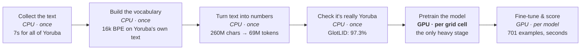

# What the group is asking, what the factory does, and where the limits are

*A2-NLP · August 2026 · a plain-language walkthrough*

Every figure here was measured on the CSED 504 workstation (2 × RTX PRO 6000 Blackwell), except
the AfriBERTa-scale projection, which is scaled from measured throughput and labeled as such.

---

## 1. The question Patrick and Leon are asking

Suppose you want a language model that understands Yoruba. There are two options, and they cost
wildly different amounts.

**Option A — borrow a big one.** Take a model someone else trained on a hundred languages at
once (XLM-R, mmBERT) and nudge it toward your task. You get the benefit of enormous compute you
didn't pay for. The catch: if your language was barely in that model's training data, you may be
borrowing very little.

**Option B — build a small one yourself.** Train from scratch on Yoruba text only. Far smaller,
but every parameter is spent on your language, and the vocabulary is built for your writing
system rather than shared with ninety-nine others.

Their research question is **when does B beat A** — and it isn't academic. It is really *who can
afford to build language technology for their own language.* If B works, a group with one
workstation can serve a language the big multilingual models neglected.

**Where this project fits:** we are not answering that question. We are building the *factory* —
the machinery that makes asking it cheap and repeatable. Their science, our tooling. The measure
of our part is whether they can run more experiments, more reliably, inside the budget they have.

---

## 2. The first hard limit: there isn't much Yoruba

Before any GPU question there is a data question. We streamed the entire Yoruba portion of
FineWeb-2, the group's main source. It **ran out in seven seconds**: 259,864,169 characters over
79,999 documents. That is everything.

At 3.73 characters per token that is 69.6 million tokens — **69.1 million** once half a million
are held out for validation, which is the number the rest of this project quotes. For comparison,
WikiText-103 — one unremarkable English benchmark already on disk from Part 1 — holds 123.8
million.

```
All Yoruba (FineWeb-2)   ████████████████████████████                     69.1M tokens
  their 64M rung         ██████████████████████████                       64M  = 93% of it
WikiText-103 (English)   ██████████████████████████████████████████████   123.8M tokens
  128M rung hoped for    ┄┄┄┄┄┄┄┄┄┄┄┄┄┄┄┄┄┄┄┄┄┄┄┄┄┄┄┄┄┄┄┄┄┄┄┄┄┄┄┄┄┄┄┄┄┄┄  not reachable
```

**This is the project's premise in one picture.** There is roughly half as much Yoruba in the
largest open web crawl as there is English in one mid-sized benchmark. Their top rung of 64M
tokens consumes 93% of everything available, and the 128M rung the proposal contemplated cannot
be reached from this source at all. The scarcity is *why the research question matters*.

---

## 3. Does the small from-scratch model actually work?

We trained one: 33.8M parameters, ten minutes on one card. Then measured it on two tasks against
the two big multilingual models and against a control.

**The control is the important part.** Identical architecture, identical fine-tuning, but *no
pretraining at all* — random weights. Whatever the trained models score above that line is what
pretraining actually bought.

The two tasks differ on purpose. **Topic classification** (SIB-200) sorts sentences into 7
categories and can often be solved from surface word cues. **Named-entity recognition**
(MasakhaNER) finds people, places and organizations — much harder to fake.

| model | topic classification | entity recognition |
|---|---|---|
| no pretraining *(the control)* | 0.100 | 0.346 |
| **from-scratch Yoruba** (33.8M, 10 min) | **0.527** | **0.698** |
| XLM-R *(no Yoruba in training)* | 0.127 | 0.843 |
| mmBERT *(Yoruba included)* | 0.537 | 0.848 |

Read the first column: the from-scratch model essentially **matches mmBERT** (0.527 vs 0.537)
after ten minutes on one card. That is the group's headline. Read the second column: on the
harder task it **does not** reach the big models. Topic classification was flattering it.

Pretraining bought **+0.43** on topic classification and **+0.35** on entity recognition over
random weights, so the small model is genuinely learning Yoruba, not exploiting an easy task.

> **Later measurement, stronger than this one.** Every number in this table is the first pass, at
> default fine-tuning settings. When every arm was given the same nine-rate sweep and selected on
> the validation split, the picture sharpened rather than reversed: ours **0.688** against
> mmBERT's 0.582 on topic classification — ahead, not merely matching — and XLM-R at 0.358, below
> its own untrained architecture. The controls climb too once *they* are swept (0.429 and 0.626),
> so the honest "what pretraining bought" is smaller than this table suggests but still real.
> [Report 11](11-selecting-on-the-dev-split.md) is the version to quote; this table is kept as
> the honest first reading.

> ### ⚠ The anomaly worth chasing
>
> XLM-R scores **0.127 on topic classification but 0.843 on entity recognition.** A model with no
> useful Yoruba knowledge cannot find Yoruba names at 0.843. The 0.127 is almost certainly a
> *fine-tuning failure* — 701 training examples is a notoriously unstable regime for that model —
> not evidence that it doesn't know Yoruba.
>
> This matters because the group's headline contrast ("XLM-R fails on languages it never saw")
> leans on exactly this number. Re-run it with more seeds and a higher learning rate before it
> goes in the poster.
>
> *Since done — [report 11](11-selecting-on-the-dev-split.md) re-ran every arm with the same
> nine-rate sweep. The instability was real: one XLM-R seed in five still collapses below chance.
> But even its best honest number (0.434, discarding the failed seed) stays within noise of its
> own untrained architecture, so the group's contrast held — for a better-measured reason.*

---

## 4. What the factory actually provides

The proof-of-concept did everything inside one notebook, from scratch, every session. The factory
splits that into work done *once* and work done *per experiment*, and moves the slow part off the
notebook entirely.



This is where the CPU/GPU question gets answered: **only one stage is a real GPU workload.** The
rest is downloading, text processing, and bookkeeping.

The four *once* stages used to run every session. Caching them is most of what the factory buys
before any GPU tuning — a re-run of the notebook now skips straight to the science. The two-card
scheduler, the live dashboard, and the cost estimator all wrap the one stage in the middle.

---

## 5. Why the GPU looked idle

A GPU goes fast when you hand it a lot of arithmetic at once. The knob for that is **batch
size** — how many text sequences it processes per step. The proof-of-concept used 64. We swept
it:

| batch | tokens/sec | memory used |
|---|---|---|
| **64** *(what the POC used)* | 364k | 3.3 GB |
| **128** *(best)* | **484k** | 6.1 GB |
| 256 | 489k | 11.7 GB |
| 512 | 464k | 22.8 GB |
| 1024 | 457k | 45.1 GB |
| 2048 | 387k | 89.7 GB |

Going from 64 to 128 is a free **1.33×**. After that the curve flattens and then falls — at batch
2048 it is *slower* than at 128 while using 89.7 GB. There is no reward for filling the card.

### The two guesses that were wrong

- **"It's the per-step synchronisation."** Part 1 taught us that copying a number from GPU to CPU
  every step costs ~7%. Here it costs **2%** — the steps are 23 milliseconds instead of a fraction
  of one, so the pause is lost in the noise. We kept it; a readable live loss is worth 2%.
- **"We're running out of memory."** Peak usage at the original settings was **3.3 GB out of 96.**
  Memory was never remotely the constraint.

### The actual reason

The model is simply *small*. 33.8M parameters over 128-token sequences doesn't give a card this
size enough arithmetic to chew on, so it spends its time starting and finishing tiny pieces of
work rather than doing them. Not fixable by tuning — but it improves as the model grows:

| model size | batch | tokens/sec | arithmetic rate | memory |
|---|---|---|---|---|
| POC · 33.8M | 64 | 364k | 74 TFLOP/s | 3.3 GB |
| POC · 33.8M | 128 | 484k | 98 TFLOP/s | 6.1 GB |
| AfriBERTa · 86M | 128 | 209k | **123 TFLOP/s** | 10.6 GB |

Fewer tokens per second, but *more actual work done* per second. The full study runs at the
larger size, so it will use the hardware better than the proof-of-concept did.

---

## 6. The other half was free: the second card

The notebook trained the four grid cells one after another on a single GPU. The second card did
nothing for twenty-five minutes.

```
Notebook, one card     card 0  ███████████████████████████████████░░░░  88%
                       card 1  ░░░░░░░░░░░░░░░░░░░░░░░░░░░░░░░░░░░░░░░  idle     25.2 min

Factory, both cards    card 0  ████████████████████████████████████░░░  91%
                       card 1  █████████████████████████████████████░░  93%      12.2 min
```

**2.07× less waiting** for identical work. Of that, the batch size contributed 1.31× as measured
in the A/B (the sweep had predicted 1.33×) and the rest came from the idle card. A scheduling fix found by watching the run — longest jobs first, so neither
card is left holding the tail — should bring it to about 9.9 minutes.

---

## 7. What the grid is for: compute or data?

The central design question is where to spend a fixed budget. More *unique text*, or more
*training* on the text you have? The 2×2 grid answers it. Numbers are validation loss —
**lower is better**; a model that has learned nothing scores 9.68.

| | short training (49M updates) | long training (197M updates) |
|---|---|---|
| **2M tokens of text** | 5.70 | 3.49 |
| **32M tokens of text** | 5.63 | **2.89** |

Read across a row: more **training** moves the number by 2.2–2.7. Read down a column: 16× more
**text** moves it by 0.08 on the left and 0.61 on the right. **Training dominates** — and extra
text only starts to help once there is enough training to use it.

Repeating the best cell at three seeds puts a size on the noise: **sd 0.049, full range 0.108.**
Against that, the training effects are 45–56× the spread and the text effect at high training is
13×, so all of those are real.

That 0.049 is this grid's number and does not travel. Re-measured at 5× the compute it is 0.149
for 33.8M English and 0.103 for 33.8M Yoruba, and on the 86M preset it is not one number at all
— that column is bimodal, with a roughly 31% chance of never leaving the plateau. See
[report 05](05-when-data-stops-mattering.md) §2. Later work quoted 0.049 as a universal threshold
and understated its own noise for it. The comparisons in this section are between cells of one
grid at one budget, which is the case where it applies. The text effect at *low* training — 0.075 — is **1.5× the
spread, which is indistinguishable from noise.** The precise claim is therefore that more unique
text does nothing measurable until there is enough training to use it.

**Why this is convenient:** the scarce resource is Yoruba text (§2), and the grid says text is
the *less* valuable axis at this budget. Spending on more training buys far more than scraping
for more text would — fortunate, because there is no more text to scrape.

> **Later measurement, stronger than this one.** This section infers that text is the cheaper
> axis from a grid that was compute-bound, which is weak evidence — the data axis was never really
> under test. [Report 05](05-when-data-stops-mattering.md) tests it properly, at fixed compute
> across a 256× span of data, in English and then in Yoruba. The conclusion holds and the reason
> is better: past roughly 64M tokens more text buys nothing measurable, and Yoruba's entire 69.1M
> sits at the bottom of that band. Scarce, yes — but scarce in a way that costs less than this
> section assumed.

> ### ⚠ Honest caveat
> The seed spread above was measured on one cell (three seeds) and assumed to characterize the
> others. The pretraining differences clear it comfortably. The **downstream** differences do
> not: the four fine-tuned models score 0.448–0.527 on topic classification with overlapping
> confidence intervals, so which grid cell fine-tunes best is still unresolved.

---

## 8. Does the real study fit?

The estimator measures throughput on this machine, then scales it to the larger model the full
study needs. It doesn't guess from a table — it runs for a few seconds and reports.

| rung | work | GPU-hours | on two cards |
|---|---|---|---|
| 4M tokens | 48M seen | 0.12 | 0.06 h |
| 16M tokens | 192M seen | 0.48 | 0.24 h |
| 64M tokens | 768M seen | 1.92 | 0.96 h |
| **per language** | | **2.52** | **1.26 h** |

Three languages, one seed each: **7.6 GPU-hours, about 3.8 hours of actual waiting** — against a
budget of roughly 20. It fits, with room left for the seed repeats the study needs.

---

## 9. Where to go next

*(Written in early August. All four items have since been done: the XLM-R re-run and the seeds
are reports 06 and 11, the scarcity finding is on both boards, and compute-bound-not-data-bound
became report 05.)*

- **Re-run XLM-R's topic-classification numbers with more seeds.** The 0.127 is probably a
  training failure, and the group's headline contrast depends on it.
- **Run the seed queue.** Three seeds on the headline cell, so the differences can be quoted at all.
- **Report the scarcity finding.** "All the Yoruba on FineWeb-2 is 69M tokens, and our top rung
  uses 93% of it" is a genuine contribution to their argument about who can afford to build these
  models.
- **Report compute-bound, not data-bound.** It changes what they should buy with the remaining
  budget.

---

*Companion notes:* [what the model actually learned](02-what-the-model-learned.md) ·
[the throughput investigation](03-efficiency.md)
