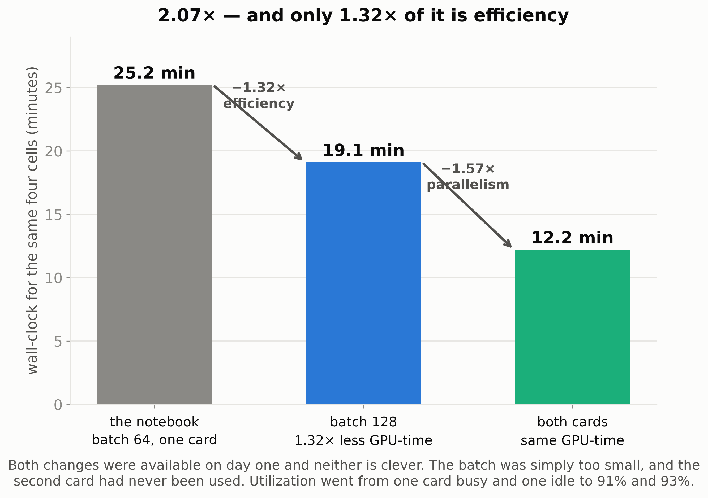
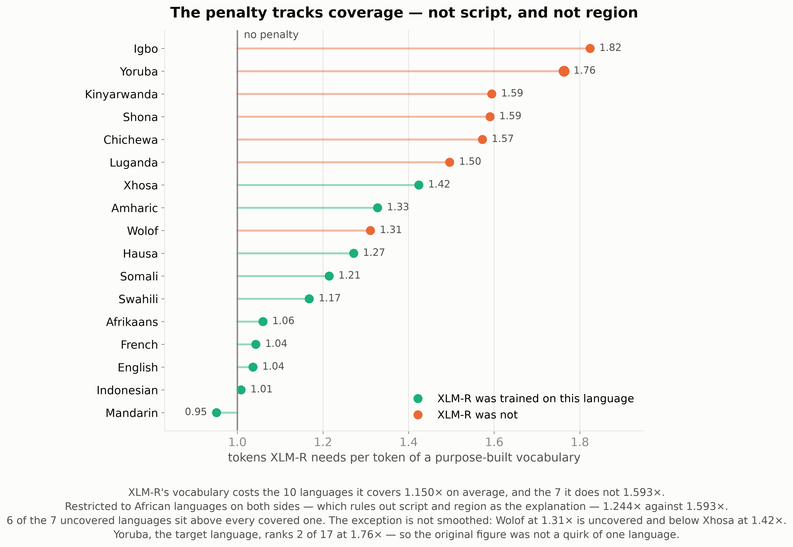
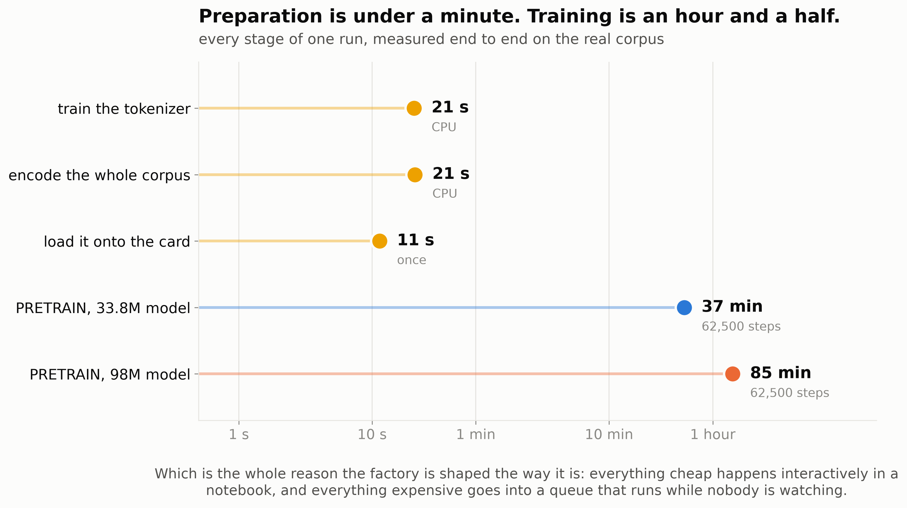
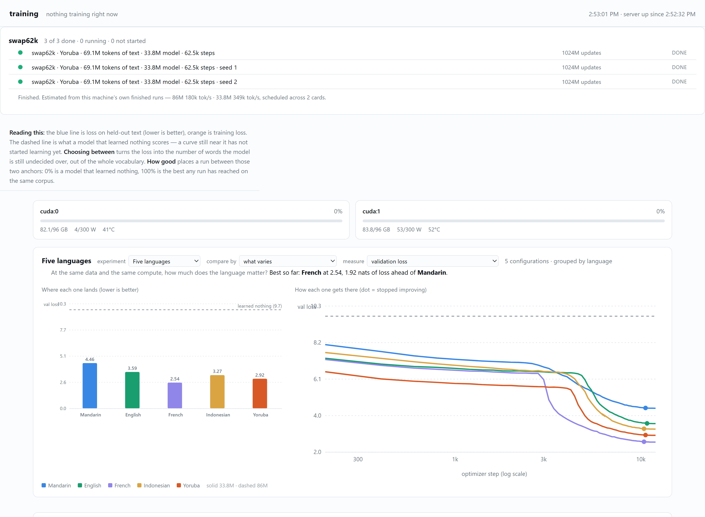
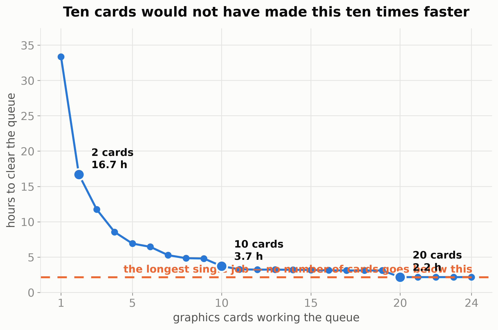
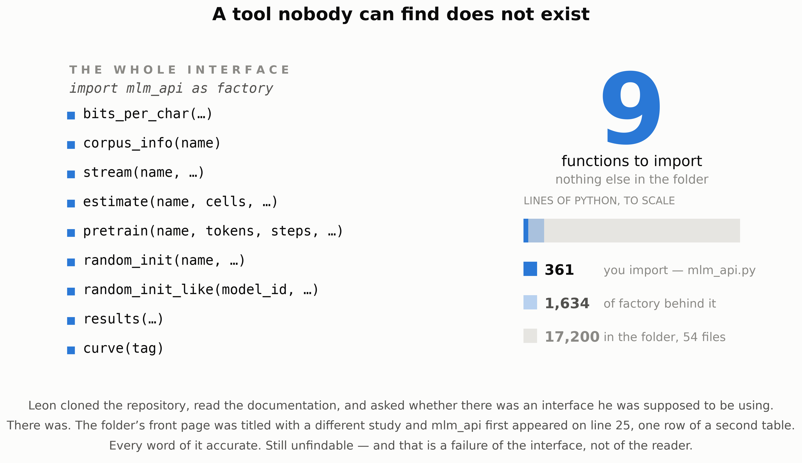
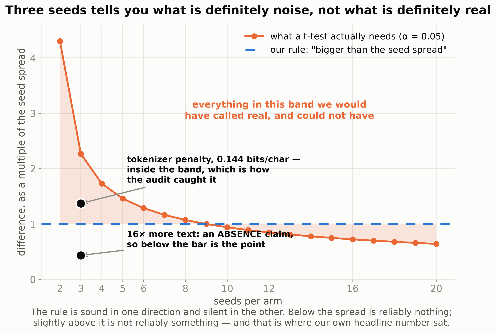
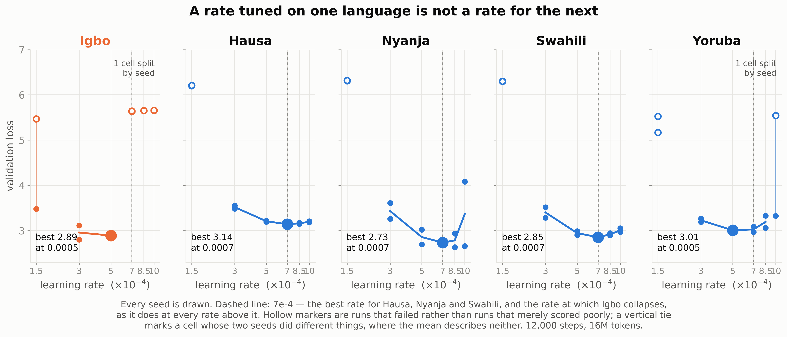
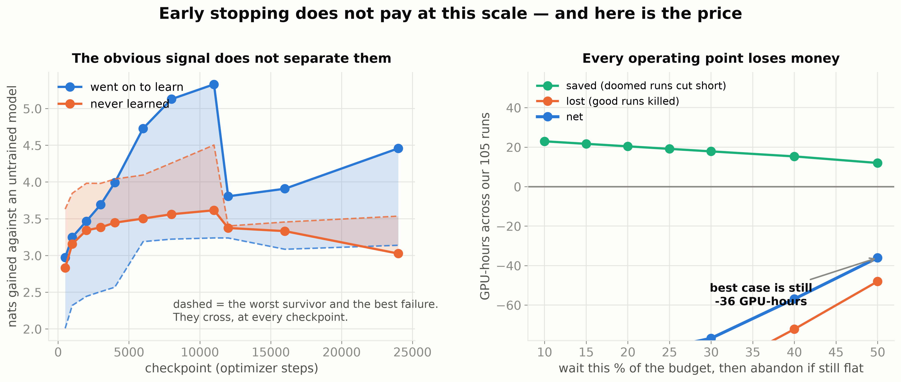

# Building a model factory: what we made, what it found, and what went wrong

*A2-NLP · CSED 504 · the plain-language version*

Written for someone who has taken an introductory machine learning course and has not built a
training pipeline before. Every technical term is explained where it first appears.

---

## Two posters, stacked

The group is presenting **two posters, hung one above the other**, because the project genuinely
has two halves and squeezing both onto one board would serve neither.

**The top poster is Patrick and Leon's: the experiment.** When is it better to train a small
language model from scratch on one under-served language than to reuse a big multilingual model?
Yoruba as the test case, the downstream tasks, the comparison against XLM-R and mmBERT, and what
the answer turned out to be.

**The bottom poster is mine: the factory.** The machinery that produced the models the top poster
compares — corpus preparation, the training fleet, the interfaces the other two called, the
dashboards, and what building it taught us about when a number is a result and when it is an
artifact.

They are meant to be read in that order, and the join between them is the point: the top poster
asks a question, the bottom poster is why it was answerable two hundred times instead of twice.
Where a finding belongs upstairs it is stated here only as far as needed to explain what the
factory was for; the top poster — [report 13](13-the-top-board.md) — carries it properly.

**This report is not the board, and the sections below are not the panels.** An earlier version of
this line claimed they were, one-for-one, and that stopped being true when the board was rebuilt:
it is **nine cells and a strip**, and this is fifteen sections of long form. One is not a subset
of the other. The board is laid out from
[the build sheet](12-the-bottom-board.md); this is where a reader goes when a cell makes them
want the whole argument. The table under *CSED 505* below is the current board, and the mapping
from each cell to the section that carries it is beside it.

---

---

## The course this would be

The clearest way to say what the bottom poster is about: **it is the syllabus for a class that
does not exist yet.**

The sequence already teaches you to build a model, one layer of abstraction at a time.

| | what it gave you |
|---|---|
| **501** | classical ML and the statistics under it — regression on house prices, `model.fit()` **is** the training, and *Elements of Statistical Learning* on the reading list |
| **502** | everything by hand, in NumPy: kNN and softmax, backprop, ConvNets, BatchNorm and Dropout, the LSTM cell, and attention — first built here, over image captions |
| **503** | the language stack: n-gram models and perplexity, GloVe, attention again and checked against PyTorch to 1e-7, minGPT on Shakespeare, decoding and distillation |
| **504** | scale, twice — images then text — on hardware you have to schedule |

### The factory is a year old, and nobody assigned it

This is the part that reframes everything below, so it goes first.

The tooling on this poster did not begin with this project. It began in **CSED 501, in autumn**,
and has been rebuilt every quarter since — none of it set as coursework, none of it provided by
an instructor.

| | | what got built alongside the assignments |
|---|---|---|
| **501** | autumn 2025 | classical ML; the habit of running the same thing on a Mac, a Windows box and Colab and expecting the same answer |
| **502** | winter 2026 | `setup_utils.py` — one import that detects Colab, mounts Drive, fixes the path, and otherwise stays out of the way locally |
| **503** | spring 2026 | **`hyper_sweep.py`, 915 lines** |
| **504** | summer 2026 | the factory on this board |

`hyper_sweep.py` is worth opening if you want to know where the rest came from. It auto-detects
CUDA, MPS or CPU and picks a different strategy for each: compiled kernels and device-resident
features on CUDA, `joblib` across cores with shared memory on CPU. It carries seeds, timing,
caching and resume. And it explains its own fallback rather than asserting it:

> *Apple's MPS backend doesn't support `torch.compile`. Without compilation every tensor op
> dispatches a separate Metal kernel — each ~3–5 µs of overhead. For tiny logistic-regression
> batches that finish their math in ~2 µs, the GPU spends more time waiting for Python than
> computing.*

That is a measured explanation of a design decision, written for logistic regression, a year
before any of this. Every habit the rest of this board argues for — measure before you assume,
say why, make it run anywhere — is already in that docstring.

**So the honest version of the progression is not that a term project produced infrastructure.**
It is that a tool built over a year for small problems met a term where the runs took ninety
minutes instead of two seconds, and had to become something else. What changed was not the
principles. It was that at this scale, being wrong got expensive enough to notice.

Every one of those ends when a model finishes training. **None of them covers what happens when
you need a hundred models and have to believe the differences between them.** That is a different
skill, it is most of what this term actually consisted of, and it is what the nine cells below
would be if they were a ten-week course.

### CSED 505: Building a Model Factory

Nine weeks as a three-by-three grid, and the tenth as the strip along the bottom, because week 10
*is* the conclusion.

Every week is a **question we could not look up**. Not one of these was answered by reproducing
somebody's result — each needed a measurement that did not exist, and three of them were run on
the two cards over the weekend this poster was written.

| | | |
|---|---|---|
| **1 · What does a run cost, and in what unit?**<br>Epochs stop being a unit the moment the dataset is a variable. Had to learn: 62,500 steps is not a choice, it is **1.024B tokens** ÷ a batch — and what the same run costs on a laptop, a Colab session and this box.<br>**Enables 2:** you cannot say a run got faster until you can say what a run is.<br>*§5 · figure — none yet, the one gap on the board* | **2 · Why optimize before anything needs it?**<br>25.2 → 12.2 minutes, **2.07×** — of which only **1.32×** is efficiency; the rest is a second card doing the same GPU-minutes in parallel. Had to learn that the hours saved are not the point: speed changes which experiments you are willing to **start**.<br>**Enables 6–9:** every result below rests on running one cell three to fifteen times.<br>*§4, §11 · figure 14* | **3 · What belongs in a notebook, and what belongs in a queue?**<br>Measure the split rather than argue it. Preparing the corpus is **53 seconds**; one pretraining run is **85 minutes** — a ratio of **96×**, which is not close enough to be a judgment call. Everything cheap stays interactive, everything expensive goes in a queue, and **both paths write the same record.**<br>**Enables 4:** work that runs unattended has nobody watching it, so it has to describe itself.<br>*§7, §8 · figure 15* |
| **4 · What makes a record survive you?**<br>Two runs silently overwrote each other; two people prepared "the same" corpus and got different vocabularies. Had to learn: a filename is an identity, a vocabulary needs a fingerprint — `15abd33de5af` — and a dashboard showing an empty queue while both cards sit at 85% is worse than none.<br>**Enables 5:** a record that describes itself is the smallest unit somebody else can pick up.<br>*§8 · figure 07* | **5 · What does someone else have to be able to call?**<br>**Nine functions**, and nothing else to import, on a folder of fourteen thousand lines they never open. Three things it had to be — callable, shareable, runnable on one card — and a fourth we got wrong: **findable.** Leon read the documentation and asked whether there was an interface he was supposed to be using. There was.<br>**Enables 6:** once other people can disagree with your numbers, "is this real" stops being private.<br>*§6, §12 · figure 19* | **6 · Is this difference real?**<br>Spread is a property of the **cell**, not a constant. And our rule, *"bigger than the spread"*, is half a rule: at three seeds a difference must be **2.27×** the spread, and the exact test cannot return a p below **0.10** at three a side however far apart the arms land. Two of our own claims were sitting in that gap.<br>**Enables 7–9:** this is the instrument the rest of the board is read through.<br>*§10 · figures 04, 13* |
| **7 · Which of your units are not units?**<br>Two vocabularies produce two losses that are not on one scale. Had to learn to convert to **bits per character** — and that a 250k output head is **5.1×** the compute per step, so matched *steps* handed one arm five times the budget and reversed the conclusion.<br>**Enables 8:** the same lesson, moved from a unit to a setting.<br>*§10 · no figure; the two readings are set as type* | **8 · Does a tuned setting transfer?**<br>We claimed adding a language was one function call — true only if the settings come too. Five languages, six rates, 60 runs: Hausa, Nyanja and Swahili all peak at **7e-4**. Igbo collapses at 7e-4 and at every rate above it. The risk is not a slightly worse model, it is a wasted night that looks like a result.<br>**Enables 9:** if runs fail this way, catch them early.<br>*§14 · figure 16* | **9 · Detect the failure, or prevent it?**<br>35 of 195 runs never learned — **17.9%**, wasting 25.5 GPU-hours. Scored against their own untrained baselines at eleven checkpoints, the two outcomes **overlap at all eleven**: the best doomed run always looks better than the worst healthy one. One rule in the grid ever fires, and it kills two healthy runs and zero dead ones. Do not build the detector — and clipping, at fifteen seeds a side, does **not** prevent divergence either (Fisher p = 1.00).<br>*§14 · figure 10* |

**10 · Writing it down so it stays true** — *the strip along the bottom.* What it cost, what we
got wrong, and the machinery that keeps a report honest after the run that produced it is
forgotten: numbers generated from records rather than typed, a staleness check that names any
sentence the data no longer supports, and the five-constants table.
*§11, §13, §15 · figure 06*

### Two findings are in this report and not on the board

The board used to carry both and no longer does, which is a decision worth stating rather than
leaving as an absence.

**Is your metric the right metric?** Across the sixteen models that trained, validation loss
correlates **−0.888** with topic classification and **+0.303** with entity recognition; the
aggregate −0.935 was three under-trained models holding up a line. It is a real result and it is
in **§10** in full. It came off the board because it needed almost none of the factory to produce
— it is a fact about the tasks, not about the machinery this poster is arguing for.

**Is the tokenizer a cost, or a coin flip?** Six pre-registered seeds shrank report 08's 0.144
bits/char penalty to 0.059 (p = 0.37) while the *spread* separated cleanly — 0.145 against 0.037,
p = 0.0098. Not a tax, a lottery. That one went **upstairs**: the tokenizer is what Patrick and
Leon's board argues about, and whoever owns the question owns the panel. It is
[report 13, panels 10 and 11](13-the-top-board.md), and figure 17 went with it.

Both survive in full here and in `poster_bottom.ipynb`. They left the board, not the project.

**Prerequisite: 504. Assessment: build the factory, then find the five places it lied to you.**

The joke in that last line is that it is the actual assessment. Every panel that reports a finding
also reports the mistake that nearly buried it, and the mistakes are the transferable part — the
models are not.

### Why this framing, and not "here is our experiment"

Two reasons, and the second is the honest one.

A poster that says *we got five things wrong* reads as a confession. A poster that says *here are
the ten weeks it would take not to get them wrong* reads as expertise. The content is identical.

And it is what you would actually tell the next student. Nobody needs our Yoruba checkpoints. What
transfers is the order in which the traps arrive, which is what a syllabus is.

---

---

## Summary

Our group asked a question about language: **when is it better to train a small language model
from scratch on one under-served language than to reuse a big multilingual model trained on a
hundred languages at once?** Yoruba — spoken by around 45 million people, and badly served by
most language technology — was the test case.

That question is the **top poster**. My half was **building the machinery that could answer it**,
and then finding out what building it teaches you — and that is this poster, the one below it.

Six things we can now say, none of which we believed at the start:

**A tiny model beat a much larger one at the task that needs meaning.** A 33.8-million-parameter
model trained on 64 million words of Yoruba scored **0.688** at sorting Yoruba text into topics.
mmBERT — 246 million parameters, and reported by its authors as trained on roughly three trillion
words across 1,800 languages — scored **0.582**. Ours is about a seventh the size and saw
something like one part in fifty thousand of the text.

**"Beat" is the right verb now, and it took two corrections to get there.** This paragraph used to
read 0.666 against 0.595, a margin of 0.071, and it told you to say *ahead* rather than *beats*
because the confidence intervals overlapped. Both halves were wrong, for unrelated reasons.

The numbers were wrong because both arms picked their learning rate on the same 204 test items
they were then scored on. Choosing on SIB-200's held-out 99-item dev split instead — Patrick's
[report 11](11-selecting-on-the-dev-split.md) — moves ours to 0.688 and mmBERT to 0.582, and the
margin *grows* to **0.106**.

The verb was wrong because "do the intervals overlap" is not a test of whether two models differ.
Two 95% intervals miss each other only when the margin clears 1.96 × (SE₁ + SE₂), which is
algebraically the assumption that the two models' per-item errors are perfectly *anti*-correlated
— and both models are being scored on the same 204 items, so that is the least plausible
assumption available. Its effective α is 0.0056. The bar it set here was 0.1100 against a margin
of 0.1059: it missed by 0.004.

Tested rather than eyeballed, on five seeds a side:

| | |
|---|---|
| margin | **+0.106** |
| all five of our seeds beat all five of mmBERT's | exact permutation **p = 0.008** — the floor at 5v5 |
| against the seed spread | **4.05×**, where 1.46× is the bar at five seeds |
| adding test-set uncertainty back in | z = 2.46, **p = 0.014** |
| intervals | still overlap, by 0.004 |

What is *not* established is that this margin would hold on a different Yoruba topic corpus.
SIB-200's Yoruba split is 204 translated Flores items in one domain, and nothing here speaks to
another one. That is a real limit and it is separate from whether these two models differ on
these items, which they do.


(The parameter counts we measured ourselves from the published configurations. The training-data
figure is the authors' claim, not something we can verify.)

**Yoruba is not a hard language to model. It is an under-served one.** Given the same amount of
text and the same amount of computer time, a model learns as much structure from Yoruba as from
English. Nothing about the language resists being learned; what is missing is the text and the
tooling.

**The disadvantage a multilingual model carries is in its vocabulary, not in the language.** We
measured this two independent ways and they agree.


**More Yoruba text would not have helped much.** Past roughly 64 million words, adding sixteen
times more text produced no measurable improvement. That is a surprising and slightly deflating
result: the field's usual complaint about low-resource languages — *there isn't enough data* —
was not our binding constraint.


**The bigger model was not too big. It was misconfigured.** One setting, changed from 1.0 to 0.5,
moved its score by a full unit and made it thirty-eight times more reproducible.


Thirteen runs of that model, every setting identical. They do not scatter around an average —
they land in two groups with nothing in between. Reporting the mean of those thirteen numbers
would describe a run that never happened.

**And the most useful finding is not on that list.** Five separate times, a number that looked
like a scientific result turned out to be an artifact of a setting nobody had questioned. Section
9 is about those five, because they are the part a student can actually use.

---

---

## The problem, in two halves

Think of the project as a building with two floors — which is literally how the two posters are
hung, one above the other.

**Upstairs, Patrick and Leon** are asking the research question. Does a small, language-specific
model beat a large multilingual one for Yoruba? To answer that they need trained models to
compare, evaluation harnesses to score them, and enough repetitions to know whether a difference
is real or luck.

**Why Yoruba, and what it is like.** Yoruba is spoken by about 45 million people in Nigeria, Benin
and Togo. It is written in the Latin alphabet with three tone marks, which matters more than it
sounds — *ọkọ* can mean husband, vehicle, or hoe depending on the marks, so software that strips
accents destroys meaning rather than merely looking untidy. It is a **low-resource** language, and
that phrase means something concrete you can measure:

| | English | Yoruba |
|---|---|---|
| Text we could collect | 4.7 billion characters | 260 million characters |
| Usable training tokens | 1.1 billion | 69 million |
| Wikipedia articles | ~7,000,000 | ~34,000 |
| Characters per token, our vocabulary | 4.25 | 3.73 |

**Sixteen times less text.** That is the whole difficulty in one number, and it is not a property
of the language — it is a property of what has been written down and digitized. This is why "is
Yoruba harder to model, or just less served?" was worth asking, and why the answer mattered.
**Downstairs — my half — is the machinery that produces those models.** Collecting text.
Converting it into a form a GPU can train on. Running dozens of training jobs across two graphics
cards without them colliding. Recording what happened so a result can be traced back to the exact
settings that produced it. Noticing when a run has gone wrong.

The split matters because the two floors fail differently. Upstairs, a wrong answer looks like a
wrong answer — you argue about it. Downstairs, a wrong answer looks like **a perfectly reasonable
number**, and nobody argues with it at all.

Almost everything this project got wrong, it got wrong downstairs. That asymmetry is why the
downstairs half is worth a poster of its own rather than a footnote on Patrick and Leon's: the
failures that cost this project the most time were never wrong *answers*, they were reasonable
numbers produced by machinery nobody was looking at.

**So why did we train models on English, Mandarin, French, Indonesian, and twelve more?** Not
drift. Three of those languages are doing specific jobs no Yoruba run could do:

- **English is the ruler.** To say "Yoruba is not harder to model, it is just under-served" you
  need a language where data is *not* the constraint, run at the same sizes with the same tooling.
  The 1.1-billion-token English ladder exists so the Yoruba result has something to be measured
  against. It is also what showed that more data stops helping past 64 million words — a fact we
  could never have established on Yoruba, because Yoruba does not have more.
- **Mandarin and French are the control group.** Our central claim is that XLM-R's vocabulary is
  expensive *for languages it was not trained on*. The obvious objection is that it might just be
  expensive for African languages, or for languages with tone marks, or for anything unfamiliar.
  The only way to kill that objection is to run the same measurement on languages XLM-R **was**
  trained on. French and Indonesian come out at 1.04 and 1.01 — essentially free — and Mandarin at
  0.95, actually cheaper. Seventeen corpora, and the split falls exactly along coverage.
- **The twelve African languages are the gradient.** One language gives you an anecdote. Seventeen
  gives you a slope, and a visible exception (Wolof, at 1.31, is uncovered but cheap) that an
  anecdote would have hidden.

And there is a fourth reason that is honestly about the tooling rather than the science: **adding
a language is one function call**. Twelve of them trained in 48 minutes. A factory that can only
make one thing is not a factory, and the cheapest way to prove the layering worked was to point it
somewhere it had never been pointed.

I joined the group partway through the term, after they had a working proof of concept in a
notebook. The immediate question was not "what should we discover" but "what would let these two
people run ten times as many experiments without ten times the effort".

---

---

## The hypothesis

I had already built something similar for the computer-vision half of this course: a set of tools
for training many image classifiers across a grid of settings and comparing them fairly.

**The hypothesis was that the machinery would transfer even though the subject would not.**

An image classifier and a language model have almost nothing in common at the level of the maths.
One looks at pixels and predicts a category; the other looks at text and predicts missing words.
But the *scaffolding* around them is nearly identical: you still need to prepare data once and
reuse it, still need to run many jobs across the hardware you have, still need to record results
so they can be compared, still need to notice when something has gone wrong at 3am.

If that guess was right, most of the work would be adaptation rather than invention, and the
group would get their tooling in days instead of weeks.

**It was mostly right, and the exceptions were the interesting part.** We measured how right
later: of the code involved, about 1,700 lines are specific to language modeling and everything
underneath — the scheduler, the dashboards, the record-keeping — is not. The two studies share
that layer.

---

---

## Goals

Stated at the start of the term and repeated here because the honest version of a goals section
is the one you can be held to afterwards.

**The group's goal, which is the top board's:** find out whether a small language model trained
from scratch on one under-served language beats reusing a large multilingual one, using Yoruba as
the test case and two real downstream tasks to judge it.

**My goal, which is this board's:** build the machinery that makes that question answerable more
than once. Not one model — a way of producing models where any two of them can be compared and the
comparison believed. Concretely, four things:

1. **A unit and a budget** that stay meaningful when the dataset is the variable, so two runs at
   different scales are comparable at all.
2. **Throughput** sufficient that a hunch is worth acting on — the difference between an
   experiment somebody runs and one they decide against.
3. **Records that outlive the session**, so a result found in August can be checked in
   September by somebody who was not there.
4. **An interface two other people can call** without reading the code, and results reproducible
   enough that they can disagree with a number rather than accept it.

**What would count as failure**, written down in advance: if Patrick and Leon had ended up running
their own training loops, the factory would have failed regardless of how well it worked for me.
That is the test the fifth panel reports against, and it is the reason discoverability turned out
to matter as much as correctness.

**One goal that changed.** The original proposal said "make the study reproducible." By the end
the more useful framing was **challengeable** — reproducible is a property you assert, and
challengeable is one somebody else demonstrates by using your tooling to prove you wrong. Five
times, as it happens, and every one of them improved a number on one of these two boards.

---

## Panel 1 — What does a run cost, and in what unit?

**Big number:** `62,500 steps = 1.024B tokens`

**Problem.** Every course up to this point measured training in epochs, and an epoch is a
perfectly good unit as long as the dataset is a constant. The moment the dataset becomes a
variable — which is the first thing any scaling study does — an epoch stops meaning anything
comparable between two runs.

**Hypothesis.** We assumed, without stating it, that "train for N epochs" was a fair way to give
two models the same amount of work. That assumption is invisible precisely because every prior
course held the dataset fixed, so nobody had ever needed to question it.

**Approach.** Vary the corpus from 4M to 1,024M tokens and hold the step budget fixed, then look
at what an epoch has become. At 4M tokens the model sees the corpus sixty times; at 1,024M it sees
a quarter of it once. The unit that stayed meaningful across all of it is **tokens of updates**:
steps × batch × sequence length, which is 62,500 × 128 × 128 = 1.024 billion regardless of what
corpus is behind it. That number is not a choice anybody made — it is a compute budget divided by
a batch size, and it was inherited from a notebook before anyone checked what it implied.

**Results.** Every run in this project is quoted in tokens of updates. The step count is a
consequence, not a setting, and the two are only interchangeable while the batch size is frozen —
which is why the batch is 128 in **191 of 197** pretraining runs and why the fleet queues are
written in update tokens rather than steps.

**Learning.** Epochs stop being a unit the moment the dataset is a variable, and scaling studies
make it a variable by definition. Pick the unit that survives the thing you intend to vary, and
write it into the tooling so nobody has to remember. The cost of getting this wrong is not a bad
number — it is two numbers that look comparable and are not.

**Source.** Every pretraining record, via `mlm_api.results('*')`; the step and batch fields are
written by `mlm_train.py` at the end of each run. The 4M-to-1,024M ladder is `runs/scaling_law.json`
(`scaling_law.py`).

**What this makes possible.** You cannot say a run got faster until you can say what a run *is*.
Panel 2 is the measurement, and it needs this unit to be meaningful.

---

---

### In depth — Budgeting a training run: the unit you were taught, and where it stops working

Every visitor will eventually ask why one run takes ninety minutes. The honest answer is a short
lesson in why the unit you learned first quietly stops being a unit — and you have already written
every piece of it by hand in an earlier course.

##### The habit, and why it was correct

By the end of 503 you had built a language model from the bottom: n-gram counts with add-k
smoothing in A2, attention from scratch in A4, plugged into minGPT on Shakespeare. In 502 you
wrote `lstm_step_forward` and its backward pass by hand. And in every one of those, and in the
image half of 504, work was measured in **epochs**.

That was correct, because of a property so dependable nobody names it: **the dataset was a fixed
object.** In 503 A4, a batch was a batch of *lines* — every Shakespeare line truncated or padded
to `MAX_LEN = 100`. A fixed set of lines has a well-defined "once through":

```
N lines  ÷  batch size  =  steps per epoch          <- a real, countable thing
```

Same for CIFAR-100's 50,000 images. Because the denominator never moves, "40 epochs" and "15,600
steps" and "2 million examples seen" are three names for one quantity. Pick whichever reads best.

##### The exact moment it breaks

The factory replaced A4's padded lines with **windows over a continuous stream** — `text_data.py`
holds the whole corpus as one flat array and each batch is a gather of random `seq_len`-token
windows. No padding, no `<PAD>`, no wasted positions.

That change is worth about a third more useful compute per batch, and it costs you the epoch.
Once you are sampling windows from a stream, **"one pass over the data" is a choice of stride, not
an object you can count.** There is no natural moment at which the corpus has been consumed.

And then the second break, which is the one that actually matters here. Our English study trains
on 4M, 16M, 64M, 256M and 1024M tokens — **the dataset size is the experiment.** Suppose we had
asked for forty epochs at every rung:

| corpus | 40 epochs means | compute used |
|---|---|---|
| 4M tokens | 160M tokens processed | 1× |
| 1024M tokens | 40,960M tokens processed | **256×** |

The big-data arm gets 256 times the compute. When it wins, we have learned nothing — "more data
helped" and "more compute helped" are indistinguishable. **The experiment would be confounded by
its own unit.**

##### Where 62,500 steps actually comes from

It was never chosen. It is derived, and the direction is the whole point:

```
1. choose the COMPUTE BUDGET     1,024,000,000 tokens of training
2. choose the batch shape        128 sequences × 128 tokens = 16,384 tokens per step
3. divide                        1,024,000,000 ÷ 16,384    = 62,500 steps
```

Nobody picked 62,500. Somebody picked **1.024 billion tokens**, and 62,500 is what that becomes
once the batch is fixed. Run the same study at batch 256 tomorrow and it is 31,250 steps — same
experiment, different number, which is the tell that steps were never the real unit.

And 1.024 billion is the **top rung of the data ladder**, chosen so the largest corpus gets
exactly one pass: every token seen once, no repetition. That is the clean reference point, and
every smaller rung becomes a measured amount of repetition against it:

| corpus | passes, at a fixed 1.024B-token budget |
|---|---|
| 4M | 256 |
| 16M | 64 |
| 64M | **16** |
| 256M | 4 |
| 1024M | **1** |

Identical compute in every row. Only the data moves. *That* is an experiment about data.

##### So why not train for 30,000 steps and save an hour?

Three reasons, worst last.

**It asks a different question.** 30,000 steps is 491M tokens — a different budget, so the answer
cannot be set beside the 105 runs already recorded.

**It breaks the design.** At the 1024M rung, 30,000 steps is 0.48 passes: the model never sees
half its corpus, and the "largest corpus gets exactly one clean pass" property that makes the
ladder readable is gone.

**The run is genuinely unfinished.** The learning-rate schedule anneals to zero at the *planned*
end. Stopping at 30,000 of 62,500 does not give a slightly worse model — it gives a model caught
mid-schedule with a large learning rate still applied, which is the top half of figure 08.

##### Where the epochs went

They stopped being what we set and became what we measure, recorded in every run as `passes`:

| | 503 A4 / CIFAR-100 | this study |
|---|---|---|
| one example | a padded 100-token line / a 32×32 image | a 128-token window of a stream |
| the dataset | fixed | **the independent variable** |
| one epoch | N ÷ batch, countable | undefined — depends on stride |
| what we FIX | epochs (40) | tokens (1.024B) |
| what FALLS OUT | steps (~15,600) | passes (**14.8** on Yoruba) |

##### The bug this left in our own records

Open any loss curve in this project. There is a field called `epoch`. At the end of the Yoruba run
it reads **125**. The true number of passes is **16**.

```
step 62,500     epoch field = 125     <- step ÷ 500, the logging interval
                passes      = 16.0    <- the truth
```

The field came across with the image code, where it genuinely *was* an epoch because the
denominator never moved. Ported to a token stream it kept the name and lost the meaning: it counts
log lines now. For weeks the dashboard showed "125 epochs" to people who reasonably read it as 125
passes — an eightfold error — and nobody caught it, because the number looked plausible.

##### Ninety minutes on what?

"A run is ninety minutes" is only useful if you know what it is ninety minutes *on*. Almost nobody
reading this board owns two Blackwell cards, and the number a student needs is the one for the
machine in front of them. `bench_portable.py` measures it anywhere — no corpus, no tokenizer, no
repository data, because a transformer's cost per step does not depend on which token ids arrive,
so a stream of random integers times identically to real text and the file pastes into a fresh
Colab cell.

| machine | 33.8M model | 98M model | one 62,500-step run (98M) |
|---|---|---|---|
| **Toothless** — 1 × RTX PRO 6000 Blackwell Max-Q, 96 GB | 382k tok/s | 184k tok/s | **93 min** |
| Surface Studio Laptop — RTX 2000 Ada Mobile | *to measure* | *to measure* | |
| Google Colab — free tier | *to measure* | *to measure* | |
| Google Colab — paid tier | *to measure* | *to measure* | |
| MacBook Pro — Apple Silicon, MPS | *to measure* | *to measure* | |

The Toothless figures are medians across 96 and 55 completed runs, not a short probe — sustained
rates after the card is hot, which is the only kind worth quoting. A twenty-step benchmark on a
cold card reads about 10% high, and a benchmark run while another job holds the same card reads
about **half**, which is a mistake we made and the script now warns about.

##### How to tell these cards apart

Colab offers you a menu — T4, L4, A100, two kinds of TPU — with no explanation, and most students
have no reason to know that "T4" is a 2018 part or that a TPU is not a fast GPU. Three properties
decide everything, and none of them is the headline number on a spec sheet.

| | generation | memory | bf16? | what that means here |
|---|---|---|---|---|
| **T4** | Turing, 2018 | 16 GB GDDR6 | **no** | Colab's free card. Predates bf16, so our stack silently falls back to fp16 — which works, but is the precision we chose *not* to use |
| **L4** | Ada, 2023 | 24 GB GDDR6 | yes | the value option: modern instruction set, modest bandwidth |
| **A100** | Ampere, 2020 | 40 or 80 GB **HBM2e** | yes | older architecture than the L4 and far faster anyway, because HBM has roughly 5× the memory bandwidth |
| **RTX 2000 Ada Mobile** | Ada, 2023 | 8 GB GDDR6 | yes | a laptop card. Modern, but 8 GB is the binding constraint |
| **RTX PRO 6000 Max-Q** | Blackwell, 2025 | 96 GB GDDR7 | yes | ours. Compute capability 12.0, 188 SMs, both measured rather than quoted |
| **Apple M-series** | — | *unified* | not in PyTorch | a different world; see below |
| **TPU v5e / v6e** | Google | — | — | **not a GPU.** Different programming model entirely — `torch_xla`, a different training loop. Our code exits rather than pretend |

*Vendor figures except where noted as measured. Treat them as ordering, not arithmetic.*

**The three things that actually decide it**

1. **Does the model fit?** This is binary and it beats everything else. The 98M model at our batch
   needs about 10 GB; on an 8 GB laptop card the answer is simply no, and no amount of patience
   changes it.
2. **Memory bandwidth, not FLOPS.** Our models are small and our batches are small, so the card
   spends its time moving parameters, not multiplying them. That is why an A100 — a *older*
   architecture than an L4 — beats it comfortably: HBM2e against GDDR6.
3. **Generation, because of bf16.** Anything before Ampere lacks bfloat16. On a T4 our stack falls
   back to fp16, which needs loss scaling and is the failure mode we deliberately avoided.
   Compute capability is the honest way to read this: our card reports 12.0, a T4 reports 7.5.

**Apple Silicon, which is the comparison people get most wrong**

A MacBook Pro with 48 GB of unified memory can *hold* a model that will not fit on an A100-40GB.
It will still train it many times slower, and the reason is worth understanding because it
generalizes: **holding and computing are different constraints.**

- **Unified memory is not VRAM.** It is shared with the operating system and everything else
  running, and its bandwidth is on the order of a few hundred GB/s against an A100's ~1,500–2,000.
  For a workload that is bandwidth-bound, that ratio *is* the performance ratio.
- **The Neural Engine does not participate.** It accelerates inference through CoreML; PyTorch
  training runs on the GPU cores through MPS and never touches it.
- **The software stack is thinner.** Many fused kernels simply do not exist on MPS, and our
  benchmark runs fp32 there deliberately rather than pretend autocast is equivalent.

So the MacBook row in the table above is **not comparable to the CUDA rows**, and we label it
rather than quietly listing them side by side. It is there to answer "can I try this on my
laptop?" — for which the answer is yes for the small model, and the honest cost is a number, not
a shrug.

##### You do not need the workstation

This is the part we would put in the largest type on the board, because the $24,000 of graphics
cards is the number that makes a reader decide this work is not available to them.

**It is available to them.** The entire project — 105 pretrained models, 172 fine-tuning runs,
143.3 GPU-hours — is reproducible on a Colab subscription. Working from measured throughput and
Colab's published compute-unit rates:

| where | the whole project | inside a $500 budget? |
|---|---|---|
| Colab A100 | ~100 GPU-hours, ~$120 | **yes, at a quarter of it** |
| Colab L4 | ~185 GPU-hours, ~$220 | **yes** |
| Colab T4 (free tier's card) | ~460 GPU-hours, ~$550 | marginally not — but every experiment that matters fits |

Those rows are estimates until `colab_reproduce.ipynb` returns real numbers; that notebook
retrains the exact headline model on Colab and computes the table from what it measures rather
than from a guess.

**Against $24,000 of cards, $120 is two hundred times cheaper.** The workstation bought us
*latency* — an answer in ninety minutes rather than tomorrow — and cell 2 argues that latency is
what let the project find its own mistakes. It did not buy access to the science. A student with a
subscription and patience can run every experiment on this board.

##### And the third route, which costs nothing at all

There is an option between "buy a workstation" and "pay for cloud" that almost nobody proposes to
students: **plug your laptop in and let it train while you sleep.**

Eight hours a night, five nights a week, is **40 GPU-hours a month for free** — on hardware you
already own and are not using between midnight and eight. Our entire project was 143.3 GPU-hours.
Even at four or five times a laptop's disadvantage, the small-model half of this study is a
month of nights. Drop the 98M model, which will not fit in 8 GB anyway, and it is comfortably
less.

| route | money | elapsed | what you need |
|---|---|---|---|
| buy the workstation | ~$24,000 | ~5 nights | the money |
| rent Colab | ~$120–220 | a few weeks of sessions | a subscription and patience with queues |
| **your own laptop, overnight** | **$0** | **~a month of nights** | a power cable and a queue that survives being left alone |

That last column is the point, and it is where this whole board turns out to be about something
other than two expensive cards.

**The factory is worth more the less hardware you have, not less.** Everything on this poster that
looks like infrastructure for a big machine is exactly what makes the laptop route possible:

- a **queue** you describe once and walk away from — because you are asleep, not supervising;
- **`reuse=True` on everything**, so a night that ends early costs nothing and the next one
  resumes rather than restarting;
- **records that survive the run**, because on a thirty-night study you will not remember what
  night eleven was for;
- **a dashboard**, because the failure you cannot see at midnight is the one that wastes the
  whole month.

Someone with two Blackwell cards can get away without any of that. They will notice a wasted night
the next morning. On a laptop over a month, a silent failure on night three is discovered on night
thirty — which is the difference between a study and nothing.

**Three practical notes for the overnight route.** Keep it plugged in: our own a1-cv measurements
found a 17% swing from thermal boost behavior, and a battery-throttled night is not comparable to
a mains one. Disable sleep, not just the screen. And expect sustained throughput to sit below any
short benchmark, because a laptop chassis cannot hold peak clocks for eight hours — which is
another reason the honest number is the one measured over a real run rather than over forty steps.

Three caveats, because this is the number people will quote:

- A subscription buys a **queue, not a machine.** Sessions end. The 34-hour studies here would
  have to be cut into resumable pieces — which our `reuse=True` convention already supports, and
  which is a good argument for having built it.
- You get **whichever GPU is free**, so a study split across an A100 and an L4 has hardware as an
  uncontrolled variable. Week 3's fingerprint discipline is exactly the tool for noticing that.
- **Owning wins eventually.** The crossover against rental is ~9,300 GPU-hours. This project used
  83 — 0.9% of the way there.

Two things this table is really for. The first is that "it does not fit" is a legitimate entry: a
mobile card with 8 GB cannot hold the 98M model at this batch, and knowing that before you plan a
term is worth more than any throughput number. The second is the ratio — if the same study is four
days on a laptop and thirty-four hours here, that difference is not convenience, it is the
difference between a study you run and a study you abandon. Which is the whole argument of cell 2.

##### You have met this exact trap before

In 503 A2 you learned that perplexity depends on the `<unk>` threshold: change which rare words
collapse to a single token and you change the vocabulary, and two n-gram models with different
thresholds cannot be compared by perplexity at all.

That is *precisely* the problem this project hit again with tokenizers. A 16k vocabulary and a
250k vocabulary produce losses that are not on the same scale, which is why nothing here is
comparable until it is converted to **bits per character** — the unit that divides out the
vocabulary, exactly as A2's fixed-vocabulary rule did by hand.

Same lesson, five years of abstraction apart, and we rediscovered it the expensive way. That is
the argument for this whole poster: the traps do not get more sophisticated as the models do, they
just get harder to see.

---

---

## Panel 2 — Why optimize before anything needs it?

**Big number:** `2.07×` — of which only **1.32×** is efficiency




**Problem.** Nothing needed to be fast yet. The study had a handful of runs, they finished
overnight, and the received wisdom — profile when it hurts — says optimizing at that point is
premature.

**Hypothesis.** We expected the speed work to buy hours, and hours were not scarce. The
counter-argument, which turned out to be the real one, is that speed does not only shorten the
work you already planned; it changes which work you are willing to begin.

**Approach.** The 2.07× on the board is the *last two steps* of about a year, and quoting it
alone badly undersells what a student would have to learn. The path ran from hand-written NumPy in
CSED 502, through PyTorch in 503, to a workstation whose two cards sit at 91% and 93% under load.
Almost none of it was clever; nearly all of it was measuring instead of assuming, and roughly a
third of what was tried turned out not to be worth keeping. The full list is below because the
*shape* of it is the teaching point: the wins are concentrated in the data path and in precision,
not in the model.

**Results.** 25.2 minutes → 12.2 minutes on the same four cells, decomposed honestly: **1.32× is
real efficiency** — less GPU-time for the same work — and the rest is a second card doing the same
GPU-minutes in parallel. The project has since spent 143.3 GPU-hours; without the throughput work
it would have been roughly double, which on realistic evenings is weeks rather than nights.

**Learning.** The hours saved are not the point; the experiments you become willing to start are —
four of the five corrections on this board came from a cheap re-run somebody did on a hunch, and a
hunch is not worth acting on at 25 minutes a cell. Conflating efficiency with parallelism is how a
project claims 2× and bought 1.3×, so decompose any speedup before quoting it. And optimize early
when what you are buying is *iteration* rather than throughput.

**Source.** `runs/pipeline_bench.json` (`pipeline_bench.py`) for the stage timings in change 4;
the 2.07× decomposition is report 03, measured on the four-cell comparison it names. Rows without a
record file were measured once at the time and are marked as such in the table.

**What this makes possible.** Weeks 6 through 9 each rest on running one cell three to fifteen
times. At 25 minutes a run nobody would have done that, and every result below would have been a
single seed with an anecdote attached. Panel 3 is where that affordability stops being about the
clock and starts being about where the work runs.

### The year, in twenty changes

Measured on this hardware unless marked. "Kept?" matters as much as the number — a third of these
were tried and rejected, and a list of only the wins would be marketing rather than a log.

#### The data path — where most of the win actually is

| # | change | measured impact | kept? |
|---|---|---|---|
| 1 | **Delete the DataLoader; hold the dataset resident in GPU memory.** One CPU core augments ~4,000 img/s while the card trains at ~13,000 — the CPU was starving the GPU 3× and the card spent its life waiting on Python. | CIFAR: 13.8k img/s (workers, bs128) → **18.5k** (resident, bs512), at far higher utilization | yes |
| 2 | **Store images as uint8, convert to float per batch.** Float residency would be 4× the memory for no gain; the conversion is nearly free on-device. | CIFAR-100 train = **147 MB**; ImageNet-32 = 3.9 GB on a 96 GB card | yes |
| 3 | **Augment on the GPU** — crop, flip, erase, normalize as tensor ops on data already in VRAM. | no PIL, no JPEG decode, no Python in the inner loop, no per-batch host→device copy | yes |
| 4 | **Tokenize once, up front, into a flat array.** Training never touches raw text, the tokenizer, or the datasets library again — it indexes. | prep is **53 s** against 85 min of training: a 96× ratio | yes |
| 5 | **Choose the token dtype from the vocabulary**, not a fixed uint16. | yor at 16k vocab: 2 bytes/token, **0.15 GB**. yor_xlmr at 250k: 4 bytes, **0.49 GB** — same text | yes |

#### Precision and kernels

| # | change | measured impact | kept? |
|---|---|---|---|
| 6 | **bf16 autocast instead of fp16.** Same speed, but bf16 keeps fp32's exponent range — no GradScaler, no loss-scale underflow to diagnose at 3 a.m. | **1.34×** on a power-capped sm_89 laptop (with #7); ~**+2%** on Blackwell | yes |
| 7 | **channels_last (NHWC) for CNNs — bf16 only.** | see #6 — and the trap: fp16 + channels_last drops into a pathological cuDNN path, **3.5× slower** on sm_89 | yes, guarded |
| 8 | **channels_last for ViTs** | a no-op for a transformer; pure overhead | **no** |
| 9 | **TF32 for matmul and cuDNN** | free on Ampere and later | yes |
| 10 | **`cudnn.benchmark = True`** — let cuDNN autotune per shape | worth it when shapes are fixed, which ours are | yes |
| 11 | **Fused optimizers** — `SGD(nesterov, fused=True)`, `AdamW(fused=True)` | one kernel instead of a chain of elementwise ops | yes |
| 12 | **`torch.compile`** | **unavailable**: Windows PyTorch wheels ship without Triton, and `triton-windows` is unreliable on Blackwell | **no** |
| 13 | **Attention backend** | already `sdpa`; nothing to win | **no change** |

#### Host-sync discipline

| # | change | measured impact | kept? |
|---|---|---|---|
| 14 | **Every `.item()` is a GPU→CPU sync.** Accumulate loss and top-k counts in on-device tensors; pay the sync once per epoch, not once per batch. | **~7%** on CIFAR | yes |
| 15 | **The same discipline at MLM scale** | only **2%** — an MLM step is ~23 ms against a CNN step's fraction of a millisecond, so the sync is genuinely in the noise. **Kept the `.item()`**: a readable live loss is worth 2% | **rejected** |
| 16 | **`zero_grad(set_to_none=True)`** | skips a full zero-fill of every gradient buffer | yes |

#### Batching and scheduling

| # | change | measured impact | kept? |
|---|---|---|---|
| 17 | **Batch 64 → 128** | **1.33×** predicted from the sweep, **1.31×** measured. Throughput *peaks* at 128–256 and then falls — batch 2048 is slower than 128 while using 89.7 GB. There is no reward for filling the card | yes |
| 18 | **Memory-saving tricks** (gradient accumulation, checkpointing) | peak allocation at the shipped config is **3.3 GB of 96**. Nothing here is memory-bound; this would have been wasted effort | **no** |
| 19 | **Use the second card** | utilization **91% and 93%** at 300 W each, against one card busy and one idle | yes |
| 20 | **Order the queue longest-budget-first.** Card 1 finished its long cell at 7.9 min then sat at 1–3% for four minutes while card 0 worked the tail — both short cells had landed behind a long one. | projected **2.55×** against the observed 2.07× | yes |

**Two more that are not speed-ups and matter more than several that are.** The compute axis moved
from *optimizer steps* to *tokens of updates*, because steps are not comparable across batch sizes
— raising the batch while holding steps fixed would have been a different, larger experiment that
scores better, and reporting it as a speed-up would have been wrong. And `pretrain(reuse=True)`
means re-running a notebook to iterate on the fine-tuning gates no longer spends twenty minutes
reproducing checkpoints that are already on disk.

**What the shape of that list says.** Fourteen kept, six rejected or unavailable. The largest
single win was deleting a component (#1) rather than tuning one, the second largest was a dtype
choice (#6), and the model architecture was never touched. Also worth a student's attention: #7
and #15 are the same idea evaluated on two workloads and answered differently, which is the whole
reason the list has a "kept?" column.

---

---


### What the capacity actually bought: 1,089 models and sixteen languages nobody was studying

The throughput number is abstract until you count what got run with it. **The factory trained
1,089 models** — 197 pretraining runs and 892 individual fine-tuning runs — from **30 seconds to
2 hours 10 minutes** each, 148 GPU-hours in total. On its busiest day it put through **44.7
GPU-hours across 69 runs**, which is more than a wall-clock day on two cards.



**And only one of those languages is the one we were studying.** Yoruba is 48 of the 197
pretraining runs. English is 70. The rest are Hausa, Igbo, Nyanja, Swahili, Wolof, Xhosa, Shona,
Kinyarwanda, Luganda, Somali, Amharic, Afrikaans, Mandarin, French and Indonesian — 22 corpora
across 17 languages. That looks like scope creep and it is the opposite: **three of the group's
findings are unprovable without them.**

**Why English.** All of FineWeb-2's Yoruba is 69.1M tokens, and the top rung already uses 93% of
it, so *the data axis cannot be varied in Yoruba at all.* The question "does more text help?" is
unaskable on the language we care about. English has effectively unlimited text, so the ladder
runs there — 256× of data at fixed compute — and the answer that comes back, that more text buys
nothing measurable past a threshold, is what licenses the sentence **"this study is compute-bound,
not data-bound."** That sentence is about Yoruba and could only be established somewhere else.

**Why Mandarin, French and Indonesian.** The group's thesis is that a multilingual vocabulary
costs you in proportion to how badly the language is covered. Tested only on Yoruba, that is one
number with no way to tell coverage from three confounds: script, region, and morphology. Yoruba
is Latin-script, African, and agglutinative-ish all at once. So the gradient spans **ten covered
and seven uncovered languages** across four scripts and three continents, and it is that spread
which lets the figure's title say **"the penalty tracks coverage — not script, and not region"**
rather than merely "Yoruba is expensive." Mandarin is in there precisely because it is a different
script and *well* covered: it is the row that breaks the script explanation.

**Why the five African languages twice.** Hausa, Igbo, Nyanja, Swahili and Yoruba are the
learning-rate transfer grid — sixty runs testing whether a setting tuned on one language survives
being moved to another. One language cannot answer a question about transfer, by definition.

**The general point, which is Panel 2's point at a larger scale.** Every one of those languages
was a decision somebody made at some point *not* to skip. At 25 minutes a cell, on a machine where
the queue is already full, a seventeen-language gradient is a week's work and gets cut to five. At
12 minutes a cell across two cards, it is an overnight queue and gets run. **The factory did not
make the Yoruba answer better by being fast. It made the comparison set big enough for the Yoruba
answer to mean something** — and a control set is exactly the kind of work that gets dropped first
when each run is expensive, because it is never the run you are excited about.

**And it made the factory itself better**, which is the second-order effect. Sixteen extra
languages found the bugs a single language could not: a Latin-script assumption in the tooling that
Mandarin broke, a Unicode normalization mismatch that only showed up on MasakhaNER, and a
vocabulary-size assumption that only failed at 250k. A factory tested on one input is a factory
tested on one input.

### In depth — Preparation: from coursework to real hardware

In coursework you are usually handed a dataset that fits in memory and a model that trains in
minutes. Neither is true here, and the differences are where the engineering lives.

**The data does not fit.** Our largest corpus is 4.7 billion characters. Loading it as ordinary
text would need more memory than the machine has. So text is converted once into a compact
numeric form and stored on disk in a way that lets the program read pieces of it without loading
the whole thing.

**The numbers can be made smaller.** Each word-piece gets an ID number. If your vocabulary has
16,000 entries, every ID fits in two bytes; if it has 250,000, you need four. Choosing the
smaller one where possible halves the memory the data occupies on the graphics card. This sounds
like a triviality. It is the difference between a dataset fitting on the card and not.

**The hardware is genuinely fast, and that changes what you measure.** Two RTX PRO 6000 cards,
96 GB of memory each. Early on, the training was leaving the cards mostly idle — not because they
were slow, but because the program was feeding them badly. Fixing that made the same work run
**twice as fast**, and none of the fix had anything to do with machine learning. It was about
keeping data on the card instead of shuttling it back and forth.

**Everything is measured, not assumed.** Before committing a night of computer time to an
experiment, we measure how fast it actually runs and predict how long it will take. Several
times that prediction changed the plan — once it showed a comparison we were about to run would
have taken ten hours to answer a question we had already answered by accident.

##### Why do this first, when nothing needs it yet?

This is the panel we would argue hardest for, because the instinct is exactly backwards. Making
things fast feels like the thing you do at the end, once the science is settled and you want to
scale it up. On this project it was the thing that **made the science possible at all**, and the
argument is not sentimental — it is arithmetic.

**What the optimization was.** Two changes, neither of them clever: raise the batch from 64 to 128,
and actually use the second card. Measured on the same work: **25.2 minutes → 12.2 minutes, a
2.07× speedup**, with utilization going to 91% and 93%. The batch change alone was 1.31× measured
against 1.33× predicted.

**What that bought in hours.** The project spent **143.3 GPU-hours**. Without the 2.07× it would
have been about 172, which on two cards and realistic evenings is ten or eleven nights instead of
five. Real, but not the interesting part.

**What it bought in experiments.** This is the part worth putting on a wall. Speed does not just
finish the same work sooner — it changes *which work you are willing to start*:

- **We ran 20 cells at more than one seed.** Nobody replicates a cell three times when a cell costs
  an evening. Replication is what turned "run-to-run spread is 0.049" into "it ranges from 0.003 to
  2.156", and that correction invalidated every earlier claim we had judged against the constant.
- **Most of the corrections came from impulsive re-checks.** A nine-minute run gets re-run on a
  hunch. A forty-minute run does not. Four of the five entries in the constants table were found
  by somebody going "hang on" and re-running something cheap.
- **A live example from this weekend.** The study asking whether validation loss predicts
  downstream score fine-tunes at 1.2 minutes a seed, so 19 checkpoints × 2 tasks × 3 seeds is 114
  runs in 2.3 hours. At ten times that cost it would have been a 23-hour job, and we would have
  picked five checkpoints instead of nineteen — which is not enough points to see that the
  correlation holds on one task and vanishes on the other. **The finding needs the speed to exist.**

**The general form**, which is the transferable bit: the value of making a run faster is not the
time saved on the runs you were already going to do. It is the runs you would otherwise have
talked yourself out of. Below some cost per experiment, checking a suspicion becomes cheaper than
arguing about it — and that is the threshold where a project starts finding its own mistakes
instead of shipping them.

There is a documented instance of this in [report 03](03-efficiency.md) §6b: the faster
configuration did not merely finish sooner, it produced a cleaner scientific reading, because the
budget that had been spent on one slow run could be spent on several fast ones.

##### What changed going from images to text

The same factory had already trained image classifiers for the previous assignment. Roughly two
thirds of it carried over untouched; the third that did not is instructive about where the real
differences between the two fields sit.

| | images (A1) | text (A2) |
|---|---|---|
| One example is | a fixed 32×32 grid of pixels | a variable-length sequence of word-pieces |
| Preparation | resize and normalize | **build a vocabulary first**, then encode |
| What the model predicts | one label out of 100 | a word-piece at every masked position |
| Output layer size | 100 | **16,000 — or 250,000** |
| Data on the card | 0.6 GB of pixels | 0.13 GB of `uint16` tokens |
| Scores comparable across datasets? | yes, accuracy is accuracy | **no** — loss depends on the vocabulary |

**The vocabulary is the whole difference.** An image model's input is a number a camera produced;
a text model's input is a number *you invented* when you built the vocabulary, and it appears
twice — once at the input and once at the output layer. Everything awkward about A2 traces back to
that. Two people can prepare "the same" corpus and get incompatible models. The final layer can be
five times the cost of the entire rest of the network. Two models' losses cannot be compared at
all unless you convert to bits per character first. None of these problems exist for images.

What carried over unchanged: the scheduler, the run supervisor, the checkpoint and resume logic,
the stall detectors, the dashboard's run discovery, and the habit of storing every setting in the
filename. Those never needed to know whether they were moving pixels or tokens — which is exactly
the payoff of having drawn the layer boundary in the right place. `text_data.py` and
`text_prepare.py`, the modules that feed the GPU, contain **zero** references to masking; the
masked-language study was built on top of them without changing a line.

---

---

## Panel 3 — What belongs in a notebook, and what belongs in a queue?

**Big number:** `53 seconds against 85 minutes` — a ratio of **96×**




**Problem.** The group's proof of concept was a notebook, and it worked — that is not the
criticism. The criticism is that a notebook is a bad place to *keep* work: close the laptop and
the state is gone, run the cells in a different order and get a different answer, train for three
hours and lose it when the kernel restarts.

**Hypothesis.** The obvious response is "move everything into scripts," and it is wrong. A
notebook is the best tool anyone has for the part of the work that is *figuring out what you
want* — look at the data, try one small model, plot something, change your mind. Deleting it
would trade a real problem for a different real problem.

**Approach.** So measure where the time actually goes and let the ratio decide the split, rather
than taste. `pipeline_bench.py` times every stage on the real Yoruba corpus — 79,999 documents,
260M characters, 69.1M training tokens. Reading all of it takes about **1 s**. Training the 16k
BPE takes **20.7 s** on the 12.7M-character sample it is fitted to, which is the real cost because
that sampling is what production does. Encoding the whole corpus to token ids is **21 s**, and
moving the resulting store onto the card is **11.4 s** — done once, because there is no DataLoader
in the loop. Preparation, all in, is **53 seconds**. One pretraining run at 62,500 steps is
**85 minutes** for the 98M model and 37 for the 33.8M. That is **96×**, and a gap that size is not
a judgment call.

**Results.** The architecture follows from the ratio. **Everything cheap stays interactive** —
preparation, inspection, plotting, one small model to see whether the idea is worth a night.
**Everything expensive moves to a file you can start and walk away from**, because a three-hour
job must survive a closed laptop. And the part that makes the split work rather than merely
tidy: **both paths write the same record.** A result from a notebook cell and a result from an
overnight queue land in the same folder in the same format, comparable without translation. We
also rewrote the group's original notebook to call the factory instead of doing everything
itself, with each change marked and the code it replaced left visible underneath — so they could
see what had changed rather than being handed something unfamiliar.

**Learning.** Do not choose between notebooks and scripts on principle; measure the ratio and let
it choose. The failure mode of a notebook is not slowness, it is that its state is invisible and
unreproducible, so the rule is that anything you would be upset to lose does not live in one.
And a split only helps if both halves produce the same artifact — two formats would have moved
the problem rather than solved it.

**Source.** `runs/pipeline_bench.json` (`pipeline_bench.py`) — the 20.7 s is stage *"2. train 16k
BPE tokenizer"*, `trained_on_chars` 12,745,110; the 1 s read and the 21 s encode are the `extrapolated_full_s`
fields of stages 1 and 3, not the sampled `seconds` beside them. The 85 minutes is stage *"6. train step,
98M model"*, `hours_for_62500_steps` × 60.

**What this makes possible.** Work that runs unattended overnight has nobody watching it, which
means it has to describe itself. Panel 4 is what that costs.

---

---


### The rush order, which is the thing a queue is actually for

An overnight queue is easy to build and easy to make useless. The test is not whether it runs
unattended; it is what happens at 9 p.m. when somebody needs four cells *now* and there are ten
hours of work already committed to both cards. On 9 August there were **44.7 GPU-hours queued
across 69 runs**, and Patrick needed a learning-rate sweep before he could write anything.

The wrong answers are all obvious. Kill the queue and lose the work in flight. Wait ten hours and
lose the evening. Start a second process and have two schedulers fight over the same two cards,
which is how you get a nine-hour run that dies at hour eight with a CUDA out-of-memory nobody can
reproduce.

**Three things already in the factory turned that into a twenty-minute answer, and none of them
was built for this.**

**Cards are assignable, so a rush order takes a lane rather than the road.** `--gpu-base` with
`--n-gpu 1` pins a fleet to one card, so the overnight queue keeps card 0 and the urgent work runs
beside it on card 1. Both write to the same records directory and the dashboard shows both. The
cost is real and worth stating: the long queue now has one card instead of two and finishes later,
which is a *decision* somebody makes rather than an accident.

**`reuse=True` means a restart is cheap, so stopping is not catastrophic.** Every finished cell is
already on disk with its settings in its name, so restarting a queue re-runs only what was
genuinely in flight — one cell, not ten hours. That single default is what turns "do not touch the
queue" into "stop it if you need to." It was built so re-running a notebook top to bottom cost
nothing; the fact that it also makes the queue interruptible is a property nobody designed and
everybody used.

**`estimate()` measures rather than guesses, so a promise can be made.** It runs twenty real steps
on the actual card and extrapolates, which means the answer to "how long will my four cells take"
is a measured number in about fifteen seconds rather than a shrug. That is the part that made the
collaboration work: **Patrick and Leon could be told *fifty minutes* rather than *sometime
tonight*,** and could decide whether to wait for it. A table of expected throughput would have been
wrong the first time something else was on the card — which, during a rush order, is always.

**What this is really about.** A factory that can only run the plan it was given at the start of
the night is a batch job with better logging. Handling a rush order correctly — without losing
committed work, without a race, and with an honest estimate attached — is the difference between
tooling two other people rely on and tooling they route around. Every capability above existed for
a different reason and cost nothing extra, which is the usual shape of this: **the things that make
a system interruptible are rarely the features it advertises.**

### In depth — Notebooks, for going fast

*Cell 3 of the board is this section and the next one together — the split between what belongs in
a notebook and what belongs in a queue. It is one argument and it is written here in two halves
because the halves were built a month apart.*

A notebook is an interactive document where you write a bit of code, run it, see the answer, and
write the next bit. It is the right tool for figuring out what you want to do.

The group's original proof of concept was a notebook, and it worked. The trouble is that a
notebook is a bad place to *keep* work. Close the laptop and the state is gone. Run the cells in
a different order and get a different answer. Train for three hours and lose it when the kernel
restarts.

**The obvious response is "move everything into scripts", and it is wrong** — a notebook is the
best tool anyone has for the part of the work that is figuring out what you want. So the split was
measured rather than argued. `pipeline_bench.py` times every stage on the real Yoruba corpus:
reading all 79,999 documents takes about a second, training the 16k vocabulary **20.7 s**,
encoding the whole corpus **21 s**, and moving the token store onto the card **11.4 s**.
Preparation, all in, is **53 seconds**. One pretraining run at 62,500 steps is **85 minutes**.

**That is a ratio of 96×, and a gap that size is not a judgment call.** Everything cheap stays
interactive; everything expensive goes into a queue you can start and walk away from. Figure 15
draws all of it on one log axis, which is the only scale on which both ends are visible at once.

So the factory is arranged so that notebooks stay useful for the part they are good at:

**Exploration stays in the notebook.** Look at the data. Try one small model. Plot something.

**Long work moves to files that run outside it.** A three-hour training job runs as a program you
can start and walk away from.

**Both write to the same place.** A result from the notebook and a result from an overnight job
are the same kind of record, in the same folder, comparable without translation.

We also rewrote the group's original notebook to call the factory instead of doing everything
itself, with each change marked and the code it replaced left visible underneath — so they could
see exactly what had changed rather than being handed something unfamiliar.

---

---

## Panel 4 — What makes a record survive you?

**Big number:** `fingerprint 15abd33de5af`




**Problem.** Two runs silently overwrote each other because their filenames did not encode a
setting that had changed between them. Separately, two people prepared "the same" corpus and got
different vocabularies, and nothing in either record said so.

**Hypothesis.** We believed a descriptive filename was enough — that `yor_64M_62.5k_s0` told you
what a run was. It does, right up until you vary something the name does not mention, at which
point the name becomes a collision rather than an identity.

### What there is to keep track of

This is the part that does not fit in anyone's head, and the reason the cell exists. As of
2026-08-10:

| | count |
|---|---|
| **pretraining runs** | **197** |
| **fine-tuning records** | **278** |
| **individual fine-tuning runs behind them** | **892** |
| distinct models fine-tuned | 28 |
| corpora prepared | 22, across 17 languages |
| figures generated from those records | 16 |

The pretraining runs, by corpus — and note that the shape is lopsided on purpose, because English
is the ruler the Yoruba results are read against:

```
eng_1b  70    yor  48    hau 13    ibo 13    nya 13    swh 13    yor_xlmr 7    other 20
```

And by axis: **two model presets** (33.8M `poc`, 86M `afriberta`), **twelve seeds** (0–11),
**ten distinct step budgets** from 2,930 to 62,500, and downstream, **twelve learning rates** swept
across **two tasks** — 172 SIB-200 records and 106 MasakhaNER.

Nine hundred runs is not a number you manage by being careful. Every one of them has a corpus, a
vocabulary, a token budget, a step budget, a seed, a learning rate, a gradient-clipping value, a
normalization form, a maximum sequence length and an evaluation split — and **any one of those
silently deciding a result is a real event that has happened to this project five times.** That is
the five-constants table on the bottom strip.

**Approach.** Put **every setting that moves the number** into the record's name, and hash the
vocabulary itself rather than trusting the corpus label. Normalization goes in the tag because it
moves MasakhaNER fertility by 47%; `max_length` goes in because at 128 it truncates 13.3% of
MasakhaNER under XLM-R and at 256 it truncates none. The corpus gets a SHA-256 fingerprint of its
vocabulary — `15abd33de5af` for Yoruba — so "the same corpus" is checkable rather than
remembered. And a reuse guard refuses to hand back a cached run whose stored settings differ from
the ones asked for.

**Results.** A record is now an identity you can verify. The guard has already refused a request
that would have silently returned a clip-1.0 run to a caller asking for clip-0.5 — same cell tag,
different experiment, and the first version of the guard missed it because it treated an absent
field as agreement rather than as "cannot confirm".

**Learning.** A filename is an identity, and an identity has to include everything that changes
the answer. A vocabulary needs a hash, because two people following the same recipe do not
produce the same tokenizer. And a dashboard that shows an empty queue while both cards are at 85%
is worse than no dashboard, because it answers the question wrongly instead of declining to.

**Source.** `mlm_api.results('*')` and `ft_api.results('*', eval_split=None)` for the inventory;
the fingerprint is `corpus_info('yor')['vocab_fingerprint']`.

**What this makes possible.** A record that describes itself is the smallest unit of work somebody
else can pick up without asking you what it is. Panel 5 is that same property at the scale of a
whole interface — and Panel 6 needs both, because you cannot ask whether two numbers differ until
you are certain they came from two different experiments.

---

---

### In depth — Offline processing: queues, dashboards, and catching problems early

Once experiments take hours, three things become necessary that a notebook never needs.

**A queue.** You describe a night's work as a list, and a scheduler works through it across both
cards. The order matters more than you would think: putting the longest jobs first keeps both
cards busy, because a short job started last finishes early and leaves a card idle, while a long
job started last sets the finish time on its own.

**A dashboard.** A web page showing what is training, how far along, how fast, and when it will
finish. This sounds like a nicety. It is not: you cannot fix at 8am a problem you could not see at
midnight.



Reading that screen top to bottom is roughly how the project was run:

- **The queue panel** names every job in tonight's list before any of them start — done, running,
  and *not started yet*. That last category is the one an earlier version hid, which made a
  twelve-job night look like a three-job night and made it impossible to tell "nearly finished"
  from "barely begun".
- **The two cards** show memory, watts, and temperature. Watts is the useful one: a card drawing 4
  W is not training, whatever the rest of the page claims.
- **The comparison view** is where the results get read. Pick an experiment, pick what to compare
  by, and it draws where each run landed against how it got there. The dashed line across both
  charts is what a model that learned nothing scores — so a curve still hugging that line has not
  started, and you can see it at a glance rather than deducing it from a number.
- **The sentence under the title is generated, not written.** "Best so far: French at 2.54, 1.92
  nats of loss ahead of Mandarin." It restates the chart in words, and it comes from the same
  records the chart does, so it cannot say something the data does not. Ours went through several rounds of being wrong in instructive ways — it showed runs as
"training" that had actually finished, it hid everything not yet started so a twelve-job night
looked like a three-job night, and it labeled a counter "epoch" that was not an epoch, which
confused everyone who read it including the people who wrote it.

**Detectors.** Automatic checks that shout when a run has gone wrong:

- *Has this model learned anything at all?* Some runs never get going. Warn halfway rather than
  waste the second half.
- *Has this model learned something and then lost it?* This one we added late, after four runs had
  each burned an hour. A model can train normally for twenty thousand steps and then fall apart,
  and the first detector could not see it — it compared against the *start*, so a run that
  improved and then collapsed still looked like it had improved.
- *Is this score better than a model that never trained?* Patrick added this one, and it caught
  the single biggest error in the project.

---

---

## Panel 5 — What does someone else have to be able to call?

**Big number:** `9 functions`

*The second half of that big number used to read `· 12,861 lines they never open`, and it is not
printed here any more because it moved twice while this sheet was being written — 12,861, then
14,409, then 14,537 — as four checks and two studies were added, none of which touched the
interface. It is **9 functions against whatever the figure prints on the day you export it**. The
figure counts the folder at render time for exactly that reason, and the moving number is itself
the point: the surface stayed at nine while the body grew 13%.*




**Problem.** A factory only its author can operate is a hobby with a queue. Two other people had a
study to run and a deadline, and neither of them was going to read fourteen thousand lines of
somebody else's Python to find out how to train a model.

**Hypothesis.** We assumed the hard part was making the machinery correct, and that a reasonable
interface would follow from reasonable code. It does not. Correctness and callability are separate
problems with different failure modes: a wrong answer announces itself eventually, whereas a
person who cannot work out how to call your code quietly writes their own and never mentions it.

**Approach.** Cut the surface until it fits on one screen, and hide the rest. **Nine functions in
`mlm_api` — prepare, inspect, estimate, pretrain, the untrained control, and three ways to read
results back — sitting on 1,634 lines of pretraining machinery inside a folder that was 12,861
lines of Python when this was written and is more now, none of which they have to open.** Three of those nine exist only because a
mistake made them necessary: `estimate()` measures twenty real steps on the actual card instead of
consulting a throughput table that was wrong the first time something else held the GPU;
`random_init()` is one line because a control that costs an afternoon does not get run; and the
run tag encodes every setting, because two runs once quietly overwrote each other. Then hold the
interface against the three things it has to survive. *Sharing:* every corpus, vocabulary and
result committed, so they can plot our findings without re-running anything. *Their machines:* one
card, free Colab included — nothing needs the two-card workstation. *Argument:* reproducible
enough that a number can be challenged rather than accepted.

**Results.** Those three held. A fourth requirement we never wrote down did not, and it is the one
worth the wall space. **Something they could find — we got that wrong.** Leon cloned the
repository, read the documentation, and asked whether there was an interface he was supposed to be
using. There was. He could not find it, because the folder's front page was titled with a
*different study* — "When Does Attention Beat Recurrence?" — and `mlm_api` first appeared on line
25, as one row of a second table, under a heading about "the masked-LM half". Every word of that
was accurate. It was still unfindable, and that is a failure of my half rather than his: **a tool
nobody can find does not exist.** The fix took twenty minutes — a two-row table at the top saying
which study you are here for — and it should have been the first thing written, not the last.

And the result that justifies the whole board: **the most valuable thing the factory produced was
not a model — it was Patrick being able to check a number I was confident about and show it was
wrong. Twice.** Once, a baseline everyone had quoted for weeks that turned out never to have
trained. Once, an evaluation dataset using a different text encoding from our vocabulary, which
had silently reversed a comparison. Both came from him re-running things rather than trusting
them.

**Learning.** The measure of a factory is not what it computed; it is whether two other people
could use it, and the honest test of that is the poster hanging above this one. Discoverability is
part of the interface and fails silently — nobody files a bug saying they could not find your API.
And the property to defend hardest is not accuracy but *challengeability*: the collaboration
worked because results were reproducible enough to be argued with, and being proved wrong twice by
a partner is evidence the tooling succeeded, not evidence it failed.

**Source.** Counted at render time from `mlm_api.py` and the folder by `poster_figures._api_surface()`,
which is why the figure and this sheet cannot disagree about a number that moves weekly.

**What this makes possible.** Once other people can run your comparisons and disagree with your
numbers, "is this difference real" stops being a private question. Panel 6 is the rule we needed.

---

---


### How much of this is "fill in the blank", and how much is a language-model factory?

A fair question about any tooling built for one study, and one with a checkable answer rather than
an opinion. Masked language modelling — *fill in the blank* — is the group's training objective.
If the factory is really a masked-LM factory, then anyone wanting to train a different kind of
model starts over, and the nine functions are worth much less than they look.

**Counted rather than argued: 35 of 1,114 lines in the two core modules touch masking.** About
**3%**. The rest is objective-agnostic and always was:

| what it does | masking-specific? |
|---|---|
| collect text, train a vocabulary, fingerprint it | no |
| tokenize once into a flat array, choose the dtype from the vocabulary size | no |
| hold the corpus resident on the GPU and serve random windows | no |
| the run tag, the record format, `results()`, `curve()` | no |
| the two-card scheduler, the queue, the dashboard, `estimate()` | no |
| **build a RoBERTa-style head and apply the 80/10/10 corruption** | **yes** — this is the 3% |
| bits per character | no — it is a unit conversion, not an objective |

**And this is demonstrated rather than claimed, which is the part worth putting on a board.** The
same folder already contains a *second* study on a different objective — next-token prediction,
LSTM against GPT on WikiText — and it shares the token store, the scheduler and the dashboard with
the masked-LM half. Two objectives, one factory, and the shared parts were never rewritten for
either.

**So: would a general NLP study need a separate API?** No. It needs a different `pretrain()` — one
function, the 3% — and it inherits everything else. The honest framing is that this is **a
corpus-and-experiment factory with a masked-LM head bolted to it**, and the head is the small part.
That is not an accident of good design so much as a consequence of where the work actually was: the
hard parts were making the data path fast, the records survivable, and the comparisons believable,
and none of those three has any opinion about what the model predicts.

**What would genuinely not transfer**, since a claim like this is only useful with its limits
attached. Anything sequence-to-sequence — translation, summarization — needs a second stream and a
different collator, which is more than one function. Anything needing a corpus that does not fit in
GPU memory breaks the resident-store assumption that buys most of the throughput; at 96 GB the
ceiling is roughly 24 billion tokens at uint32, which is generous and is still a ceiling. And the
evaluation half — `ft_api` — is genuinely task-specific: it knows about topic classification and
entity recognition and nothing else.

### In depth — Setting up a factory: workloads, interfaces, and adjustments

A "model factory" is not a metaphor for anything clever. It is the boring observation that if you
are going to train a hundred models, you should build a production line rather than assemble each
one by hand.

The production line has four stations:

**Prepare a corpus, once.** Download text in a language, build a vocabulary from it, convert
everything to numbers, save it under a name. Done once per language and reused forever. Preparing
1.1 billion words of English takes twenty minutes; every experiment afterwards costs nothing to
set up.

**Train one model.** Given a corpus name, a size, and a budget, train a model and record
everything about it.

**Run many models.** Given a list of configurations, work through them across both graphics
cards, starting a new one the moment a card frees up.

**Read the results.** Every finished run leaves a record. Ask for all of them and get a table.

The interface Patrick and Leon actually call is nine functions. That number is deliberate. A tool
with a hundred options is a tool nobody else can use, and the point was for two other people to be
able to run experiments without reading my code.

Here is the whole surface. Nine functions to pretrain, and six more to fine-tune and score:

```python
import mlm_api as factory

---

### In depth — --- once per language --------------------------------------------------------------

factory.prepare_corpus('yor', lang='yor_Latn')   # text -> vocabulary -> numbers on disk
factory.corpus_info('yor')                       # how big, what vocabulary, what fingerprint

---

### In depth — --- before committing a night to it ------------------------------------------------

factory.estimate('yor', [(64_000_000, 62_500)])  # measures THIS box, predicts the hours

---

### In depth — --- the experiment -----------------------------------------------------------------

factory.pretrain('yor', tokens=64_000_000, steps=62_500, seed=0)
factory.random_init('yor')                       # the untrained control, in seconds

---

### In depth — --- reading it back ------------------------------------------------------------------

factory.results('yor_*')                         # every matching run, as a list of records
factory.curve('yor_64M_62.5k_s0')                # the loss over time for one run
factory.bits_per_char('yor_64M_62.5k_s0')        # the only unit comparable across vocabularies
```

And the downstream half, which answers "is the model any good at a real task":

```python
import ft_api as ft

ft.finetune_once('runs/yor_64M_62.5k_s0', task='sib200', lang='yor_Latn', seed=0)
ft.evaluate('runs/yor_64M_62.5k_s0', task='sib200', seeds=(0, 1, 2))   # mean, sd, CI
ft.table()                                       # every downstream result, one table
```

Three design decisions in there are worth a student's attention, because each one was bought with
a mistake:

- **`estimate()` measures rather than looks up.** It runs twenty real steps on the actual card and
  extrapolates. A table of expected throughput would have been wrong the first time something else
  was using the GPU.
- **`random_init()` is one line.** Making the untrained control trivially cheap to produce is why
  it eventually got produced. When a control costs an afternoon, it does not get run.
- **The tag encodes the settings.** `yor_64M_62.5k_s0` is corpus, data, steps, seed. Two runs that
  differ in anything that matters cannot collide, and a filename is enough to know what you are
  looking at.

**The adjustments were the education.** Every one came from something going wrong:

- Two runs quietly overwrote each other's results because their names collided. Names now include
  every setting that changes the answer.
- Two people who both downloaded "the same" text got different vocabularies, and their scores
  stopped being comparable. Every vocabulary now carries a fingerprint, and runs only compare
  across matching fingerprints.
- A run that finished did not exit, and sat holding a graphics card for thirty hours.
- Two jobs writing the same status file at the same moment crashed one of them mid-experiment.

None of these is a machine learning problem. All of them cost real time.

---

---

### In depth — What someone else has to be able to call

*This is cell 5 of the board, and the section it most needs. §6 above describes the interface as
one of the factory's four stations, which is how it was built; this is the interface as the thing
two other people had to operate under a deadline, which is what it turned out to be for.*

The measure of the factory is not what it computed. It is whether two other people could use it —
and the honest test of that is the poster hanging above this one. Every trained model, every
score, and every comparison on Patrick and Leon's board came out of this machinery. If their
poster stands up, that is the result this section is reporting.

A factory only its author can operate is a hobby with a queue. Correctness and callability are
different problems and they fail differently: a wrong answer eventually announces itself, whereas
somebody who cannot work out how to call your code quietly writes their own and never mentions it.
So the surface was cut until it fit on one screen, and the rest hidden.

**Something they could call.** Nine functions — prepare, inspect, estimate, pretrain, the
untrained control, and three ways to read results back — documented where they are defined, and
nothing else to import. Behind them sit **1,634 lines** of pretraining machinery, inside a folder
of **more than fourteen thousand lines** of Python none of which they have to open. Figure 19 draws
that ratio, and it counts the folder at render time rather than quoting it: while this report was
being written the folder grew 13% and the interface stayed at nine.

Three of those nine exist only because a mistake made them necessary. `estimate()` measures twenty
real steps on the actual card instead of consulting a throughput table, which was wrong the first
time something else was using the GPU. `random_init()` is one line, because a control that costs
an afternoon does not get run. And the run tag encodes every setting, because two runs once
quietly overwrote each other.

**Something that survives being shared.** Corpora, vocabularies and every result are committed to
the repository, so Patrick and Leon can plot our findings without re-running anything.

**Something that works on their machines.** Everything runs on a single graphics card, including
a free cloud notebook. Nothing requires the two-card workstation.

**Something they could find.** This one we got wrong. Leon cloned the repository, read the
documentation, and asked whether there was an interface he was supposed to be using. There was —
he could not find it, because the folder's front page described a *different* study and the
folder's front page was titled with a *different study* — "When Does Attention Beat Recurrence?" —
and `mlm_api` first appeared on **line 25**, as one row of a second table, under a heading about
"the masked-LM half". Every word of that was accurate. It was still unfindable, and that is a
failure of my half rather than his: **a tool nobody can find does not exist.** The fix took twenty
minutes — a two-row table at the top saying which study you are here for — and it should have been
the first thing written rather than the last.

Discoverability is part of an interface and it fails silently. Nobody files a bug saying they
could not find your API.

**And crucially, something they could argue with.** The most valuable thing the factory produced
was not a model. It was Patrick being able to check a number I was confident about and show it was
wrong — twice. He found that a baseline everyone had quoted for weeks had never actually trained,
and that an evaluation dataset used a different text encoding from our vocabulary, which had
silently reversed a comparison. Both came from him re-running things rather than trusting them.

It kept happening after the boards were written, which is the better evidence. He found that the
label-quantity study's model set had grown from sixteen to twenty-one when somebody else's sweep
landed, flipping a printed verdict with no change to the study at all. He found that the audit's
untrained-NER floor was picking up his own subsampled controls and was right only by luck. He read
a permutation *p* of 1/70 in a paragraph of mine and identified from that value alone that the
test underneath it was one-sided while being reported as two-sided — without seeing the code,
because the code was not in the repository to see.

The collaboration worked because results were reproducible enough to be challenged. That is a
property of the tooling, it is the property I would defend hardest, and being proved wrong five
times by a partner is evidence the tooling succeeded rather than evidence it failed.

---

---

## Panel 6 — Is this difference real?

**Big number:** `2.27×, not 1.0×`




**Problem.** This project's rule for believing a difference was "bigger than the cell's own seed
spread." That rule is doing something real — it correctly rejects anything smaller than the noise
— but it had never been checked against what a significance test actually requires.

**Hypothesis.** We treated the rule as symmetric: below the spread, reject; above it, accept.
Nobody had asked what multiple of the spread a difference must clear before the two arms are
genuinely separated at three seeds a side.

**Approach.** Derive the bar rather than look it up, because every number in this panel is one a
reader would otherwise have to take on faith. Four of them, in order.

**Where 0.05 comes from.** It is a convention, not a fact about the world — the probability we are
willing to accept of announcing a difference that is not there. It comes from **Ronald A. Fisher**
(1890–1962), the British statistician who built most of the machinery this panel uses, in
*Statistical Methods for Research Workers* (1925) — where he suggested one-in-twenty as a
convenient line and said so in about that many words [[1](#references)]. It stuck because it was
convenient, and nothing in the mathematics requires it. It matters here only because everything
below is calibrated to it: change α to 0.01 and every threshold in this cell moves. Stating it as
a choice rather than a law is the first honest thing a panel about significance can do.

**Where 2.27× comes from.** A two-sample t-test asks whether the difference between two means is
large compared with the noise in those means. Written as a multiple of the pooled standard
deviation, the threshold is `t* × √(2/n)`, where `t*` is the critical value of the t-distribution
at your chosen α and `n` is the seeds per arm. At three seeds a side there are `2n − 2 = 4` degrees
of freedom, and `t*` at the 97.5th percentile — two-sided 0.05 — is **2.776**. Then
`√(2/3) = 0.8165`, and `2.776 × 0.8165 = 2.267`. That is the whole derivation: **2.27**, and it
falls as seeds are added because `t*` shrinks and `√(2/n)` shrinks with it.

**Where 0.10 comes from, and why it is the sharper limit.** A permutation test makes no
distributional assumption at all — the idea is Fisher's again, from *The Design of Experiments*
(1935), and was put on a formal footing by Pitman two years later [[2](#references),
[3](#references)]. It pools the six numbers, tries *every* way of splitting them into two groups of
three, and asks how often a split as extreme as the one you observed comes up by chance. There are `C(6,3) = 20` such splits. If your actual arrangement is the most extreme
possible, exactly one split beats it in each direction, so the two-sided p is `2/20 = 0.10`. **No
arrangement of six numbers can do better.** Even if every seed of one arm beats every seed of the
other by a mile, the test reports 0.10 — and 0.10 is above 0.05, so a three-seed experiment cannot
reach significance *at all* on this test. The floor is `2/C(2n, n)`:

| seeds a side | ways to split | smallest reachable p |
|---|---|---|
| 3 v 3 | C(6,3) = 20 | **0.100** — above α, so unreachable |
| 4 v 4 | C(8,4) = 70 | **0.029** |
| 5 v 5 | C(10,5) = 252 | **0.0079** |
| 6 v 6 | C(12,6) = 924 | **0.0022** |

That table is why the swap experiment got a fourth seed: going from three to four is the cheapest
change available to what the experiment is *allowed to claim*, and it costs about 50 minutes.

**Where the 22% comes from.** There are two standard deviations. The *population* sd divides by
`n`; the *sample* sd divides by `n − 1`, because estimating the mean from the same data uses up a
degree of freedom. The ratio is `√(n/(n−1))`, which at n = 3 is **1.2247** — so the sample sd is
22% larger, and at n = 5 it is 12% larger. Our records store the population form, and every
threshold above is derived for the sample form. Feeding one to the other silently inflates every
"× the spread" figure by that factor, which is more than enough to move a claim across a line.

**Results.** Two of our own claims were sitting in the gap between 1.0× and 2.27×. The tokenizer
penalty passed the old rule at 1.4× and fails the real one. The clipping ladder's celebrated "38×
spread reduction" came from three-seed rows that could not have established anything in either
direction.

**Learning.** Our rule was half a rule: sound at rejecting things below the noise, silent about
things just above it. A pre-registered sample size sets a floor on the p-value you are allowed to
quote, and that floor is often larger than people expect. This is the instrument the rest of the
board is read through, and the first thing it did was retire two of our own numbers.

**Source.** `runs/claims_audit.json` (`claims_audit.py`) for which claims clear the bar. The four
derivations above are arithmetic, not measurements — they are reproduced here so a reader never has to
take a threshold on faith.

**What this makes possible.** Weeks 7 through 9 are all comparisons, and so is every number on
the board above this one. Without this they are anecdotes with decimal points.

---

---

### In depth — What we computed, and what made it hard

**Two hundred models sounds like a lot. Why so many?**

Not because of a grid search. A grid search asks "which settings give the best score?" — you try
combinations and keep the winner. We were asking something different: **"is this difference real?"**

Those need different amounts of compute. To find the best setting you need one run per setting. To
know whether two settings genuinely differ, you need several runs of *each*, because the same
setting run twice gives different answers, and until you know how different, you cannot say
whether anything you measured means anything.

**What the 105 runs were actually for.** They are not one grid. They are seven separate
questions, and the run counts follow from the questions rather than from a product of axis
lengths:

| what it was asking | runs |
|---|---|
| How much text does a model need before more stops helping? (English, 4M → 1024M words) | 46 |
| Does the answer change at a larger model size? (33.8M vs 98M, same ladder) | included above |
| What does a purpose-built vocabulary buy? (Yoruba, 16k vs XLM-R's 250k) | 9 |
| Does the vocabulary penalty track XLM-R's coverage, or something else? (17 languages) | 17 |
| Does gradient clipping fix the unstable model? (clip 1.0 vs 0.5) | 10 |
| Is this difference real, or is it seed noise? (repeats of cells already run) | 20 cells run more than once |
| Baselines, controls, and the untrained floor | the rest |

**And the hyperparameters we did search — and what each one actually did.** This is a genuine
grid search, and it is a *small* part of the total. Every "what happens" column below is measured
on our own runs, not quoted from a textbook.

| knob | what it is | values tried | turn it **down** | turn it **up** |
|---|---|---|---|---|
| **learning rate**, pretraining | how large a correction the model makes at each step | 1e-4 … 1e-3 | slower to converge, but safe — 0 failures below 3e-4 | it stops converging and starts thrashing. 19% of runs at 3e-4 never learned anything; the one run at 1e-3 failed outright |
| **learning rate**, fine-tuning | the same knob, on the downstream task | 5e-6 … 2e-4 | badly under-fits — our model scores **0.275** at 5e-6 | improves, peaks, then turns over. SIB-200 peaks at 3e-5 (**0.688**); NER climbs all the way to 1e-4 (**0.837**) and turns over at 2e-4 |
| **gradient clipping** | a hard ceiling on any single correction | 1.0, 0.5 | *tighter is better, among runs that survive.* At 1024M, clip 0.5 trains to **2.530** against 1.0's 2.825 (exact p = 0.0003) and is tighter, sd 0.104 against 0.256 | it does **not** change whether a run falls over at all: 3 of 15 against 4 of 15, Fisher p = 1.00. The 256M cell often quoted here is three seeds a side and resolves nothing |
| **training steps** | how many corrections the model makes | 2,930 … 62,500 | the run stops before the cliff — see the curve above; the first 11,500 steps look like failure | past the point where the schedule has annealed, nothing more happens; the last third of our run is worth 0.10 |
| **training data** | how much text the model sees | 2M … 1,024M tokens | below ~16M the model is data-starved (6.74 at 4M, 4.35 at 16M) | above ~64M it stops mattering: 16× more text moves the loss **−0.080**, against a spread of 0.185 |
| **model size** | parameters | 33.8M, 98M, 154M | the small model is faster *and* not worse — 419k vs 201k tokens/s | bigger did **not** win. At 256M tokens the two sizes are indistinguishable, and at clipping 1.0 the larger one failed 31% of the time |
| **batch size** | sequences per step | 64, 128, 256, 512 | more, smaller steps; noisier gradients | fewer, larger steps. Fixed at **128** for 99 of 105 runs so nothing in the study depends on it — the other four were throughput probes, not a controlled sweep |
| **warmup fraction** | how long the rate ramps before annealing | none, 0.06 | — | — *we cannot say.* No two runs differ in warmup alone, so we have no controlled comparison. Listing it as "searched" would be overclaiming |
| **sequence length** | tokens per example | 128 | — | — fixed for every single run, deliberately, so no result can depend on it |

Two of those rows are worth a student's attention beyond the numbers:

**The fine-tuning learning rate moves the score more than the model does.** Our model scores 0.275
at one rate and 0.688 at another — a range of 0.413 — while the entire gap to mmBERT is 0.106. A
comparison where one side was tuned and the other was not is not measuring the models at all. That
is exactly the mistake report 08 §2b had to unwind three times.

**"Turn it up" is not the same lever as "make it better."** Clipping is the clean example: the
tighter setting was *better on the metric and more reproducible*, which is the opposite of the
usual speed/quality tradeoff. We only found it because a run's spread looked wrong, not because we
were searching for it.

**Why multiple seeds, when the settings are identical?** Because a neural network starts from
random numbers and shuffles its data randomly, so the same recipe run twice gives two different
models with two different scores. Until you know how far apart *those* are, you cannot interpret
the gap between any two experiments.

We measured that spread on 20 cells that were run more than once. **It is not a constant.** The
median is 0.071, the smallest 0.003, the largest **2.156** — a range of nearly a thousandfold
across cells of the same study. For most of the term we used a single number, 0.049, measured once
on one model on one language, and applied it everywhere. That was the first of the five constants
in the table below, and it is why every early claim was judged too generously.

**The rule we worked to for most of the term:** run the same cell at three seeds *before*
comparing it to anything, and treat a difference smaller than that cell's own spread as no
difference at all.

##### The rule was half right, and we read it as if it were whole

That rule is sound in one direction and **silent in the other**, and we had been using it in both.
It correctly rejects a difference smaller than the noise. It says nothing whatever about a
difference slightly *larger* than the noise — and we had been treating "clears the spread" as
"is real."

Here is the bar a two-sample test actually sets:


| seeds per arm | the difference must be | |
|---|---|---|
| 2 | 4.30× the spread | |
| **3** | **2.27×** | ← where we worked |
| 5 | 1.46× | |
| 6 | 1.29× | |
| 10 | 0.94× | the rule finally becomes true here |

At three seeds a difference has to be **more than twice** the spread before it is distinguishable
from nothing. Our threshold was 1.0. Everything between those two lines is a difference we would
have called real and could not have.

**And one of ours was sitting in that gap.** The tokenizer penalty — 0.144 bits per character at
matched compute, the headline of report 08 and a cell on this board — is 1.4× the spread. It
passed our rule and fails the test: Welch t = 1.68, **p = 0.22** at three seeds against three. The
direction is consistent across every seed and the number is not wrong; it is simply not
established.

The audit that found it is [`claims_audit.py`](../claims_audit.py), and it exists because the
check we already had verified that *numbers* in the prose still matched the records while having
nothing to say about whether the claim wrapped around a number was supported. Every mistake this
project shipped lived in that gap.

**What we did about it is the part worth copying.** Not a hedge — three more seeds per arm, which
is four GPU-hours. At the observed effect size n = 6 reaches p = 0.039 and n = 5 only reaches
0.061, so six was fixed in advance and written into the script before the runs started. If the
penalty still fails at six seeds, report 08 will say it is not established. Choosing the sample
size after seeing the result is the failure this whole board is about, and the only thing
separating buying power from p-hacking is which of those two you decided first.

That is why the count is high, and it is where the project's hardest lessons came from.

**How much do two identical runs differ?** We spent most of the term using one number for this —
0.049 — measured once, on one model, on one language. It turned out to be wrong nearly everywhere
it was applied: the true figure was three times larger on some experiments and **twenty-seven times
larger** on others. Every claim we had judged against it was judged too generously.

**Sometimes an average is the wrong summary entirely.** The larger model's results, sorted, looked
like this:

```
2.57  2.67  2.70  2.82  2.90  3.05  3.20  3.28  3.76   |   5.38  5.66  6.72  7.47
```

Nothing between 3.8 and 5.3. That is not a spread around an average — it is two different
outcomes. Some runs learned and some did not, at about a 31% failure rate, and reporting the mean
of those thirteen numbers would have described neither group.

**And five times, a constant decided a result.** This is the finding I would put at the center of
the poster:

| the setting | chosen for a good reason | what it silently decided |
|---|---|---|
| run-to-run spread of 0.049 | measured honestly, once | whether every later difference counted as real |
| a field named "epoch" | compatibility with an older tool | that nobody could tell two different things apart |
| "use the first 400 documents" | a default nobody revisited | a clean-looking result that reverses at 800 |
| "train for 352 steps" | reproducing an earlier notebook exactly | the project's central conclusion about a baseline |
| "give both models the same number of steps" | the obvious way to be fair | that the tokenizer made no difference |

**None of these was a bug.** Every one was a sensible choice where it was made. Each stopped being
sensible somewhere else, and nothing announced the change. That last one is the sharpest: giving
two models the same number of training steps sounds like the definition of a fair comparison. But
one of them was five times more expensive per step, so "the same number of steps" quietly handed
it five times the resources. Read one way the tokenizer made no difference; read correctly it
costs **0.144 bits per character** — 1.6 times the run-to-run spread. **Same three experiments,
opposite conclusions.**


The left two bars are the comparison as it was first run: same number of steps, and the scores
land on top of each other. The bracket above them is the conclusion that reading supports. The
number printed inside each bar is the one nobody looked at — the middle model used five times the
GPU time to reach it. The third bar is the first model given that same time, and the second
bracket is the conclusion *that* reading supports. Neither bracket is wrong about the data. They
are answers to two different questions, and only one of them was the question we meant to ask.

That is what made this hard, and it is not a machine learning skill. It is the habit of asking, of
every number in a result, *what did I hold fixed, and did I mean to?*

---

---

## Panel 7 — Which of your units are not units?

**Big number:** `5.1× the compute, at "matched" steps`

Losing the chart is a gain rather than a concession, and it is worth saying why: the finding is
that **one experiment read two ways gives opposite answers**, and a bar chart has to work against
itself to show that — it draws one set of heights and then annotates its way to the second
reading. Two rows of type do it directly, at a size legible from three metres, which a five-bar
chart never is:

| 12,000 steps each, read two ways | 16k vocabulary | 250k vocabulary |
|---|---|---|
| **what it scored** — bits per character | 1.131 | **0.989** *(looks better)* |
| **what it cost** — minutes per seed | 8 | **42** |

The cell's whole argument is that the second row is missing from the first reading. Set the `5.1×`
at 90–110 pt, the table beneath it, and nothing else.

*Recomputed 12 August: n = 4 and n = 6, the 250k arm taken through `arm_records()` rather than the
glob. The wall-clock ratio is 5.24× on these cells; **5.1×** is the throughput measurement — 408k
tokens/sec against 80k — and is the number to print, because it is the property of the two
architectures rather than of one night's scheduling. An earlier draft of this table quoted 1.135
and 1.056 at 8 and 41 minutes, which was the three-seed version from the README. Same conclusion,
and it should still have been rederived rather than copied.*

**Problem.** Two vocabularies produce two validation losses that are not on the same scale,
because a loss per token means something different when the tokens are different sizes. Comparing
them directly is a category error that looks like arithmetic.

**Hypothesis.** We believed "same number of steps" was the fair way to hold compute constant
between the two arms. It is the most natural reading of a controlled comparison, and it is wrong
here for a reason that is invisible until you count.

**Approach.** Convert to **bits per character**, which is vocabulary-independent: nats per token,
divided by ln 2, divided by characters per token. Then count what matched steps actually bought
each arm. A 250k output projection at hidden size 512 is a 128M-parameter head against 8.2M, and
its matmul dominates the forward pass — measured, the large-vocabulary arm runs at 80k tokens/sec
against 408k. So "12,000 steps each" handed one arm **5.1× the compute** of the other.

**Results.** Read as matched steps the two vocabularies looked indistinguishable, and the study's
central argument was in trouble. Read as matched compute — the question anyone actually has,
because nobody chooses a vocabulary and then buys whatever hardware it needs — the answer
reversed. Both readings come from the same runs; only the axis held fixed changed.

**Learning.** Fairness is a property of the unit, not of the intention behind it. Any time two
arms differ in something that changes cost per step, "same steps" is a budget transfer rather than
a control. Convert to a unit that does not depend on the thing you are varying, and state which
axis you held fixed, because the reader cannot tell from the number.

**Source.** `runs/tokenizer_seeds.json` (`study_tokenizer_seeds.py`), selected through `arm_records()`
rather than a glob; throughput from the `tokens_per_s` field of the runs themselves.

**What this makes possible.** The tokenizer question can now be asked in a unit capable of
answering it — and it is asked on the board above this one, where it belongs. Panel 8 takes the
same lesson from a unit to a setting.

---

---

## Panel 8 — Does a tuned setting transfer?

**Big number:** `7e-4: best for three languages, fatal to a fourth`




**Problem.** The factory's selling point is that adding a language is one function call. That is
only true if the *settings* come with it, and we had never checked whether they do.

**Hypothesis.** We expected the best learning rate to be roughly stable across languages of
similar size and script, so that tuning once and reusing was a reasonable saving. The worst case
we imagined was leaving a little performance on the table.

**Approach.** Five languages — Hausa, Igbo, Nyanja, Swahili, Yoruba — six learning rates, two
seeds, sixty runs. Plot them as small multiples rather than five curves on one axis, because the
heights are not comparable across languages with different corpora and the *shape* is what carries
the answer. Draw every seed, not the cell mean: two cells here are split, with one seed training
and the other collapsing, and a mean over those describes no run that happened.

**Results.** Hausa, Nyanja and Swahili all peak at **7e-4**. Igbo **collapses** at 7e-4 and at
every rate above it — 2.889 at 5e-4 against 5.638 at 7e-4, and it stays there. So the rate that is
optimal for three of the five destroys a fourth.

Yoruba's own top end is the more instructive row, and an earlier draft of this cell got it wrong.
It said *"Yoruba peaks at 5e-4 and degrades at 1e-3."* The 1e-3 cell does not degrade. It is
**split**: one seed collapsed at 5.540 and the other trained to 3.326, which is within 0.32 of
Yoruba's best rate. "Degrades" is what the average of those two numbers looks like, and it
describes neither run. That is the mistake the Approach paragraph above warns about, made in the
Results paragraph directly underneath it, which is roughly how these errors actually happen.

**Learning.** The risk of transferring a tuned setting is not a slightly worse model; it is a
wasted night that looks like a result until you check it against something. A setting is part of
the experiment, not part of the tooling, and "one function call" is a claim about the code rather
than about the science. When a hyperparameter can fail catastrophically rather than gradually,
sweep it per language or do not claim transfer.

### Luck, skill, and what to spend the next hour on

The honest question underneath this cell is one nobody asks out loud: **how much of a tuned result
is knowing what you are doing, and how much is having run enough things that one of them came out
well?** Sixty runs is enough to answer that, and the answer is uncomfortable.

**1. The winning rate is not identified — in any of the five languages.** For each language, the
gap between the best rate and the runner-up is *smaller than the gap between two seeds at the same
rate*. Every "peak" quoted above is a range, not a point.

| language | best | runner-up | gap between them | seed sd at one rate | identified? |
|---|---|---|---|---|---|
| Hausa | 7e-4 · 3.139 | 8.5e-4 · 3.160 | 0.021 | 0.022 | no |
| Igbo | 5e-4 · 2.889 | 3e-4 · 2.956 | 0.067 | 0.127 | no |
| Nyanja | 7e-4 · 2.734 | 8.5e-4 · 2.782 | 0.048 | 0.354 | no |
| Swahili | 7e-4 · 2.853 | 8.5e-4 · 2.916 | 0.063 | 0.070 | no |
| Yoruba | 5e-4 · 3.006 | 7e-4 · 3.026 | 0.020 | 0.090 | no |

What the experiment *did* establish is real and worth having: which rates are fatal, and roughly
where the usable band sits. What it did not establish is which rate inside that band is best.
Those are different claims, and only the first one survives Panel 6's bar.

A footnote for whoever checks this against `claims_audit.py`, which flags Swahili as separated
where the table above does not. The audit compares the gap against the larger of the two cells'
own seed gaps (0.063 against 0.050); this compares it against the sd estimated over every
surviving rate (0.063 against 0.070). Both are heuristics, and the reason they can disagree is
that neither is a test: **at two seeds a side the exact permutation floor is 2 / C(4,2) = 0.333**,
so nothing in this grid could have reached 0.05 whatever it showed. Panel 6's arithmetic applies to
our own sweep exactly as it applies to Patrick's, which is the point of having built it.

**2. What identifying it would cost.** Apply the same arithmetic as Panel 6 in reverse — how many
seeds a side to resolve a gap that small against that much seed noise. Hausa needs 9 and Swahili
10, which are affordable. Yoruba needs **164 seeds per rate** and Nyanja **413**. Across the five
languages and six rates that is **3,744 runs — 565 GPU-hours, about four times this entire
project**, spent to move a validation loss by two hundredths of a nat. The correct response to
that number is not to run it. It is to stop describing the winner as the winner.

**3. Longer, or more seeds?** The one place we paid for both arms: Yoruba's full corpus at 5e-4,
run at 12,000 steps for four seeds and 62,500 steps for six. A long run costs **5.4×** a short
one, so the comparison is one long run against five short ones with the best kept.

| what you buy with the same compute | expected validation loss |
|---|---|
| one run at 12,000 steps | 2.9274 |
| best of 2 at 12,000 steps | 2.8879 |
| best of 4 at 12,000 steps | 2.8855 |
| **one run at 62,500 steps** | **2.4067** |

**Length buys 0.521 nats. Best-of-four seeds buys 0.042 — twelve times less.** And it is not
close in the tail either: the *worst* of the six long runs (2.5326) beats the *best* of the four
short ones (2.8855) by 0.35 nats, with no overlap between the two sets at all. Given a fixed
budget and a rate you already believe in, **train longer**.

Two honest caveats on that table. Only four short seeds exist, so best-of-*five* — the true
like-for-like against one long run — cannot be priced; but going from three to four bought
0.0008 nats, so the missing row would not change the conclusion by anything visible. And this
holds *at a rate that works*. The trade reverses completely at a rate near the cliff, where the
long run is a coin flip and the short runs are cheap information about which way it lands.

**4. Then why run more than one seed at all?** Not for quality — for finding out which kind of
cell you are standing in. Collapse is partly a seed event: of the nine cells in the grid where
collapse happened at all, **two collapsed for one seed and not the other**. A single run at
Yoruba's 1e-3 tells you either "this rate is fatal" or "this rate is fine", with a coin deciding
which, and a sweep built from single runs inherits that coin at every rate. Seeds are not how you
buy a better number. They are how you find out whether your number was a number.

**The order to spend in, measured rather than asserted.** A wrong rate costs about **3 nats** —
Hausa at 1.5e-4 is 6.204 against 3.139 at its best. Five times the training length buys **0.52**.
Four seeds buy **0.042**. That is roughly **75 : 13 : 1**, and it is the whole budget policy:
find the usable band first, then spend everything left on length, and run a second seed for
information rather than for a better score.

And the sharpest way to say it: **inside the usable band, choosing the rate is worth about as much
as choosing the seed.** Comparing the spread across rates against the spread across seeds at one
rate, over trained runs only, the median ratio across the five languages is **1.2×** — Hausa 7.1,
Swahili 3.1, Yoruba 1.2, Nyanja 1.0, Igbo 0.4, where below 1.0 means the seed mattered *more* than
the rate did. Almost the entire measured effect of the learning rate is the cliff, not the slope.
Which means the sweep was worth running and the winner was not worth quoting, and those two
sentences have to be said together or the second one sounds like modesty.

**And the reproducibility consequence.** "We tuned the learning rate on a held-out set" is a
sentence in almost every paper, this one's drafts included, and on this evidence it usually means
*we ran a grid and reported the argmin.* With one seed per cell the argmin is substantially a draw
from the seed distribution, which is why a tuned setting reproduces so badly on somebody else's
machine: they are not failing to reproduce your model, they are failing to reproduce your luck.
The defensible version is narrower and costs nothing extra to say — **report the band, name the
rates that failed, and say how many seeds each cell got.** Every number in this section came out
of records that were already on disk, which is the only reason the question could be asked at all
after the fact rather than re-run from scratch — not one new model was trained to produce any of
it. `study_budget.py` recomputes all five parts and writes `runs/budget.json`; quote it from there
rather than from this sheet.

**Source.** `runs/lr_transfer.json` (`study_lr_transfer.py`) for the 60-run grid, and `runs/budget.json`
(`study_budget.py`) for every number in the luck-and-skill section below — that script recomputes all five
parts and trained nothing new to do it.

**What this makes possible.** If runs can fail this way — and if a second seed is the cheapest
instrument for noticing — the obvious engineering response is to catch the failures early and stop
paying for them. Panel 9 tries exactly that, and fails.

---

---

### In depth — What the factory could answer about itself

Everything above is the factory answering questions about *language*. This panel is the factory
answering a question about **training**, using nothing but its own history — 105 stored loss
curves, no new compute, no GPU touched.

**The question.** Thirteen of our 105 runs never learned anything. They did not crash: they
trained for up to ninety minutes, saved a checkpoint, and produced a number that was worthless.
Between them they consumed **13.1 GPU-hours, 16% of everything we ever spent**. The obvious fix is
to notice early and kill them. Should we build that?


**The obvious detector does not work, and not by a little.** Every model drops about three nats
almost immediately — that is the unigram distribution, which anything learns in a few hundred
steps — and then the doomed ones simply stop. At step 8,000 a run that never learned has gained
**more** (3.31 nats) than the weakest run that went on to succeed (3.22). The populations overlap
at every checkpoint we tested, in both directions. No threshold on "how far has the loss fallen"
can work at any step.

**The rule that does discriminate still loses money.** What actually separates the two groups is
whether the run has *left its plateau* — the cliff in figure 08. A rule that waits and then
abandons anything still flat catches **every one** of the doomed runs. It also kills a large
number of good ones, because the cliff arrives anywhere from 15% to 90% of the way through a
run. The best operating point available nets **−36.1 GPU-hours**.

**Why it is structural rather than a tuning failure.** Only 18% of runs are doomed. A doomed run
wastes at most its *remaining* time; a false kill wastes a *whole* run and you have to do it
again. With that base rate and that asymmetry, the arithmetic cannot close no matter how good the
classifier is. That is worth knowing before building the feature, and it took no compute to find
out.

**And the deadline cannot be a constant, because the cliff moves.** Median 16,000 steps, range
2,200 to 48,500 — a 22× spread. By configuration: 7,200 steps for the 33.8M model against 30,000
for the 98M. (Learning rate and model size are perfectly confounded in our runs, so we cannot say
which causes it. That is a real gap, and a cheap experiment would close it.)

**So the honest recommendation is: do not build the detector, and go and test prevention
instead.** We had been saying that tighter gradient clipping "fixes" the large model. Pulled
apart, that is two claims we had merged — does it stop runs failing, or does it improve the ones
that don't? — and the prevention study has since answered both at the 1024M cell.

| | verdict |
|---|---|
| clipping **prevents** divergence | **no** — 4 of 15 diverge at clip 1.0, 3 of 15 at clip 0.5, Fisher p = 1.00 |
| it improves runs that **do** train | **yes** — 2.825 → 2.530, exact p = 0.0003 |
| it tightens their **spread** | **yes** — sd 0.256 → 0.104, F = 6.03, p = 0.0065 |

That inverts what this section used to say, in the more interesting direction. Clipping was sold
here on reproducibility and called untested on prevention; prevention is now tested and the answer
is no, while the quality gain — which nobody had claimed — is the largest effect of the three.

The reason it took fifteen seeds is the same reason the detector is a bad idea. Diverged runs sit
at 7.469 and trained ones near 2.5, so any statistic taken across both is a weighted average of a
failure rate, and it moves when the coin lands differently rather than when clipping does. The
three-seed ladder in the reports README could not have resolved this in either direction: at three
a side a permutation test cannot return a p below 0.10.

---

##### Is your metric the right metric? *(cut from the board — see the note under the grid)*

Every pretraining decision this term was made on **validation loss**. Not one was ever checked
against whether the model is any *good* at anything, because of an accident of history: 107
checkpoints on disk and exactly one had ever been fine-tuned.

Checking it cost 2.3 GPU-hours — the pretraining was already paid for, and a fine-tuning seed is
1.2 minutes. Nineteen checkpoints spanning validation loss 2.25 to 5.67, both downstream tasks,
three seeds each.


| | all 19 models | the 16 that actually trained |
|---|---|---|
| Topic classification | r = −0.616 | **r = −0.888** |
| Entity recognition | r = −0.935 | **r = +0.303 — i.e. none** (t = 1.19, p ≈ 0.25) |

Read the second row twice. Across all nineteen the correlation looks like the tightest number in
the study. Restrict it to models that trained, and **it disappears**.

Not *inverts* — disappears. The +0.303 is tempting to read as a reversal and it is not one: at
n = 16 that is t = 1.19, p ≈ 0.25, indistinguishable from zero. Asserting an inversion would claim
something the data cannot carry, which is exactly the failure the panel beside this one is about.
The supportable statement is that the relationship is **absent**, and that is enough.

That −0.935 is manufactured entirely by three under-trained models sitting far to the right.
Among the sixteen working ones, 0.79 nats of pretraining loss buys a score range of 0.044 with a
standard deviation of 0.013 — against a seed noise of 0.004. There is real variation between those
models; it simply is not tracking the thing we spent a term minimizing.

**So validation loss tells you a model is broken. On entity recognition it does not tell you which
working model is better.** On topic classification it does, strongly. Two tasks, opposite answers,
the same checkpoints.

##### Why the two tasks differ — and the explanation we got wrong first

The first version of this account blamed the floor: entity recognition starts closer to its ceiling,
so less is left for pretraining to supply. That is wrong, and it survived into a figure and an
email before anyone checked it. **The floors are near enough identical** — 0.403 of 0.705 on topic
classification is 57%, 0.414 of 0.798 on entity recognition is 52%. A five-point difference
explains nothing.


What separates them is not the *size* of the benefit but its **variability**:

| | the gain every model gets | the band 16 trained models span |
|---|---|---|
| Topic classification | +0.159 | **0.143** wide |
| Entity recognition | +0.340 | **0.044** wide |

Entity recognition hands every working model a large and **nearly constant** benefit — the spread
between the best and worst of sixteen is 0.044, about 13% of the smallest gain. Topic
classification spreads them over 0.143, about 90% of the smallest gain.

**A benefit that everyone receives equally cannot be predicted by anything**, because there is
nothing left to predict. That is the whole reason validation loss tracks one task and not the
other, and it has nothing to do with where the floor sits.

The uncomfortable implication is for the data ladder, the step budgets and the seed replication —
all chosen to move a number that, on one of our two tasks, moves nothing downstream.

##### Cell 8 — does a tuned setting transfer to a new language?

This board claims adding a language is one function call. That is only true if the *settings* come
with it, and we had never checked: Yoruba and English were tuned separately and the two best rates
were never compared.

Five languages at a fixed 16M-token budget, four learning rates, two seeds — 4.6 GPU-hours.

| | 1.5e-4 | 3e-4 | 5e-4 | 7e-4 | best |
|---|---|---|---|---|---|
| Swahili | 6.297 | 3.400 | 2.943 | **2.853** | 7e-4 |
| Hausa | 6.204 | 3.518 | 3.207 | **3.139** | 7e-4 |
| Yoruba | 5.346 | 3.226 | **3.006** | 3.026 | 5e-4 |
| Igbo | 4.472 | 2.956 | **2.889** | 5.638 | 5e-4 |
| Chichewa | 6.316 | 3.433 | 2.856 | **2.734** | 7e-4 |

**The best rate is not the same.** And look at Igbo: it *diverges* at 7e-4 — 5.638 — exactly where
three other languages are still improving. Different languages have different ceilings, so "the
rate that worked last time" is not a safe default for a new one.

Then the sweep caught itself. Swahili, Hausa and Chichewa all peaked at **7e-4, the top of the
range**, which means their true optima are outside it and those three "best" numbers are not
quotable. Three of the five sweeps in this project have now done that. The script prints the
warning itself rather than leaving it to be noticed, and the range has been extended to 1e-3 —
for all five languages, not only the three that ran out of room, because extending just the arms
that hit the edge is the asymmetry report 08 spent three passes removing.

##### The mistake inside this section

The first version of this analysis called a run dead if it finished within four nats of an
untrained model. That labels every *data-starved* run a failure — at 4M tokens the best anyone
achieved is 6.72, so the threshold condemned the whole rung — and it produced a conclusion that
was **backwards**: it made tighter clipping look like the *cause* of failures, when clipping had
simply been run on the small corpora on purpose.

The fix was to stop asking "did it end high" and start asking "did it end much worse than this
configuration is capable of", using the best result any run achieved at the same corpus and model
size as the reference.

That is the sixth entry for the table in section 10, and it is the first one we caught in the same
afternoon we made it — which is the only reason it is a footnote here rather than a result.

---

---

## Panel 9 — Detect the failure, or prevent it?

**Big number:** `0 of 11 checkpoints separate them`




**Problem.** Across 195 runs, **35 never learned** — 17.9%, wasting 25.5 GPU-hours. That is real
money on a shared machine and the obvious fix is to notice early and kill the run.

**Hypothesis.** We expected a doomed run to be visible in its first few thousand steps, and an
abandonment rule to pay for itself. The intuition is strong: failed runs look bad early, so a
threshold should separate them.

**Approach.** Score every run against **its own untrained baseline** rather than against a fixed
loss — raw loss is not comparable between a 16k and a 250k model, since an untrained 250k model
starts 2.7 nats higher and a fixed threshold would condemn every large-vocabulary run at step one.
Measure nats gained at eleven checkpoints from step 500 to step 24,000. Then price every
abandonment rule: what it saves in abandoned compute against what it costs in healthy runs killed
by mistake.

**Results.** At **all eleven checkpoints the two outcomes overlap** — the best doomed run has
always gained more than the worst healthy run. Only one rule in the entire grid ever fires, and it
kills two healthy runs and zero dead ones, netting −0.5 GPU-hours. The patience-based rules lose
up to 84. There is no threshold, because there is no separation to threshold.

**Learning.** Do not build the detector; the signal it needs is not there. Spend the effort on
prevention instead — and then measure that too, because tighter gradient clipping, tested at
fifteen seeds a side, does **not** prevent divergence either (4 of 15 against 3 of 15, Fisher
p = 1.00). What clipping does do is improve the runs that survive (2.825 → 2.530, exact p = 0.0003)
and tighten them (sd 0.256 → 0.104, p = 0.0065), which is a real benefit and not the one it was
sold on.

**Source.** `runs/early_signal.json` (`early_signal.py`) for the eleven checkpoints and the abandonment
grid; `runs/clip_prevention.json` (`study_clip_prevention.py`) for the fifteen-seeds-a-side clipping test.

---

---

## Panel 10 — Writing it down so it stays true

Full width, three columns.

**Left — What it cost.** `06-what-it-cost.svg`, plus the three routes to reproducing it: a
workstation at roughly **$24,000**, Colab Pro at about **$120**, or a plugged-in laptop over a
month of nights, free. The line that matters: *the workstation bought latency, not access.* A
student who runs one cell a night for a month gets the same board; they just wait longer for it.
The hardware figure belongs here too once the measurements exist — see the Appendix.

**Middle — The five constants.** The table from report 09 §10, verbatim. Each was a value chosen
sensibly for one purpose that then silently decided an answer somewhere else: a seed spread
measured on one grid and applied everywhere, an `epoch` field kept for dashboard compatibility, a
400-document sample nobody revisited, an `FT_STEPS = 352` inherited from an extraction, and
matched steps as the obvious way to hold compute fixed. None was a bug. Each stopped being
defensible somewhere it had travelled to without anyone noticing it had moved.

**Right — How this stays honest.** Numbers generated from records, not typed — and a gate that
tests each comparative claim against its null rather than checking that the digits still match.
It currently reports **9 claims: 6 supported, 2 not supported, 1 underpowered**, and two of the
three failures are ours. That is the claim worth making: not that we were careful, but that we
ran the test, published the count of our own failures, and did not quietly drop the two claims
that failed — a tokenizer penalty and a floor explanation, both already written up, one already
emailed.

The AI disclosure belongs in this column too, in one line, because it is the same kind of claim
and it is derived the same way: **120 of the repository's 144 commits carry a `Co-Authored-By:
Claude` trailer.** That is `git log`, not a promise. Reference 19 has the rest, and Panel 10 of this report
has the version worth actually reading — including the three occasions it was confidently and
completely wrong.

---

---

### In depth — What it cost to build and run

Cost is usually left out of student projects, which is a shame, because it is the thing that
decides what you are allowed to attempt. Here are real figures.

##### What the work actually consumed

Everything below is measured from the run records, not estimated.

| | |
|---|---|
| Models pretrained | 197 |
| Fine-tuning experiments | 161, made of 541 individual runs |
| Total graphics-card time | **143.3 GPU-hours** |
| Electricity for that (cards only) | ~43 kWh |
| Electricity at the wall, with cooling and the rest of the machine | ~69 kWh |
| Storage: prepared text | 5.1 GB |
| Storage: model checkpoints and logs | 166 GB |

69 kilowatt-hours is roughly two months of a domestic fridge. **The entire
computational output of this project cost about $7 of electricity.** That is worth
sitting with, because it contradicts the impression most people have of what machine learning
costs — and the reason is that these are small models. The same tooling pointed at a
billion-parameter model would multiply everything below by a hundred or more.

##### Time to train one model

| what | how long |
|---|---|
| 33.8M parameters, 196.6M tokens of training | **8.8 minutes** |
| 33.8M parameters, 1.024B tokens of training | 39.8 minutes |
| 98M parameters, 1.024B tokens of training | 92.1 minutes |
| 33.8M parameters but a 250,000-word vocabulary | 40.9 minutes |

That last row is the one to notice. It is the *same model size* as the first two and takes five
times as long as it should, because a bigger vocabulary makes the final layer enormous. Section 10
explains how that nearly produced a wrong scientific conclusion; here it is simply a reminder that
"model size" and "cost to train" are not the same number.

Measured throughput: **419,000 tokens per second** for the small model, **185,000** for the larger
one, taken as the median across all 105 runs.

##### Why so many steps, and why we could not just go faster

This is the question an AI/ML student should ask, and the answer is the most transferable thing in
this section.

**Where the number 62,500 comes from.** Each step shows the model 128 sequences of 128 tokens —
16,384 tokens. 62,500 steps is therefore **1.024 billion tokens of training**. The Yoruba corpus
holds 69 million tokens, so the model sees the whole corpus **14.8 times over**. It is not that we
wanted a long run; it is that a language model has to see text repeatedly before the statistics
stick, and 14.8 passes was the smallest number that got us to a stable answer.

**Why not just turn the learning rate up?** We tried. The learning rate is the size of the step
the model takes each time it corrects itself, and turning it up is exactly the "go faster" lever.
Here is what the 105 runs say about it:

| peak learning rate | runs | runs that never learned anything |
|---|---|---|
| 0.0001 – 0.00015 | 4 | 0 |
| 0.0003 | 37 | 7 (19%) |
| 0.0005 | 63 | 5 (8%) |
| 0.001 | 1 | 1 (100%) |

Push the step size up and past some point the model stops converging and starts thrashing. It does
not fail loudly — it produces a finished run, a saved checkpoint, and a number. The number is just
worthless. So the practical limit on "train faster" is not patience. It is that the faster
settings **silently produce garbage**, and you only find out by running the slow version too.

**Why not just stop the run early?** Look at what a run actually does:


For the first **11,500 steps — seven minutes, a sixth of the run** — the loss barely moves. Then it
falls off a cliff. A run that is going to fail looks *identical* to a run that is about to succeed,
right up until the cliff, and 31% of our large-model runs never reached it. There is no early stop
you can apply that keeps the good runs and kills the bad ones, because for the first sixth of their
lives they are indistinguishable.

The tail is the honest counterweight: the last third of the run is worth about **0.10** of loss,
which is inside the run-to-run noise. We could have cut the tail. We could not have cut the head,
and the head is where the uncertainty lives.

##### Ten more cards would not have made this ten times faster

"Training is slow, buy more GPUs" is the reflex answer, and at this scale it is only half right.


More cards finish a *queue* sooner. They never make a single *run* shorter. Twenty jobs on two
cards take 16.1 hours; on ten cards, 3.7; on twenty, 2.2 — and there it stops, because at twenty
cards every job is running already and the night is exactly as long as its longest job. Card
twenty-one changes nothing at all.

That matters more than it sounds, because **the thing we were actually waiting for was usually one
run**. "Does clipping fix the large model?" is one experiment, three seeds, and no amount of
hardware returns the answer in less than ninety minutes. Splitting a single run of this size across
cards is possible but does not pay — the model is small enough that the cards spend the saved time
talking to each other.

So the bottleneck on this project was never money and never card count. It was **the latency of a
single question**, and the only lever that moved it was asking better questions before starting.

##### The parts of the pipeline, and what each one costs

Training is the part people picture, but it is not the whole job. Measured end to end on the
Yoruba corpus — 80,000 documents, 260 million characters — by `pipeline_bench.py`:

| stage | what happens | time | where |
|---|---|---|---|
| 1. Collect documents | pull text, filter, normalize to NFC | seconds | CPU |
| 2. Train the tokenizer | learn 16,000 sub-word pieces from a 12.7M-character sample | **21 s** | CPU |
| 3. Encode the corpus | text → token numbers, at 3.25M tokens/s | **21 s** | CPU |
| 4. Store it | 69.1M tokens as `uint16` | — | 0.13 GB on disk |
| 5. Load onto the card | the entire corpus goes GPU-resident, once | 11 s | 0.13 GB of 96 GB |
| 6. Pretrain, 33.8M model | 62,500 steps at 470k tokens/s | **37 min** | 5.8 GB peak |
| 6. Pretrain, 98M model | the same 62,500 steps at 201k tokens/s | **85 min** | 10.0 GB peak |
| 7. Fine-tune and score | 1,056 steps on 701 labeled examples, ×3 seeds | ~4 min | GPU |

**Preparation is about forty seconds. Training is an hour and a half.** That ratio is the whole
reason the factory is shaped the way it is: everything cheap happens interactively in a notebook,
and everything expensive goes into a queue that runs while nobody is watching.

Two details worth pulling out for a student:

- **The corpus lives on the graphics card.** 69 million tokens as 16-bit integers is 138 MB, and
  the card has 96 GB. So there is no data loader, no worker processes, no disk in the training
  loop at all — the batch is a slice of an array already in GPU memory. This is why throughput is
  419,000 tokens per second rather than something bottlenecked by Windows file I/O.
- **`uint16` is a decision, not a default.** It holds numbers up to 65,535, which covers a 16,000
  vocabulary. XLM-R's 250,002-word vocabulary does not fit, so that corpus has to be stored as
  `uint32` and **doubles on disk** — 0.5 GB against 0.13 GB for the same text. The vocabulary
  choice reaches all the way down to the storage layer.

##### Buying the hardware versus renting it


**What we own (capital expenditure).** Two RTX PRO 6000 Blackwell cards with 96 GB of memory each,
in a workstation. These cards are about **$12,000 each** at the time of writing, so **$24,000** in
cards and call it **$28,000** for the whole machine. The hardware prices are current market
figures; every number in the table above is measured from our own records.

**What renting would have cost (operating expenditure).** Cloud providers charge by the
graphics-card-hour. A card in this class rents for roughly $2–4 per hour depending on provider and
commitment. At 143.3 GPU-hours:

| | cost |
|---|---|
| Cloud, at ~$3/GPU-hour | **~$250** |
| Owning, electricity only | **~$4** |
| Owning, hardware amortized over three years | ~$1.07/hour of *wall-clock ownership*, whether or not you use it |

**So renting would have been cheaper for this project, by a lot.** $250 against $28,000. If you
are doing one term's work, rent.

The arithmetic flips when the machine is busy. $28,000 of hardware pays for itself against
$3/hour at about **9,300 GPU-hours** — roughly six and a half months of both cards running
continuously. A research group that keeps its cards busy is better off owning; a student doing one
project is not. We used 83 hours over about three weeks. Two cards running continuously for three
weeks would be 1,008 card-hours, so that is **8% utilization** — and 8% is generous, since most of
those hours were overnight batches rather than steady work.

**But three things do not show up in that comparison**, and they mattered more than the money:

- **Iteration speed.** A three-minute experiment you can run on impulse is a different activity
  from one that needs a cloud instance provisioned, data uploaded, and a card waited for. Most of
  the corrections in section 10 came from cheap, impulsive re-checks. I do not think I would have
  run them against a meter.
- **Data transfer.** 5.5 GB of prepared text and 96 GB of checkpoints. Moving that in and out of a
  cloud provider costs money and time, and the checkpoints are what let us go back and re-measure
  things weeks later.
- **The overnight pattern.** The most productive thing in the project was queuing eight hours of
  work at midnight. That is free on hardware you own and metered on hardware you rent, and the
  metering changes what you are willing to try speculatively.

##### Queue depth, and why it matters

The scheduler works through a list across both cards. The deepest queue we ran was **twenty
jobs**; a typical overnight run was ten to eighteen.

Queue depth is what turns a fast machine into a productive one. Two cards can only run two things
at once, so the useful question is not "how fast is a job" but "how much work can I describe
before going to bed". Some numbers from real nights:

- Twelve languages trained in **48 minutes** running two at a time — but **96 minutes** the first
  time, because a scheduling flaw left one card idle throughout. Same work, same hardware, twice
  the wall-clock.
- The longest single job was 92 minutes; the longest night was about ten hours.
- **Ordering matters.** Longest jobs first, always. A short job started last finishes early and
  leaves a card idle; a long job started last sets the finish time by itself. On one grid, the
  natural reading order produced 12.2 minutes of wall-clock for 10.1 minutes of work.

##### The cost nobody counts

The largest expense on this project was not hardware or electricity. It was **the compute spent on
experiments that turned out to answer the wrong question** — and the human time spent finding out.

- Ten hours of queued work canceled after discovering the comparison it would run was confounded.
- Four separate runs that trained normally and then fell apart, an hour each, before we built a
  detector that noticed.
- An entire tokenizer comparison run at the wrong control, then re-run.
- Three learning-rate sweeps whose best value sat at the edge of the range, needing extension.

Call it fifteen to twenty hours of the eighty-three — **around 20% of all compute spent on work
that had to be redone.** For a student project that is fine. It is a useful ratio to know before
you scale it up, because at a hundred times the model size that 20% is the whole budget.

---

---

### In depth — How the factory got used, and how it changed

It was not built and then used. It was built *by* being used, and every capability traces to a
question somebody could not otherwise answer.

**"Their corpus is tiny — how tiny?"** Prepare it and count. All the Yoruba in our source is 69
million words. It trains in seconds. That single measurement reframed the project: the group had
been planning around data scarcity, and the scarcity was more extreme than anyone had assumed.

**"Is this result real or luck?"** Train the same thing several times with different random
starting points. If the difference between two setups is smaller than the difference between two
runs of the *same* setup, you have not measured anything. This is the single most valuable habit
the project developed, and section 10 explains what it cost us to learn it.

**"Can we compare languages?"** Not directly — a model's score depends on the vocabulary it uses,
so scores from different languages are not on the same scale. Subtract a baseline that captures
how predictable each language is on its own, and what remains is comparable. That is what let us
say Yoruba is not harder to model than English.

**"Does the tokenizer actually matter?"** This needed a genuinely new capability: measuring
quality in *bits per character* rather than per word-piece, which is the only unit that survives
changing vocabularies. Without it the central experiment could not have been read.

By the end the factory had trained **197 models across 22 corpora and 17 languages, plus 278
fine-tuning records made of 892 individual runs, using about 143 hours of graphics-card time** —
and the number that matters more is that any of those runs can be traced to the exact settings
that produced it.

That first figure was 105 when this paragraph was written, then 156, then 197. It is recomputed by
`poster_bottom.ipynb` rather than typed, which is the only reason the sentence is still true.

---

---

### In depth — How we used AI, honestly

I used an AI coding assistant throughout, and the useful thing to report is not that it helped —
it is *where* it helped and where it actively made things worse.

**First, what it did not do.** No AI ran overnight, and no AI analyzed a result unsupervised. The
pattern was: compose the night's queue together in the evening, hand it to `mlm_fleet.py`, and let
**plain Python** work through it for six to twelve hours with nothing intelligent in the loop. In
the morning we read the records together. This matters because the alternative — an agent running
unattended for eight hours making judgment calls about experiments — is what people imagine, and
it is not what happened. The scheduler is four hundred lines and has no model in it.

**Where it was genuinely strong.** Writing the scaffolding: schedulers, dashboards, record-keeping,
the hundred small pieces that are tedious rather than hard. Adapting the existing image-model
tooling to language models. Producing careful written explanations of what had been measured.

**The unexpected one: it made a three-person group work.** We used it to write our coordination
emails, and this worked far better than anyone predicted. Three things happened at once:

- **The sender wrote more, not less.** An AI-drafted handoff runs longer than a human would type
  and stays dense — it includes the numbers, the file paths, the thing that was tried and failed —
  where a hand-typed message would have said "pushed, take a look".
- **The receiver got help reading it.** The other end could ask their own assistant what a message
  meant, what a term referred to, what was actually being requested. That is a genuinely different
  experience from re-reading a dense paragraph and guessing.
- **It flattened the language barrier.** Coordinating precisely across first languages is hard,
  and the friction usually shows up as under-communication rather than misunderstanding. This
  removed most of it.

The result was that problems got fixed in **hours instead of at the next meeting**, and that
handoffs arrived with enough context to act on. The group never met in person. Of everything on
this poster, this was the least expected and, in terms of hours saved, possibly the largest single
effect.

**Where it was wrong, and confidently so.** Several times it produced a clean, well-reasoned,
completely incorrect analysis:

- It diagnosed a broken baseline as a real scientific finding, argued itself out of the correct
  first instinct with a plausible-sounding story, and told me the risk was overstated. Patrick
  checked the individual runs and found the model had never trained at all.
- It designed the central tokenizer experiment with a flaw that produced the *opposite* of the
  right answer, and only caught it by noticing a timing column looked odd.
- It reported a "perfect separation" between two groups of languages, with a significance test to
  match, that vanished when the sample size was doubled.

**What actually made it work.** Every claim was checked against the stored results rather than
against what anyone remembered, including the assistant's own written reports. A surprising number
of errors were caught that way — including errors in text the assistant had itself just written.

**The honest summary for a student:** it made me perhaps three to five times faster at building
things, and no faster at all at knowing whether a result was true. Those are different skills, and
only one of them was automated. If you take one thing from this section, take that the verification
habit is not optional overhead — on this project it was the difference between eight findings and
about three.

---

---

## Ethics, and what this work does not license

*Required by the assignment and absent from thirteen reports until now, which is itself worth
reporting: a project can run 143 GPU-hours, publish its own failed claims, and still never write
down who the work is for.*

### The limitation that outranks the rest: nobody here reads Yoruba

Three people built this and **none of us speaks or reads Yoruba.** Every judgement about model
quality in this project is a number — validation loss, macro-F1, entity-F1 — and not one of them
is a judgement about whether the model's output is *good Yoruba*. We can say a model separates
topics better than another model. We cannot say what it generates, whether it is fluent, whether
it is offensive, or whether it reproduces something harmful from its training data, because we
have no way to read the answer.

That is not a footnote. It bounds every claim on both boards to *relative* statements about
measurable quantities, and it is why the correct summary of the group's finding is "the small
model scores higher on these two benchmarks" rather than "the small model is better."

**What we would have needed:** a Yoruba speaker on the team, or a native-speaker evaluation of
generated text and of MasakhaNER's error cases. Neither was available in a ten-week term, and the
honest version of this panel says so rather than implying the benchmarks covered it.

### Where the text came from, and who consented

The corpus is **FineWeb-2**, which is filtered Common Crawl — web pages scraped at scale. All
69.1M tokens of Yoruba on it are used here, which is 93% of everything available. Nobody who wrote
those pages was asked, and the licence position for a derived model is unsettled rather than
settled in our favour. This is the ordinary situation for language modelling and it is not made
acceptable by being ordinary.

It matters more here than it would for English. When a language has 69M tokens of web text rather
than a trillion, **a small number of sites dominate the corpus**, so whatever those sites are —
their register, their politics, their idea of who speaks Yoruba — is what the model learns as the
language. We did not audit which sites they are. That is a real gap and a cheap one to close, and
it is on the next-steps list for exactly that reason.

### Who benefits from the finding, and how it could be used

**The access argument is the reason to do this work.** A 33.8M-parameter model runs on a laptop, a
free Colab session, or a phone. A 277M multilingual model does not, comfortably. If a small
from-scratch model is competitive on real tasks, that is an argument that speakers of under-served
languages do not need a large lab's infrastructure to have usable tooling — and Yoruba has roughly
45 million speakers, which is more than several languages with far better model support.

**The use we should name rather than assume away is entity recognition.** MasakhaNER finds people,
places and organisations in text. That capability has obvious civic uses and obvious surveillance
uses, and building it for a language that previously lacked it lowers the cost of both. We are not
in a position to control which, and saying "we only published benchmarks" would be a dodge — the
checkpoints and the recipe are in the repository precisely so others can reuse them.

### What the factory itself licenses, and what it does not

The methods half, which is this board's own ethics rather than the study's.

**Publishing a claims audit that fails your own claims is the practice worth defending.** The gate
reports **9 claims: 6 supported, 2 not supported, 1 underpowered**, and two of the three failures
are ours — a tokenizer penalty and a floor explanation, both of which had already been written up
and one of which had already been emailed. They stayed visible instead of being quietly dropped. A
project that reports only its surviving claims is reporting a filtered sample of its own work and
is not obliged to tell you the filter exists.

**Reproducible is not the same as correct, and neither is the same as understood.** Every number
on these boards regenerates from committed records. That guarantees you can obtain the same
number; it guarantees nothing about whether the number answers the question asked. Three of this
project's five worst errors — matched steps, the untrained floor at the wrong rate, the model set
that grew from sixteen to twenty-one — were perfectly reproducible for as long as they stood.

**And the assistant.** An AI wrote a large share of the code these results come from, disclosed in
full in Panel 10 and in the references, derived from `git log` rather than asserted. The load-bearing
sentence is the one from that panel: it made this work three to five times faster to build and no
faster at all to *verify*, and only one of those two is a skill that got automated.

---

## Conclusions and recommendations

**About the science.** A small model trained on one under-served language can beat a large
multilingual one at tasks needing meaning, and comes close at tasks needing surface patterns. The
multilingual model's disadvantage is mostly in its vocabulary: it chops Yoruba into 1.76 times as
many pieces as a purpose-built one, and at equal computer time that costs real quality. Yoruba
itself is not hard to model.

**About the engineering.** The scaffolding transfers between problems far better than the models
do. Roughly 1,700 lines of our code know they are doing language modeling; everything underneath
would work as well for images. If you are going to run more than a handful of experiments, build
the production line first.

**About measurement — the part I would put on the poster in the largest type.**

> **Run everything twice before you believe it once.** Almost every claim this project had to
> withdraw was a single run reported as a measurement.
>
> **Write down what you held fixed.** Five times, a setting chosen for one good reason silently
> decided an answer somewhere else. None was a bug. All were invisible until someone asked.
>
> **Build the thing that tells you a number is wrong.** The detectors caught more real problems
> than any analysis did. A number that looks reasonable and is wrong is far more dangerous than
> one that crashes.
>
> **Measure against a floor.** Always know what an untrained model scores. One of our baselines
> was beating an untrained model by 0.004 and had been quoted for weeks as a real result.

**What we would do differently.** Seed everything from the start — it is cheaper than re-running
studies later. Measure the run-to-run spread for each configuration rather than borrowing one.
Check whether a sweep's best value sits at the edge of the range you swept, because three of our
five did. And write the front page of a repository for the person who has never seen it.

**What is still open.** Whether the vocabulary penalty costs anything on a real downstream task is
the one experiment we did not finish. We know it exists, we know it tracks which languages a model
was trained on, and we know it costs quality in raw language modeling. Whether it costs *accuracy
on a task someone cares about* is unmeasured, and it is the obvious next thing.

---

# Provenance — where every number on this board comes from

Each cell above ends with a **Source** line naming the record a reader can open. This is the index
of those records. The layer being cited is deliberate: a report cites the **study record**, the
study record is computed from the ~700 per-run files beside it, and those are what the cards
actually wrote. The middle layer is the useful altitude — small enough to read, specific enough to
check.

| record | written by | what it holds |
|---|---|---|
| `runs/pipeline_bench.json` | `pipeline_bench.py` | what each stage of a run costs in wall-clock |
| `runs/budget.json` | `study_budget.py` | luck vs skill vs search budget on the 60-run grid |
| `runs/lr_transfer.json` | `study_lr_transfer.py` | five languages x six rates x two seeds |
| `runs/early_signal.json` | `early_signal.py` | can a doomed run be detected early |
| `runs/clip_prevention.json` | `study_clip_prevention.py` | does tighter clipping prevent divergence |
| `runs/swap_downstream.json` | `study_swap_downstream.py` | the vocabulary swap, carried downstream |
| `runs/tokenizer_seeds.json` | `study_tokenizer_seeds.py` | six pre-registered seeds a side |
| `runs/label_quantity.json` | `study_label_quantity.py` | the decisive labelled-data experiment |
| `runs/ner_control_sweep.json` | `study_ner_control_sweep.py` | the untrained NER floor, twelve rates |
| `runs/downstream_correlation.json` | `study_downstream_correlation.py` | does validation loss predict downstream score |
| `runs/gradient_table.json` | `gradient_table.py` | the vocabulary penalty across seventeen languages |
| `runs/gradient_languages.json` | `prepare_gradient_languages.py` | which languages were prepared |
| `runs/scaling_law.json` | `scaling_law.py` | the fitted data/compute surface |
| `runs/claims_audit.json` | `claims_audit.py` | every comparative claim against its null |
| `runs/hardware.json` *(not yet on disk)* | `bench_portable.py` | one run costed on each machine — NOT YET COLLECTED |

`check_provenance.py` resolves every `runs/*.json` named in any report against what is on disk, and
reports the other direction too: a record that exists and no report points at is an experiment that
ran and never reached a reader. It exits non-zero on a dangling citation, so it belongs in the print
gate beside `check_links.py` and `check_boards.py`.

**One citation dangles on purpose.** `runs/hardware.json` is named by Week 1 and the Appendix and
does not exist, because the measurements can only come from machines that are not this one. That is
the blocked cell, and the check stops failing the moment the benchmark is run.

---

---

# References

Everything the board leans on that we did not measure ourselves — **including the assistant**,
which belongs here rather than in a footnote, because a tool that wrote code you are now reading
results from is a source in exactly the sense the other eighteen entries are. The poster should
carry a shortened version of this. A board that quotes a significance threshold, a dataset and a
model without saying where any of them came from is asking to be taken on trust, which is the one
thing this board argues against.

Five entries left with the two cut cells — Levene, Pearson, Spearman, Simpson and Anscombe, which
between them supported the metric-validity and tokenizer-variance results. They are still cited in
report 09, where those results now live in full. If the tokenizer panel goes to the top board,
Levene goes with it.

### Statistics

1. **Fisher, R. A.** (1925). *Statistical Methods for Research Workers.* Oliver & Boyd,
   Edinburgh. — the source of the 0.05 convention, offered there as a convenience rather than a
   law. [Archive copy](https://archive.org/details/statisticalmethod031898mbp)
2. **Fisher, R. A.** (1935). *The Design of Experiments.* Oliver & Boyd, Edinburgh. — randomization
   as the basis of inference; the ancestor of the permutation test used throughout this board.
3. **Pitman, E. J. G.** (1937). "Significance tests which may be applied to samples from any
   populations." *Supplement to the Journal of the Royal Statistical Society* 4(1), 119–130. — the
   formal treatment of permutation tests. [DOI: 10.2307/2984124](https://doi.org/10.2307/2984124)
4. **Welch, B. L.** (1947). "The generalization of Student's problem when several different
   population variances are involved." *Biometrika* 34(1–2), 28–35. — the unequal-variance t-test
   `claims_audit.py` uses by default.
   [DOI: 10.1093/biomet/34.1-2.28](https://doi.org/10.1093/biomet/34.1-2.28)

*A note worth making to a class rather than hiding in a bibliography:* Fisher was also a prominent
eugenicist, and that is a matter of record rather than a matter of opinion. It does not make the
arithmetic wrong. It is a useful reminder that a field's foundational tools arrive attached to the
people who built them, and that using the tool is not the same as endorsing the person.

### Models

5. **Conneau, A. et al.** (2020). "Unsupervised Cross-lingual Representation Learning at Scale."
   *ACL 2020.* — XLM-R, our 277M-parameter multilingual baseline, loaded as
   `FacebookAI/xlm-roberta-base`. [arXiv:1911.02116](https://arxiv.org/abs/1911.02116)
6. **mmBERT** — loaded as [`jhu-clsp/mmBERT-base`](https://huggingface.co/jhu-clsp/mmBERT-base);
   246M parameters, reported by its authors as trained on roughly three trillion tokens across
   1,800 languages. *Cite the model card directly — check the current card for the paper reference
   before the poster is printed.*
7. **Liu, Y. et al.** (2019). "RoBERTa: A Robustly Optimized BERT Pretraining Approach." — the
   architecture our from-scratch models use.
   [arXiv:1907.11692](https://arxiv.org/abs/1907.11692)
8. **Devlin, J. et al.** (2019). "BERT: Pre-training of Deep Bidirectional Transformers for
   Language Understanding." *NAACL 2019.* — the 80/10/10 masking scheme every pretraining run here
   follows. [arXiv:1810.04805](https://arxiv.org/abs/1810.04805)
9. **Ogueji, K., Zhu, Y. and Lin, J.** (2021). "Small Data? No Problem! Exploring the Viability of
    Pretrained Multilingual Language Models for Low-resourced Languages." *MRL Workshop, EMNLP
    2021.* — AfriBERTa, after which our 86M `afriberta` preset is shaped and named.
    [ACL Anthology](https://aclanthology.org/2021.mrl-1.11/)

### Data

10. **Adelani, D. et al.** (2024). "SIB-200: A Simple, Inclusive, and Big Evaluation Dataset for
    Topic Classification in 200+ Languages and Dialects." *EACL 2024.* — our topic-classification
    task, loaded as `Davlan/sib200`. 701 train / 99 validation / 204 test for Yoruba.
    [arXiv:2309.07445](https://arxiv.org/abs/2309.07445)
11. **Adelani, D. et al.** (2022). "MasakhaNER 2.0: Africa-centric Transfer Learning for Named
    Entity Recognition." *EMNLP 2022.* — our entity-recognition task. Read from
    [the CoNLL files in the masakhane-ner repository](https://github.com/masakhane-io/masakhane-ner),
    **not** via `load_dataset` — the HuggingFace copy ships a custom loading script and that path
    is no longer executed. [arXiv:2210.12391](https://arxiv.org/abs/2210.12391)
12. **FineWeb-2** — [`HuggingFaceFW/fineweb-2`](https://huggingface.co/datasets/HuggingFaceFW/fineweb-2),
    the source of every corpus in the language gradient, including all 69.1M tokens of Yoruba that
    exist there. English rungs come from `fineweb-edu` and `fineweb`.

### Method

13. **Smith, L. N.** (2018). "A disciplined approach to neural network hyper-parameters." — the
    one-cycle schedule every run here anneals under, which is why a run cannot be truncated and
    still compared. [arXiv:1803.09820](https://arxiv.org/abs/1803.09820)

### Search, seeds, and reproducibility

Week 8's luck-versus-skill section is the part of this board most likely to be met with "surely
somebody has already shown that." They have, repeatedly, and for longer than this project has
existed. Our contribution there is not the finding; it is that we measured it on our own grid
instead of citing it and carrying on.

14. **Bergstra, J. and Bengio, Y.** (2012). "Random Search for Hyper-Parameter Optimization."
    *Journal of Machine Learning Research* 13, 281–305. — why a grid spends most of its budget
    re-measuring dimensions that do not matter. Our sweep is a grid, which is defensible only
    because it varies one parameter.
    [JMLR](https://jmlr.org/papers/v13/bergstra12a.html)
15. **Dodge, J., Gururangan, S., Card, D., Schwartz, R. and Smith, N. A.** (2019). "Show Your
    Work: Improved Reporting of Experimental Results." *EMNLP-IJCNLP 2019.* — the expected-maximum
    curve as a function of search budget, which is exactly the best-of-*k* column in Week 8's
    second table, and the argument that a result is not reportable without the budget that
    produced it. [arXiv:1909.03004](https://arxiv.org/abs/1909.03004)
16. **Melis, G., Dyer, C. and Blunsom, P.** (2018). "On the State of the Art of Evaluation in
    Neural Language Models." *ICLR 2018.* — a plain LSTM, tuned with the same budget as its
    challengers, beats several architectures published as improvements on it. The cleanest
    demonstration that search budget masquerades as method.
    [arXiv:1707.05589](https://arxiv.org/abs/1707.05589)
17. **Reimers, N. and Gurevych, I.** (2017). "Reporting Score Distributions Makes a Difference:
    Performance Study of LSTM-networks for Sequence Tagging." *EMNLP 2017.* — report the
    distribution over seeds rather than a single number. Written about the same task family as our
    MasakhaNER half. [arXiv:1707.09861](https://arxiv.org/abs/1707.09861)
18. **Picard, D.** (2021). "torch.manual_seed(3407) is all you need." — the seed lottery measured
    at scale on vision models; the title is a joke and the measurement is not.
    [arXiv:2109.08203](https://arxiv.org/abs/2109.08203)

### The assistant, disclosed

19. **Anthropic Claude**, used through the Claude Code command-line tool — Opus 4.8, Opus 5 and
    Fable 5 over the term. Scaffolding, analysis code, written explanations, and the group's
    coordination email. **120 of this repository's 144 commits carry a `Co-Authored-By: Claude`
    trailer** — 83%, and that figure is `git log` rather than a sentence about honesty, which is
    the only form of disclosure this board is entitled to make. What it did not do: no model ran
    unattended overnight, no result was analyzed without a person reading the records, and the
    scheduler that spent every one of the 143.3 GPU-hours has no model in it. It was also
    confidently and completely wrong three times, in ways worth reading rather than summarizing.
    **The full account is [Panel 10 of this report](09-the-bottom-report.md), "How we used AI, honestly."**

**Check before printing.** Reference 6 is the one to verify — mmBERT is recent enough that the
canonical citation may have changed since this was written, and a poster is a bad place to be
wrong about somebody else's model. Reference 19's commit counts move every time anybody pushes;
recompute them rather than reprinting these.
