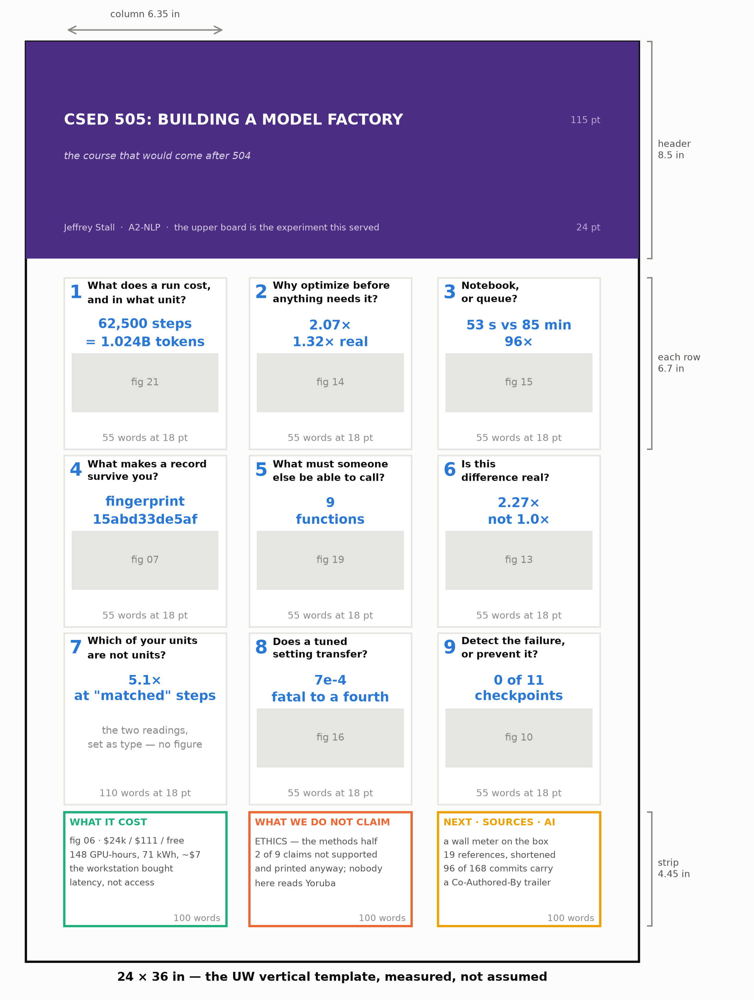

# The bottom board — what to print

*The poster itself: the grid, the measurements, and the words that go in each cell. This is the
thing to hold while laying out. [Report 09](09-the-bottom-report.md) is the long form of the same
ten panels — go there when a cell makes somebody want the whole argument.*

> **Read this first if you laid anything out before 12 August.** Every measurement in the previous
> version was wrong, because it assumed a 3 ft × 4 ft board and the UW template is **2 ft × 3 ft**.
> The real numbers were read out of `ResearchPoster_Template_Vertical_2023.pptx` rather than
> assumed. The board is 2.25× smaller in area than planned and the body type is 18 pt rather than
> 24, which halves the words per cell from 90–120 to **55**.

---

## Format — measured from the template, not assumed

| | value |
|---|---|
| board | **24 × 36 in** · 61.0 × 91.4 cm, portrait |
| columns | **three**, at x = 1.50 / 8.75 / 16.13 in, each **6.35 in** wide |
| header band | 8.5 in deep, full width |
| body area | y = 9.25 → 34.60 in, so **25.35 in** of column |
| title | **115 pt** · author line 24 pt |
| section header | **40 pt** |
| body | **18 pt** |
| photo caption | 12 pt |

**The grid this board uses.** Three rows of **6.70 in** with 0.25 in gutters, then a **4.45 in**
strip across the foot. Nine cells of 6.35 × 6.70 in, three strip blocks of 6.35 × 4.45.

**Word budgets, which are hard limits rather than targets.** A cell spends 0.6 in on its header,
1.4 in on the big number, 2.3 in on a figure, and has **1.9 in left — about 55 words at 18 pt.**
A cell with no figure gets about 110. A strip block gets about 100.

**What 55 words means for the writing.** It is three sentences. The
Problem / Hypothesis / Approach / Results / Learning structure **cannot fit on a panel** and does
not belong here — it is the report's spine. A cell states the question, the answer, and why it
matters, and the figure does the rest.

**The big number must fit about 18 characters per line.** This is the constraint that catches
people out: `2.07×, of which 1.32× is efficiency` overflows a 6.35 in column and has to become
`2.07×` over `1.32× real`. Check every one against the measure before setting it.



---

## Title block

> ## CSED 505: Building a Model Factory
> *the course that would come after 504 — ten weeks, derived from one term of building one*
>
> **501** the statistics · **502** the mechanics · **503** the language stack · **504** scale
> **All four end when a model finishes training. None covers needing a hundred models and having
> to believe the differences between them.**

Author line, in the header band: *Jeffrey Stall · A2-NLP · CSED 504 · the upper board is the
experiment this machinery served.*

The assignment asks for team member names. Both boards carry all three — **Jeffrey Stall, Patrick
Kwok, Leon** — with the role split named once, on this board, in the strip.

---

## The nine cells

> **A decision three cells need before setting.** Cells 2, 3 and 5 each carry a **second block**
> below, added on 12 August. A cell holds ~55 words *with* a figure or ~110 *without*, and two
> blocks is 120. So each of those three is a straight choice: **keep the figure and cut the second
> block, or drop the figure and run both blocks as type.** My recommendation in each case —
>
> - **Cell 2:** drop `14-where-the-speedup-came-from.svg`. The seventeen-language argument is the
>   stronger content and the speedup decomposition survives as a big number.
> - **Cell 3:** keep `15-what-a-run-is-made-of.svg`; the rush-order block moves to **cell 4**,
>   which is about records and queues and is currently the lightest cell on the board.
> - **Cell 5:** keep `19-the-interface.svg` and cut the masking block to one sentence — *"35 of
>   1,114 lines touch masking; a second study on a different objective already shares this
>   factory."* It is a footnote-sized point and the figure is doing more work.
>
> None of this is settled. It is the last real layout decision on the board.

Read left to right, top to bottom. The top row builds a factory; the middle row makes it
survivable, shareable and trustworthy; the bottom row spends the instruments, and two of those
three answers are *no*.

### 1 · What does a run cost, and in what unit?

**Big number:** `62,500 steps` / `= 1.024B tokens` · **Figure:** `21-hardware.svg`

> Every course measures training in epochs — one pass over the data. That stops meaning anything
> once the dataset is the variable, which is the first thing a scaling study does: at 4M tokens
> the model sees the corpus sixty times; at 1,024M, a quarter of it once. **Tokens of updates**
> survives both — and fixing the unit is what lets the figure below compare hardware and nothing
> else.

*67 words · `runs/scaling_law.json` · `runs/hardware.json`*

**Over the 55-word guide on purpose, and worth it.** Two additions. *"One pass over the data"*
glosses **epoch**, which is the one term on this board a 501 student may genuinely not have met.
And the closing clause is the bridge this cell was missing: a reader saw epochs-versus-tokens
sitting above a chart of eight machines with nothing joining them. Fixing the unit is precisely
what makes that chart legible, and saying so costs twelve words.

*(First draft of this ran to 91 words, which is past what the column physically holds — the
guide is approximate, the column is not. 67 fits.)*

### 2 · Why optimize before anything needs it?

**Big number:** `2.07×` / `1.32× real` · **Figure:** `14-where-the-speedup-came-from.svg`

> Nothing needed to be fast yet, which is the argument against doing it. 25.2 → 12.2 minutes —
> but only **1.32× is efficiency**; the rest is a second card. The hours saved are not the point.
> **197 models and 892 fine-tuning runs, across 17 languages, and only one is Yoruba.** At 25
> minutes that control set is a week's work and gets cut. At 12 it runs.

*59 words · `mlm_api.results()` · `ft_api.results()` · report 03*

> **Why the wording changed.** This said "1,089 models", which is 197 + 892 and is not 1,089
> models — 892 of them are fine-tuning runs on top of the 197. Nobody would have caught it from
> the board, and it is the first question a reviewer at the poster would ask.

**Second block, if the cell can take two:**

> **Why train Mandarin, French and Indonesian for a Yoruba study?** Because "the penalty tracks
> coverage" cannot be shown on one language — Yoruba is Latin-script, African and under-served all
> at once, and you cannot tell which one is doing the work. Ten covered languages against seven
> uncovered, four scripts, three continents. **Mandarin is the row that kills the script
> explanation.**

*58 words · `runs/gradient_table.json`*

### 3 · What belongs in a notebook, and what belongs in a queue?

**Big number:** `53 s vs 85 min` / `96×` · **Figure:** `15-what-a-run-is-made-of.svg`

> Do not choose on principle — measure the ratio and let it choose. Preparing the corpus is **53
> seconds**; one pretraining run is **85 minutes**. A gap of **96×** is not a judgment call.
> Everything cheap stays interactive, everything expensive goes in a queue you can walk away from,
> and the part that makes it work rather than merely tidy: **both paths write the same record.**

*55 words · `runs/pipeline_bench.json`*

**Second block — the rush order:**

> A queue that only runs the plan it was given is a batch job. On 9 August there were **44.7
> GPU-hours across 69 runs** committed to both cards when Patrick needed four cells now. Pin the
> urgent fleet to one card; `reuse=True` means restarting costs the one cell in flight, not ten
> hours; and `estimate()` measures twenty real steps, so the answer was **"fifty minutes"** rather
> than "sometime tonight."

*62 words · `mlm_api.estimate()` · `mlm_fleet.py --gpu-base`*

### 4 · What makes a record survive you?

**Big number:** `fingerprint` / `15abd33de5af` · **Figure:** `07-dashboard.png`

> Two runs silently overwrote each other. Two people prepared "the same" corpus and got different
> vocabularies, and nothing in either record said so. A filename is an identity, and an identity
> has to include **everything that changes the answer** — so the vocabulary gets a hash rather
> than a label. 197 pretraining runs and 892 fine-tuning runs later, no collision has survived.

*54 words · `mlm_api.results()` · `ft_api.results()`*

### 5 · What does someone else have to be able to call?

**Big number:** `9` / `functions` · **Figure:** `19-the-interface.svg`

> **Nine functions**, nothing else to import, on sixteen thousand lines they never open. Three
> things it had to be — callable, shareable, runnable on one card — and a fourth we got wrong.
> Leon read the documentation and asked whether there was an interface he should be using. There
> was. **A tool nobody can find does not exist**, and nobody files a bug to tell you.

*57 words · counted at render time from `mlm_api.py`*

**Second block — is it a masked-LM factory, or a factory?**

> **35 of 1,114 lines touch masking — about 3%.** The corpus prep, the resident token store, the
> records, the scheduler and the estimator have no opinion about what the model predicts. Proof
> rather than claim: a **second study on a different objective** — next-token prediction, LSTM vs
> GPT — already shares the token store, the scheduler and the dashboard. A general study needs a
> different `pretrain()`, not a different API.

*63 words · counted from `mlm_data.py`, `mlm_train.py`*

### 6 · Is this difference real?

**Big number:** `2.27×` / `not 1.0×` · **Figure:** `13-how-many-seeds.svg`

> Our rule was "bigger than the seed spread" — half a rule: sound at rejecting noise, silent just
> above it. At three seeds a difference must clear **2.27×** the spread. Worse: three against
> three is only twenty possible shufflings, so the smallest p the test can return is **0.10**,
> however far apart the arms land. Two of our claims sat in that gap. Both retired.

*64 words · `runs/claims_audit.json`*

**Why this one is over the guide.** "The exact test cannot return a p below 0.10" is the most
useful sentence on the board and the easiest to misread as a typo. The reason is countable and
worth showing: three against three is twenty possible shufflings, and a two-sided test needs at
least two of them to be as extreme as what you saw — 2/20 = 0.10. **A student who takes one thing
from this board should take this**, because it means a three-seed experiment cannot produce a
significant result at p < 0.05 no matter what the effect is. Sixteen extra words buys that.

### 7 · Which of your units are not units?

**Big number:** `5.1×` / `at "matched" steps` · **Figure:** *none — set the table as type*

> Two vocabularies give two losses that are not on one scale. Convert to **bits per character**,
> which divides the vocabulary back out. Then count what "matched steps" actually bought: the
> final layer that scores 250k possible tokens costs **5.1×** the compute of one scoring 16k, so
> twelve thousand steps each handed one arm five times the budget.

| 12,000 steps each | 16k vocab | 250k vocab |
|---|---|---|
| **scored** — bits/char | 1.131 | **0.989** *(looks better)* |
| **cost** — min/seed | 8 | **42** |

> Same runs, two readings, opposite answers. Fairness is a property of the unit.

*61 words + table · `runs/tokenizer_seeds.json`*

### 8 · Does a tuned setting transfer?

**Big number:** `7e-4` / `fatal to a fourth` · **Figure:** `16-lr-transfer.svg`

> "Adding a language is one function call" — true only if the settings come too. Five languages,
> six rates, sixty runs. Hausa, Nyanja and Swahili all peak at **7e-4**; **Igbo collapses** there
> and at every rate above. And the winner is not identified in *any* of the five: the gap to the
> runner-up is smaller than the gap between two seeds at the same rate.

*57 words · `runs/lr_transfer.json` · `runs/budget.json`*

### 9 · Detect the failure, or prevent it?

**Big number:** `0 of 11` / `checkpoints` · **Figure:** `10-early-signal.svg`

> 35 of 195 runs never learned — 17.9%, wasting 25.5 GPU-hours, so catch them early. Scored
> against their own untrained baselines at eleven checkpoints, the two outcomes **overlap at all
> eleven**: the best doomed run always looks better than the worst healthy one. Do not build the
> detector. And tighter clipping does not prevent divergence either.

*54 words · `runs/early_signal.json` · `runs/clip_prevention.json`*

---

## The strip — three blocks across the foot

### What it cost

**Figure:** `06-what-it-cost.svg`

> **148 GPU-hours. ≈71 kWh. ≈$7 of electricity.** Rent the same work on Colab: **$112 on an L4,
> $111 on an A100** — or **≈1,100 compute units either way, under four months of the 300 a month
> every student already gets free.** What the faster tier buys is **7 days against 30**, not a
> cheaper bill. **You buy latency, not access.** Team: Jeffrey Stall, Patrick Kwok, Leon.

*66 words · `runs/hardware.json`*

> **Set this block — the tiers are measured.** All three were re-run on the realistic loop, twice
> or more each. The instruction that used to sit here said to wait, and it outlived its reason.
>
> **One honesty note before it prints.** *148 GPU-hours* is measured. *71 kWh* and *$7* are not:
> they are 148.0 × 300 W × 1.65 × $0.0986, and only the 300 W was ever observed. They could be a
> third out in either direction and the sentence would still be true, which is why the block keeps
> them — but write them with "≈" rather than as readings. Report 09 §Cost carries the derivation.

### What we do not claim

> **Nobody on this team reads Yoruba.** Every quality judgement here is a benchmark number, not a
> judgement about whether the output is *good Yoruba* — so every claim is relative. The corpus is
> scraped web text nobody consented to. And the gate reports **9 claims: 6 supported, 2 not, 1
> underpowered** — two of the three failures ours, printed rather than dropped.

*57 words · `runs/claims_audit.json` · report 09 §Ethics*

### Next · sources · AI

> **Next:** a wall meter on the workstation, an audit of which sites dominate 69M tokens of
> Yoruba, and a Yoruba-speaking evaluation this project could not do. **Sources:** 19 references,
> shortened. **AI:** an assistant wrote much of this code — **96 of 168 commits carry a
> `Co-Authored-By` trailer**, which is `git log` rather than a promise. It made the building 3–5×
> faster and the *verifying* no faster at all.

*63 words · report 09 §Panel 10*

> **Both numbers moved and one moved down.** It said 120 of 144. Squash-merging collapses a
> branch's commits into one, so a pull request with four trailered commits arrives as a single
> trailered commit — the ratio falls as the history is tidied. Worth knowing before quoting a
> `git log` count as if it were a constant. The hardware figure was the old first "next"; it is
> built, so a wall meter takes its place as the cheapest unmeasured thing left.

---

## Does the board answer the assignment?

Checked against the rubric rather than assumed, because a panel that satisfies nothing required is
expensive wall space. The pair of boards is what gets marked; this column is only the bottom one.

| required | where it is on this board |
|---|---|
| Team member names | header band + strip 1 |
| Problem / motivation | title block + cell 1 |
| Goals | title block, and report 09 §Goals in full |
| Tool stack | cells 2, 3, 4, 5 |
| Pre-existing vs from scratch | cell 5, and the top board's panels 3 and 5 |
| How performance was explored | cells 6, 8, 9 |
| Dataset EDA | cell 4's inventory; the top board's panel 2 carries the corpus EDA |
| Results / summary statistics | cells 1–9, every one a measured number |
| Discussion / limitations | cells 6–9 and strip 2 |
| **Ethical impact** | **strip 2**, with the full account in report 09 |
| Next steps | strip 3 |
| Citations + AI statement | strip 3, with all 19 references in report 09 |

---

## Gaps

**Cell 1's figure is drawn — `21-hardware.svg`. Nothing on this board is blocked any more.**

Eight columns across six machines: the workstation, a Colab A100, a Colab L4, a free Colab T4, a
MacBook Pro, and the 8 GB Surface Studio Laptop three ways — plugged in, on battery, and with
`--cpu` on its own processor. **A Colab A100 comes within a fifth of one Blackwell card** —
1.19×, 46 minutes a run against 37. The L4 is **4.9× slower, 30 days of card time, $112**. The
free T4 is the floor of what somebody with no budget gets — **8.3×, 53 days, and the 98M model
fits there too**. The laptop a student most likely already owns runs **4.3 h / 10.2 h per run, 56×
its own CPU, and beats the free T4 on both model sizes even on battery.** More rows drop into
`runs/hardware.json` without touching the figure.

> **Read this paragraph before quoting any of it.** On 14
> August the benchmark stopped timing a stripped-down step and started timing the one
> `mlm_train.pretrain()` actually runs — batches built and masked on-device, gradients clipped,
> the loss read back every step. **Every machine on this figure is now measured that way**, and
> every one of them at least twice except the workstation. No `‡` remains.
>
> **I predicted the re-measured rows would all get worse. Most got better.** The method
> correction is real and one-directional — it always makes a machine look slower — but the old
> and new readings also come from *different sittings*, and that term is larger and has no
> direction: across eight re-measured rows the net change ran **−5.0% to +5.9%**. Which way a row
> lands is set by which sitting you caught, not by the method.
>
> **And the size of the method correction is not predictable either.** It was supposed to shrink
> as the step got dearer, and on four machines it did. The A100 broke it: a step 19% *dearer*
> than the workstation's and an overhead **2.3× larger** — 5.0% against 2.6%. Measured across the
> table the per-step overhead runs 1.0 ms to 6.4 ms and does not track the card's speed at all.
> We have not isolated why, and the honest form of the claim is the measurement rather than the
> rule: **between 0.7% and 5.0%, per machine, and you find out by running it.**

**Two terms this section uses constantly, defined once, here.**

**`throttle`** is the number every row carries for how much the machine slowed down *while being
measured*: the speed over the first third of the run divided by the speed over the last third.
**1.0 means it held its pace.** 1.20 means it ended a fifth slower than it started, which is a
card getting hot and backing off its clock. Below 1.0 means it got *faster*, which usually means
the run had not settled yet — fans still spinning up — and that reading should be thrown away.

**`p90`** is a way of saying "a good run rather than a typical one". Sort every real training run
by speed and walk 90% of the way up the list: that run is the p90. The middle of the list is the
median. We use both because the gap between them is the point — the benchmark predicts the good
run, and most runs are not the good run.

**The workstation row was measured on an idle card, twice** — **443,313 tok/s** (33.8M) and
**186,734** (98M), the median of two sittings that agree to 0.36% and 0.21%, and validated against the project's own training runs: it lands within half a percent of
the 98M preset's p90 across its 68 comparable runs. That is the first time any number on this
figure has been checked against the thing it claims to predict.

> **Two places where a sceptic should push, and what the honest answer is.** There were three
> until 16 August: the workstation was the only machine measured once, and it is the denominator
> of every ratio here, so an unrepresentative sitting would have moved all eight together and
> nothing would have looked wrong. It has now been measured twice and the sittings agree to
> **0.36% and 0.21%** — the tightest repeatability on the figure. That objection is closed, and
> it was closed by doing the measurement rather than by arguing about it.
>
> **p90 was chosen after seeing the data.** "The benchmark predicts a run that gets the machine to
> itself" is a fair description of what p90 means, but nobody wrote p90 down before looking, and a
> different quantile would have made the agreement better or worse. What is *not* post hoc is the
> shape: the 98M preset's whole distribution is tight (p10–p90 spans 1.11×) so the choice barely
> matters there, while the 33.8M preset spans 1.76× and the choice matters a lot. Read the 98M
> agreement as the real validation and the 33.8M one as an illustration.
>
> **The throttle ≥ 0.95 rule was also written after seeing the row it excludes.** The defence is
> that it is stated as a general criterion, it is checkable, and it makes two independent presets
> agree that previously disagreed — but it was not a pre-registered rule, and one row out of
> fifty-six is a thin basis for a threshold. If a second unsettled row ever appears, that is the
> one to check the rule against rather than to apply it to.

**The MacBook row landed on 13 August, and it is the one row on the figure that runs off the top
of the axis.** An M4 Pro with 24 GB sustains **16.8k tok/s on the 33.8M model and 6.6k on the
98M** — one run is **16.9 h and 43.1 h**, an overnight and a two-nighter. It neither throttles
(1.00 and 1.01 over three minutes, better than the mobile RTX) nor is it close to the CUDA
tiers: **26× and 28×** off the workstation, and slower than the *free* T4 by a factor of three.
Two sittings landed **0.80% and 0.15% apart**, which is the tightest repeatability on the figure
and the first honest error bar any machine here has. The
bar is drawn clipped with its value on it, because at full height it flattens the A100 and the
workstation into nothing and those two are the comparison the panel exists to make. Its dtype is
on the tick label in the same breath as its name — **fp32 against everyone else's bf16 or fp16**,
which makes it directional rather than exactly comparable, and is worth having anyway because a
lot of students own one.

**The Mac's first reading was 286 tok/s, and it was the third machine to lie to us the same way.**
That number is not a rate: it is four steps in 229 seconds, decaying 1,029 → 701 → 515 as it ran,
because the full batch wants **20.1 GB against the 17.8 GB Metal recommends** on that machine and
unified memory has no out-of-memory to raise — the GPU takes the difference from the pool the
operating system is using and everything slows down together. Through the same gradient
accumulation the 8 GB laptop already needed, the identical 16,384-token step runs at **6,210
tok/s in 16.2 GB: 21.7× the first reading.** Had it gone on the board it would have said the
whole project costs a Mac owner eleven years.

**The tell was free and we should have looked for it sooner: the two presets' ratio.** Every
machine on this figure runs the 33.8M model between **2.07× and 2.55×** the speed of the 98M — the
workstation, the A100, the L4, the T4, the laptop on both power settings, the honest Mac row, and
even the bare Intel CPU, which is the same fp32 path the Mac uses. The first Mac reading said
**59×**. One line of arithmetic across rows that already existed, and it is a better detector than
any of the three platform-specific mechanisms, because it does not need to know what went wrong.

**It is a weaker claim than "a property of the two models" and worth stating as what it is.** The
band is 23% wide across nine columns, which is a lot for something described as a constant — the
workstation's own real runs sit at 2.07 and the Mac at 2.55, and the reasons for the spread
(precision, memory architecture, whether the run needed gradient accumulation) are real effects
rather than noise. So it will not catch a reading that is 30% wrong. It catches the ones that are
an *order of magnitude* wrong, which is what all three of ours were: 59×, and the two others would
have been similar. `test_board_numbers.py` asserts a padded 1.8–3.2 for that reason, not the
observed band.

**Switching from a burst to `--seconds 180` mattered on one machine out of six, and it was the
one that mattered.** The A100 and the L4 came back within 2% of their burst readings. The free T4
came back **19% lower on the 33.8M model and 22% lower on the 98M**. Two explanations were
confounded — "the method flatters this card by a fifth" against "free-tier sessions differ by a
fifth" — and the only way to separate them was to sit the T4 down three times.

*(An earlier version of this paragraph put the laptop in the untroubled group and said none of
those machines "decayed measurably". The laptop's own rows say otherwise — throttle 1.08 and 1.11
plugged — and it contradicted the battery paragraph four blocks down. Two true sentences in one
document disagreeing is worse than either being wrong on its own, because each one looks checked.)*

**Three sittings, and the answer is the method.** Free-tier sessions agree to **1.8%** on the
33.8M model and **0.5%** on the 98M. A shared host was the intuitive explanation and it is wrong:
this is one of the most repeatable machines on the figure.

**What the burst was catching was a card that throttles, and only on the small model.** The T4's
within-run decay is **1.19, 1.22 and 1.20** across the three sittings on the 33.8M preset — it
opens near 60k tok/s and closes near 50k, every time — while the 98M preset sits at **0.98–0.99**
and does not decay at all. No other machine here does this: the A100, the L4 and the laptop are
flat on both shapes. A 70 W passively-cooled card runs the cheap model at a duty cycle it cannot
hold and the expensive one at one it can, so the 40-step burst was reading an opening clock that
lasts about twenty seconds. **The row a student with no budget lands on is the one row where the
first number you see is not the number you get**, and it is the only row on this figure whose
throttle would have told you so.

**Unplugging the laptop costs about a sixth: 15.4% on the 33.8M model, 14.9% on the 98M**, run
back-to-back so the battery reading started warm and got no cold-start flattery. 4.3 hours becomes
5.1, and 10.2 becomes 11.9.

That figure was **24% and 25%** until the laptop was re-measured on the realistic loop, and the
correction is entirely in the *plugged* numbers — the battery readings barely moved (56,159 →
55,992 and 23,850 → 23,842). Unplugged, the card is power-capped and therefore stationary: it
returns nearly the same number however you measure it. Plugged, it boosts and then decays, which
is where the old reading was flattering itself. **The mains figure was the unreliable half of that
comparison, not the battery one**, which is the opposite of what you would assume.

**And the first sitting of a cold session is the one to throw away.** The laptop's first 98M run
came back at 25,038 against 28,027 from the sitting straight after it — a 12% gap that would have
medianed to a number neither run measured. Its `throttle` was **0.87**: the last third ran 15%
*faster* than the first, so it never settled inside the window. The cause is mundane — the fans
had not spun up. The figure now drops any row whose throttle is below 0.95, and the check pays for
itself immediately: with the unsettled row out the two presets agree on the battery penalty
(15.4% and 14.9%), and with it in they do not (15.4% and 10.1%).

**The first T4 reading said 33× and would have killed the claim.** `bench_portable.py` chose its
precision with `torch.cuda.is_bf16_supported()`, whose signature is `(including_emulation=True)` —
so a card whose tensor cores have no bf16 answered yes and ran it in software. 11,566 tok/s against
64,644 once it was measured in fp16 — both bursts; sustained the card holds 53,148, which is the
number on the figure. It also reported the 98M model as not fitting in 15 GB, which
was the same cause: in fp16 it fits at batch 128 with 9.85 GB. Nothing errored and nothing warned,
and both readings looked equally plausible on the page. **Every row on the figure carries its dtype
for that reason.**

**The laptop's first reading failed the same way, in the opposite direction.** The 98M model wants
~10 GB and the card has 8. Windows does not refuse: the driver spills the overflow into system RAM
and the benchmark "worked" at 5,075 tok/s — the PCIe bus wearing a GPU costume, six times under the
card's honest rate. On Linux the same run is an OutOfMemoryError. The fix was already in the
factory: gradient accumulation (`mlm_train.pretrain(accum=)`, now mirrored by `bench_portable.py`)
folds the same 16,384-token step into micro-batches — identical update math, the batch never stops
being 128 — and the model trains in **6.1 GB at 28,027 tok/s** sustained. The script now treats an
allocation past free memory exactly like an OOM, walks the fallback ladder, and **the row records
the configuration it took**, because a rate without one is not reproducible. Report 09 carries the
full story in **Appendix A**, under *"The 8 GB story: we needed 10 GB and had 8."* — the
machine-by-machine detail moved there on 15 August when Panel 1's hardware section went from 5,100
words to 1,450.

**`11-metric-validity.svg`, `08-why-not-shorter.svg` and `09-scaling-with-cards.svg` are drawn and
carried by neither board.** Available if a cell wants one.

**Figure 03 went to the top board.** It was claimed by both, which neither document could see from
the inside; `check_boards.py` exists because of it and exits 0 now. Cell 7 sets its table as type
instead, which is the better panel anyway.

**Do not reuse the retracted floor sentence.** An earlier draft claimed the difference between the
two tasks' floors explained the divergence, argued from shares of 57% and 52%. Sweeping the
MasakhaNER floor moved it to **0.6261** and the shares to 61% and 78% — so the sentence was wrong
*and* its supporting numbers have evaporated.

---

## Order of work

1. ~~Figures for cells 3, 5 and 8~~ — **done**.
2. ~~Settle figure 03~~ — **done**, it is the top board's.
3. **Set the nine cells and three strip blocks from the words above.** They are written to the
   measure; do not re-expand them.
4. **Check every big number against the 18-character measure** before setting it.
5. ~~Cell 1's figure~~ — **done**, `21-hardware.svg`, eight columns across six machines and the
   CPU baseline in its side panel.
6. ~~Re-measure every machine at `--seconds 180`~~ — **done, and superseded.** All six were
   taken as three-minute rows, and then on 14 August the thing being timed changed: see 6b.
6b. ~~Re-measure every machine against the realistic loop~~ — **done.** Workstation ×2, Mac ×2,
   T4 ×3, L4 ×2, A100 ×2, laptop ×2 plugged + ×1 battery. Every column on the figure times the
   loop `pretrain()` runs, no `‡` remains, and every machine has been sat down at least twice.
   **Two optional short runs are left, neither affecting a printed number**: a third plugged
   sitting on the laptop, whose first 98M reading never settled (throttle 0.87) and was dropped,
   leaving that one cell at n=1; and `--cpu --seconds 60` on the same laptop, the last row in
   the file still measured with the old step-only loop.
7. ~~Re-render `fig_hardware`~~ — **done.** Set the strip's cost block, the only board text
   whose digits depend on the tiers. The `‡` marks and the PROVISIONAL note clear themselves.
8. **The print gate, last, once nothing is still writing:** `check_links.py`, `check_boards.py`,
   `check_provenance.py`, `poster/board_content.py`, the four test files, regenerate every
   figure, run the staleness pass. Do it once.

---

## What the board must not do

Quote a count typed by hand. Every number comes from `poster_bottom.ipynb`, which recomputes from
the records and flags any sentence in report 09 the data no longer supports.

The counts moved three times while this was being written: 105 pretraining runs became 156, then
**197**. Fine-tuning records stand at **278**, of which 161 are test-scored and 117 dev-scored —
the dev rows pick a learning rate and are chosen on the items they are scored on, so they are not
reportable numbers.

**Recompute, do not copy from this sheet.** Anything quoted here was true on the day it was
written.

---

# Appendix — measuring what a run costs on your machine

This is the missing cell-1 figure. `bench_portable.py` needs no corpus, no tokenizer and no
repository data, because its token stream is random integers — worthless for learning and
identical for timing, which means it pastes straight into a fresh Colab cell.

**What we are collecting.** For each machine, on both model shapes: tokens per second for the step
`mlm_train.pretrain()` actually runs, the same figure for the old step-only loop, whether the model
fits in memory, and the extrapolated wall-clock for one full 62,500-step run. The reference is the
workstation running this same script on one idle card, twice — **443,313 tok/s** at 33.8M and
**186,734** at 98M, the median of two sittings — so every ratio divides a measurement by the same
kind of measurement.

**Everything before 13 August needs re-running.** Those rows timed a stripped-down step: one fixed
batch reused, no gradient clipping, no host sync. Rows now carry `"method"`, and `bare-step` and
`realistic-loop` numbers must never be averaged together.

**Read every row as a ceiling.** The benchmark measures a machine with nothing else running on it,
and that turns out to be exactly what a *lucky* real run gets.

Checked against 184 of this project's own training runs: **sort them by speed and take the one
90% of the way up the list** — the "p90", the run that had a good night. The benchmark lands
within half a percent of it on the 98M model. The *typical* run does worse: the middle run of the
33.8M set reached only **0.86** of the benchmark, because a nine-minute run is at the mercy of
whatever else the machine was doing during those nine minutes.

How much worse depends on how long the run is. Sorting the 33.8M runs by speed, the one 10% up
the list and the one 90% up differ by **1.76×**; for the 98M runs, whose average length is 93
minutes rather than 9, that gap is only **1.11×**. A long run averages over the interruptions. A
short one is at their mercy. **The benchmark number is honest; the spread around it is the
finding.**

**Before you start, on every machine: close other GPU work, and mean it.** A number taken while
something else holds the card is simply wrong, and it is the most common way these tables mislead.

The script now names the processes rather than guessing from a memory threshold. It prints either
`no other process is computing on this card` or a count with their pids. **Do not read past the
second one.** On 13 August three workstation readings were taken with ollama on the same card, the
warning fired on all three, and it was dismissed each time as "Windows display memory" — the
numbers, 448,571 then 377,576 for an identical configuration, then supported two different wrong
explanations. It was dismissed so easily because *it fired on every run*, including clean ones: the
old check asked `torch.cuda.mem_get_info()`, which can only be called after CUDA has taken its own
1.6 GB context, and then called that context "other processes". A warning that is always on carries
no information. You can still confirm by hand:

```
nvidia-smi --query-gpu=index,utilization.gpu,memory.used --format=csv
```

**About four minutes per preset, so eight per machine.** That is `--seconds 180` for the realistic
loop plus `--bare-seconds 60` for the old step-only one, interleaved in ten-to-twenty-second blocks
rather than run back to back. Interleaving is not fussiness: run in sequence, whichever loop goes
second is measured on a hotter card, and this workstation sheds ~5% over its first couple of
minutes. Measured sequentially the same gap read 1.01× one way and 1.09× the other; interleaved it
is 1.03×.

**And interleaving alone was not enough, which the T4 caught.** The first version always ran the
bare block *second* within each cycle, so on a card whose clocks fall it was always sampled a
little later and a little cooler. On flat machines that is invisible; on the T4, which sheds 20%
across three minutes, it showed up as `bare_over_real` of **0.99** — the stripped-down step, which
does strictly less work, reading *slower* than the loop that builds and masks a batch on top of
it. An impossible number is a gift; a plausible one would have gone on the board. The loops now
take turns leading, and the T4's three rows read about 1% optimistic on the 33.8M preset until
they are taken again.

Every row now also reports
**`throttle`**: the first third of the run against the last. A datacenter card should read ~1.0;
anything well above means the machine cannot sustain its opening pace, and on a laptop that is the
finding rather than an artefact.

`--out` **appends** rather than overwrites, so re-running is safe and rows accumulate.

---

## A. Windows — Anaconda Prompt (Toothless and the Surface laptop)

Both Windows machines run this from the **Anaconda Prompt**, which is `cmd.exe`. Not Git Bash, not
PowerShell — the commands below are cmd syntax and will not work in a bash shell.

```bat
conda activate uw-csed504
```

### A1. Toothless — the workstation *(done — and the only machine that is)*

Measured on an idle card 0 on 14 and 16 August: the two sittings agree to **0.36% and 0.21%**,
and the figure uses their median — **443,313** at 33.8M and **186,734** at 98M. Three
earlier attempts were all taken while ollama held the card; the fourth was clean, and the script
now says so in as many words rather than firing a warning it fires on every run.

The procedure is kept because this row is the denominator of every ratio on the figure, so it is
the one most worth being able to reproduce. Re-run it if the card, the driver or the torch version
changes.

```bat
cd /d O:\Sources\GitHub\TrueRottweiler\WashingtonCsed504\src\a2-nlp
nvidia-smi --query-gpu=index,utilization.gpu,memory.used --format=csv
```

**Read that output before continuing.** Then:

```bat
set CUDA_VISIBLE_DEVICES=0
python bench_portable.py --seconds 180 --out runs\hardware.json --note "Toothless, RTX PRO 6000 Blackwell Max-Q, 1 card, idle"
```

One card deliberately: the figure compares *a card*, and a two-card number is not comparable to a
MacBook. `set CUDA_VISIBLE_DEVICES=0` lasts for that prompt session only.

### A2. Surface Studio Laptop — RTX 2000 Ada Mobile, 8 GB *(done — 2 plugged, 1 battery)*

The most important row on the figure, because it is the machine a student is most likely to own.
It does not need the repository — the script is self-contained. The procedure is kept because the
back-to-back ordering is what the battery finding rests on, and because this machine produced the
one reading the table had to throw away.

**Two things are still worth doing here, neither urgent.** A third plugged sitting would take the
98M cell off n=1, since the first one never settled. And the `--cpu` baseline is the last row in
the file still measured on the old step-only loop — `python bench_portable.py --cpu --seconds 60`,
about three minutes. Its number will barely move (a CPU step is 14 seconds, so per-step overhead
is nothing), but it is the last mixed-method comparison on the board and the `56×` quotes it.

```bat
conda activate uw-csed504
cd /d %USERPROFILE%\Desktop
curl -o bench_portable.py https://raw.githubusercontent.com/TrueRottweiler/WashingtonCsed504/main/src/a2-nlp/bench_portable.py
```

Take a fresh copy every time — this matters more now than it did. A copy from before 14 August
times the stripped-down step and one from before 13 August times a 40-step burst, and all three
readings look equally plausible on the page. The row's `method` field is the only thing that says
which loop produced it.

**Plugged in first, and twice** — the spread between two sittings is the only honest error bar a
single machine can give you:

```bat
python bench_portable.py --seconds 180 --out hardware.json --note "Surface Studio Laptop, RTX 2000 Ada, plugged in"
```

**Then pull the mains out and immediately run:**

```bat
python bench_portable.py --seconds 180 --out hardware.json --note "Surface Studio Laptop, RTX 2000 Ada, on battery"
```

**Back-to-back matters.** The battery run should start on a warm card, because that is the honest
comparison — letting it cool first hands the battery reading exactly the cold-start flattery the
old burst was giving everything. About **eight minutes per sitting**, so twenty-four for the three.

Expect the 98M model to fall back to gradient accumulation: it wants ~10 GB and the card has 8.
That is not a failure, and the row records the configuration it took.

**If `python` is not the one with torch.** A bare `python` on Windows is often the Store alias or
another environment, and the resulting error names `transformers` even when the real problem is
the interpreter. Check with:

```bat
python -c "import torch, transformers; print(torch.__version__, transformers.__version__)"
```

If that fails inside the activated environment, install into it:

```bat
pip install torch --index-url https://download.pytorch.org/whl/cu124
pip install transformers
```

---

## B. MacBook Pro (M4 Pro, MPS) *(done — two realistic-loop sittings)*

**This row was run as a prediction and it came back right.** The new loop's overhead should cost a
machine less the dearer its step already is — 2.7% on the workstation, and an M4 Pro's step is 26×
dearer, so `bare_over_real` was expected **near 1.00**. Measured: **1.007 and 1.004**. The
mechanism holds on a different vendor, a different precision and a different memory architecture.

It also corrected the half of the account that was too strong. The overhead is not *fixed*: in
absolute terms it is 6.4 ms here against 0.98 ms on the workstation. It grew 6.5× while the step
grew 26×, so it is sub-proportional to the machine rather than independent of it. Only the host
round-trip is really fixed; the masking and the gradient-norm scale with the hardware.

Two sittings landed 0.80% and 0.15% apart — the tightest repeatability on the figure.

A Mac is **zsh**, not cmd. From Terminal:

```bash
curl -o bench_portable.py https://raw.githubusercontent.com/TrueRottweiler/WashingtonCsed504/main/src/a2-nlp/bench_portable.py
pip install torch transformers
python bench_portable.py --seconds 180 --out hardware.json --note "MacBook Pro M4 Pro, 24 GB, MPS"
```

**A lot of students own a Mac, so this is a row people will look for.** An earlier version of this
appendix called it a footnote and said to skip it if time was short. That was the wrong call: it
put methodological tidiness ahead of the audience, and a Mac owner reading this board deserves an
answer rather than an omission. It is also the row that turned out to need the most care, so the
procedure is kept here rather than deleted as done.

**Say how much memory the machine has in the `--note`.** On a Mac that is not a detail, it is the
variable that decides whether the 98M model can be measured at all — 24 GB and 48 GB are different
machines for this benchmark in a way that 8 GB and 12 GB of discrete VRAM are not.

Two things to expect, both of which go *on* the figure rather than being reasons to leave it off.
MPS does not support the same mixed-precision path — the run stays in fp32 on purpose, because a
benchmark that silently changes precision between machines is comparing two different computations
— so the row is **directional rather than exactly comparable**, and its dtype column reads
`float32` where every CUDA row reads bf16 or fp16. And unified memory means the 98M preset may fit
where a discrete card of nominally similar size would not.

**That second one is the trap, and it cost us a reading.** Unified memory does not fit the model
so much as fail to refuse it. There is no separate VRAM to overflow, so going past what Metal
recommends as a working set raises nothing at all — the GPU takes the difference out of the pool
the operating system is using, and the whole machine degrades together. On a 24 GB M4 Pro the 98M
preset at full batch wants **20.1 GB against a 17.8 GB recommendation**, and the run that came back
reported **286 tok/s**: four steps in 229 seconds, decaying 1,029 → 701 → 515, with no error, no
warning, and a throughput number that looked like data. Folded through gradient accumulation it is
**6,210 tok/s in 16.2 GB** — the same 16,384-token step, 21.7× faster.

`bench_portable.py` now knows this. It reads `torch.mps.recommended_max_memory()` as the budget,
checks what the driver is holding after the first step **and again after warmup** — MPS grows into
its allocation, so a single early check passes — and treats crossing it exactly like the Windows
PCIe spill: not a measurement, walk the fallback ladder. You should see it happen:

```
 afriberta: no room for full batch 128 (19.2 GB held after the first step
            against a 17.8 GB budget) -- retrying smaller
```

**If you do not see that line and the 98M number comes back under ~1,000 tok/s, do not record it.**
Check the ratio between your two presets: every machine on this figure sits between 2.07× and
2.62×, so anything past about 4× means the large model is not really running on the GPU.

`throttle` matters here as much as on the laptop: a lightly-cooled chassis will not hold its
opening pace for three minutes, and that is exactly what somebody needs to know before starting an
overnight run. The M4 Pro passed that test — **0.98 and 1.01**, flatter than the mobile RTX — so on
this chassis the memory ceiling is the finding and the thermals were a non-event.

---

## C. Google Colab — the tier ladder *(done — T4 ×3, L4 ×2, A100 ×2)*

All three tiers are measured on the realistic loop, twice or more each: **$112 on an L4, $110 on
an A100, $0 on the free T4.** The two paid tiers land within 1% of each other, which is the
board's "you buy latency, not access" claim arriving cleanly for the first time — earlier
versions of that sentence were comparing tiers measured different ways.

**Quote it in compute units on the board, and in dollars here.** Units are what a student actually
spends and the claim is tighter in them — **1,105 on an A100 against 1,119 on an L4, 1.3% apart**,
because the per-hour rate is exactly the thing that cancels. Dollars survive in the appendix and
in figure 06 because that panel needs to set the $24,000 workstation and the $7 electricity bill
beside the rental, and those two have no meaning in units.

| | A100 | L4 |
|---|---|---|
| one 33.8M run, 1.024B tokens | 5.2 units | 4.9 units |
| one 98M run | 10.9 units | 11.5 units |
| the whole project | 1,105 units | 1,119 units |

**The rates that turn hours into units are read off the usage page, not measured** — 6.77
units/hour on the A100 and 1.54 on the L4, on 13 August 2026. Re-read them when you re-run, and
put them on the row: `compute_units_per_hour` and `usd_per_compute_unit`. A tier whose selected
row lacks them gets priced from an older sitting, and `test_board_numbers.py` now fails when that
happens.

**Attach the compute-unit rate by hand when you record a paid tier.** The benchmark cannot see
it, so a fresh row arrives without `compute_units_per_hour` and `usd_per_compute_unit`. Left off,
the cost table silently falls back to whatever older row still carries them — which on 14 August
would have quoted the L4's price from a bare-step sitting while drawing its bar from a realistic
one. `test_board_numbers` now fails if a paid tier's selected row has no billing fields.

**The T4 is done, three times, and it settled an open question.** It was run three times because
its readings had disagreed by a fifth and two explanations were confounded: the method, or the
free tier's shared host. The sittings came back **1.8% apart** on the 33.8M model and **0.5%** on
the 98M. The host was not the problem. What the old burst was catching is a card that **throttles
20% within three minutes on the small model and not at all on the large one** — the only machine
on this figure that does. Its `throttle` column said so all along.

**A second sitting is what buys an error bar**, and it is worth having even where the answer turns
out to be boring: the figure can only draw a spread for a machine measured more than once.

```python
!wget -q https://raw.githubusercontent.com/TrueRottweiler/WashingtonCsed504/main/src/a2-nlp/bench_portable.py
!python bench_portable.py --seconds 180 --note "Colab T4"
```

> **Do not `pip install torch` on Colab.** An earlier version of this appendix said
> `!pip -q install torch --upgrade` and it is wrong in a way that silently ruins the measurement.
> Colab ships torch already, pinned against the CUDA libraries in that image; upgrading it pulls a
> newer torch over them and leaves `torchvision`, `cuda-python` and the RAPIDS stack mismatched.
> The run may still complete, and its throughput number is then wrong in an unpredictable
> direction — the worst failure a benchmark has, because it looks like data.
> `bench_portable.py` imports nothing Colab does not already ship. If you have already run the
> upgrade: **Runtime → Disconnect and delete runtime**, reconnect, and run the two lines above.

| runtime | why it is on the list |
|---|---|
| **T4** (free) | the honest floor — what somebody with no budget gets |
| **L4** | the cheap paid tier, probably the best-value row |
| **A100** | the fast tier — ours read as an A100-SXM4-80GB |
| **TPU** | *skip* — the script refuses; it needs a different training loop and would not be comparable |

**Copy the printed JSON out of each session before it disconnects** — a Colab disk is disposable
and these numbers are the whole point of the exercise.

**And read the compute-unit rate off the Colab usage page for each paid tier.** That is the half of
the cost claim a benchmark cannot see, and the rates move with pricing and demand — the ones on the
board were read on 13 August at $9.99 per 100 units.

---

## D. What happens then

Paste the JSON back, or drop the rows into `runs/hardware.json` directly — it is a plain list and
the figure reads it. Then:

```bat
python poster_figures.py fig_hardware
```

**The sentence the figure has to earn:** *you do not need the workstation.* It is only true if the
numbers say so. Six machines say it today — the free T4, the paid L4, an A100 that comes within
a tenth of one Blackwell card, an 8 GB laptop that runs both models overnight-sized on mains,
still runs them on battery, and beats its own CPU by 56×, and a MacBook Pro that is slow but
finishes.

**Every machine is measured the same way now**, and every one at least twice except the
workstation itself.

**How much a re-run moves a row is measured, and it is not what I predicted.** The method
correction is one-directional — it always makes a machine look slower — but between-sitting
variation is larger and has no direction at all. Across the re-measured rows the net change ran
**−12% to +6%**. The L4's cost fell from $117 to $112; the A100's rose from $107 to $110; the
laptop plugged fell 11%, which is what rewrote the battery finding.

**The one number left unmeasured is the laptop's plugged 98M row at n=1**, because its first
sitting never settled and was dropped. One more eight-minute plugged run would close it. Nothing
on the board depends on it to two significant figures.

**The Mac is the honest edge of that claim rather than a counterexample to it.** 16.9 h and 43.1 h
is three times the free T4, and a reader who owns one should know that the free tier is faster
than the laptop they paid for. What the row buys is the answer to a different question — *can I
start tonight without asking anyone for anything* — and there the answer is yes.
